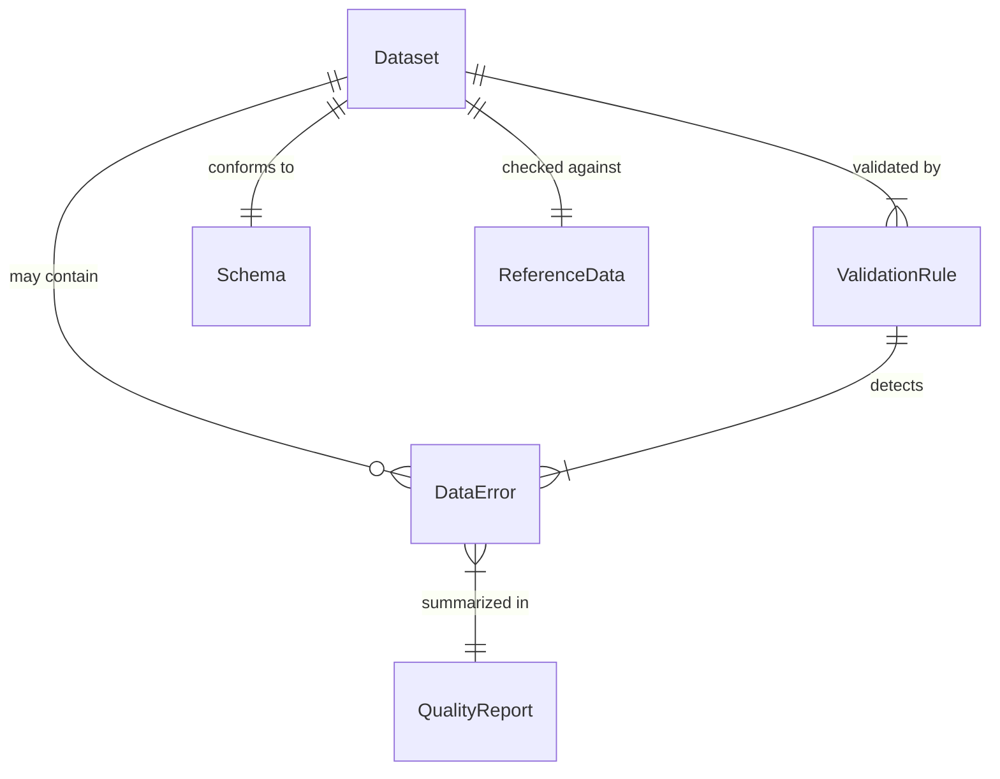
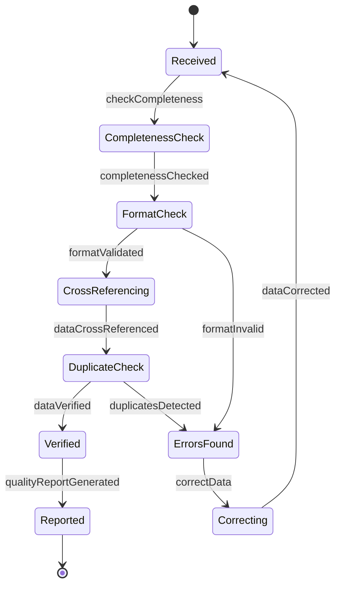
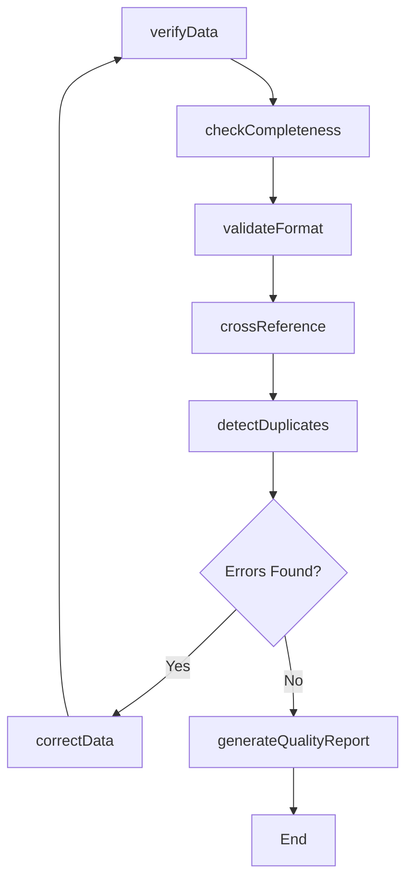
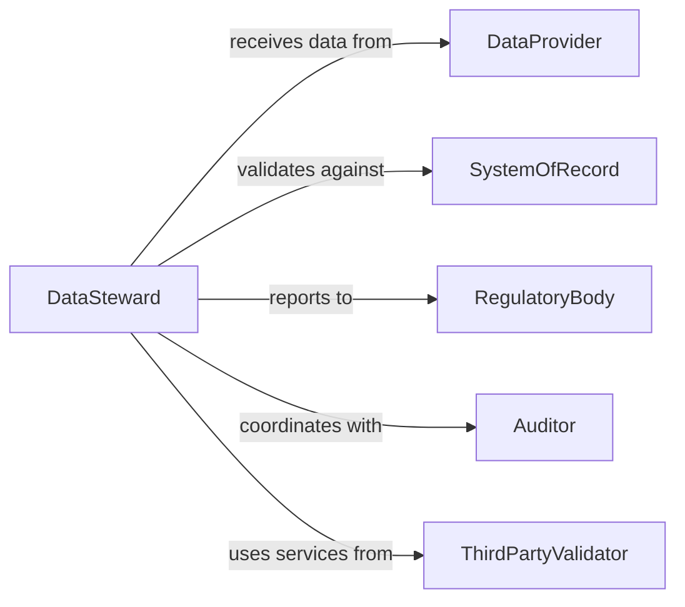

# Verify Accuracy Data

> Business-as-Code definition for general data accuracy verification. Models validation workflows for data completeness, format compliance, referential integrity, and quality standards.

## Overview

Data accuracy verification ensures that information stored and processed meets quality standards for completeness, correctness, and consistency. This definition provides actions for validating data against schemas, business rules, and external sources across all business domains.

## Actors

| Actor | Description |
|-------|-------------|
| DataProvider | Supplies data through integrations or manual entry |
| SystemOfRecord | Authoritative source for reference data |
| RegulatoryBody | Sets data quality and reporting standards |
| Auditor | Reviews data accuracy for compliance |
| ThirdPartyValidator | Provides external verification services |
| Customer | Relies on accurate data for service delivery |

## Roles

| Role | Description |
|------|-------------|
| DataSteward | Oversees data quality and governance |
| QualityAnalyst | Performs data validation and profiling |
| SystemAdministrator | Manages data validation rules and processes |
| DataGovernanceOfficer | Defines data standards and policies |

## Entities

| Entity | Description |
|--------|-------------|
| Dataset | Collection of data records to be validated |
| ValidationRule | Business rule or constraint for data quality |
| DataError | Identified issue with data accuracy or completeness |
| QualityReport | Summary of validation results and metrics |
| ReferenceData | Master data used to validate other records |
| Schema | Data structure and format specification |

## Actions

| Action | Description |
|--------|-------------|
| verifyData | Validate data against quality rules |
| checkCompleteness | Ensure required fields are populated |
| validateFormat | Confirm data matches expected patterns |
| crossReference | Verify data against authoritative sources |
| detectDuplicates | Identify redundant or conflicting records |
| generateQualityReport | Create summary of validation results |
| correctData | Update records with verified corrections |

## Events

| Event | Description |
|-------|-------------|
| dataVerified | Data validation is complete |
| completenessChecked | Required field validation finished |
| formatValidated | Format compliance confirmed |
| dataCrossReferenced | External verification complete |
| duplicatesDetected | Redundant records identified |
| qualityReportGenerated | Validation summary created |
| dataCorrected | Records updated with corrections |

## Searches

| Search | Description |
|--------|-------------|
| findDataErrors | List validation errors by type or severity |
| getIncompleteRecords | Retrieve records with missing required fields |
| getDuplicates | Find redundant or conflicting records |
| getQualityMetrics | Retrieve data quality scores and trends |

## Entity Relationships



## State Diagram



## Workflow



## Actor Relationships



## Usage

### Calling Actions

```typescript
import { verifyAccuracyData } from '@headlessly/verify-accuracy-data'

const verification = verifyAccuracyData()

// Verify a dataset
const results = await verification.verifyData({
  datasetId: 'customer-records-2026',
  rules: ['completeness', 'format', 'referential-integrity']
})

// Check for missing required fields
const incomplete = await verification.checkCompleteness({
  datasetId: 'customer-records-2026',
  requiredFields: ['email', 'phone', 'address']
})

// Generate quality report
const report = await verification.generateQualityReport({
  datasetId: 'customer-records-2026',
  period: '2026-Q1'
})
```

### Event-Driven Automation

```typescript
// Auto-correct common format errors
verification.formatValidated(async ({ datasetId, errors }) => {
  const autoFixable = errors.filter(e => e.severity === 'low')
  if (autoFixable.length > 0) {
    await verification.correctData({
      datasetId,
      corrections: autoFixable.map(e => e.suggestedFix)
    })
  }
})

// Alert on critical data quality issues
verification.dataVerified(async ({ datasetId, qualityScore }) => {
  if (qualityScore < 0.85) {
    await notify({
      to: 'data-governance',
      priority: 'high',
      message: `Data quality score ${qualityScore} below threshold for ${datasetId}`
    })
  }
})
```
