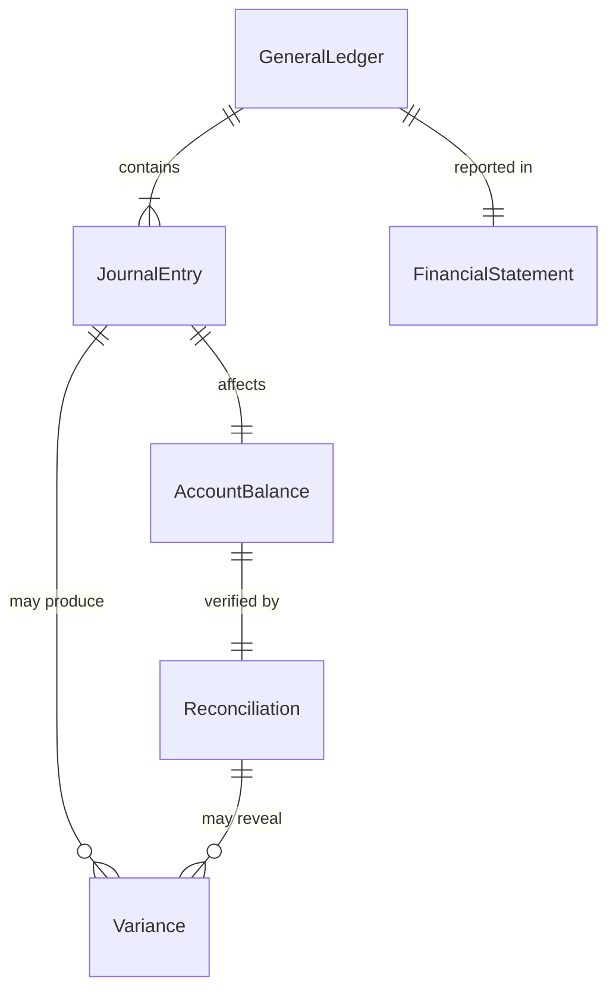
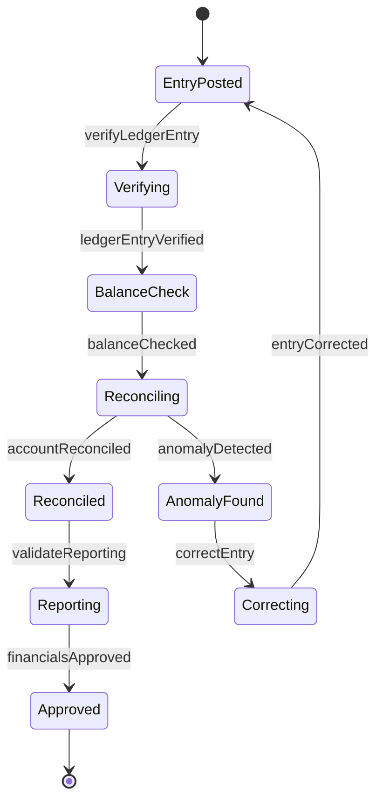
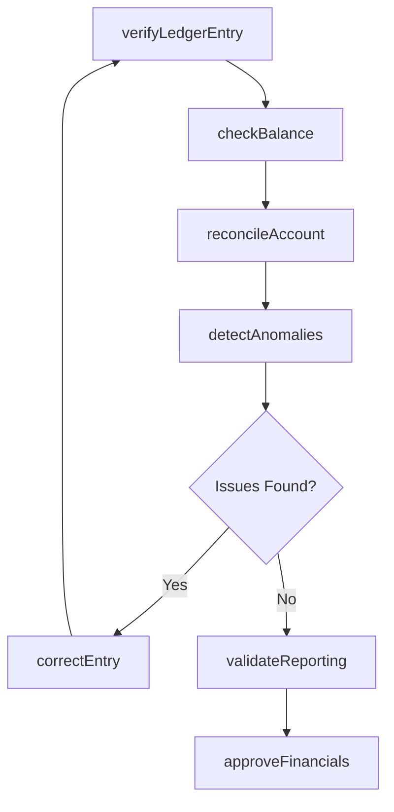
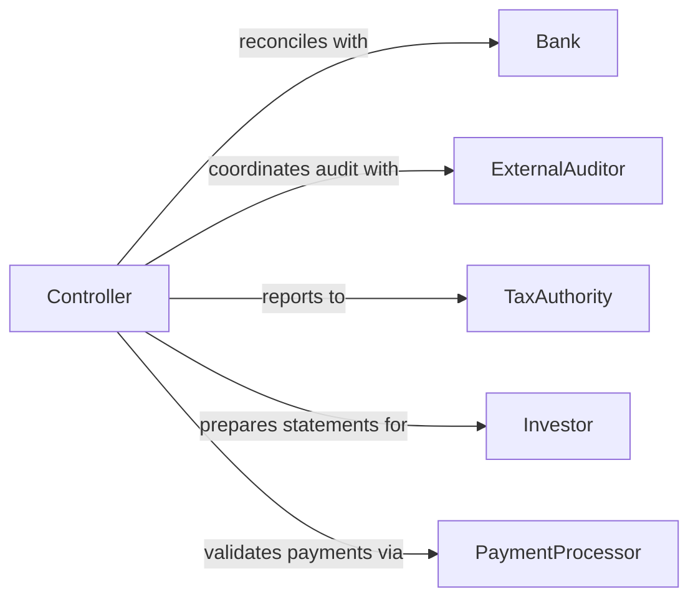

# Verify Accuracy Financial Information

> Business-as-Code definition for financial data accuracy verification. Models validation workflows for account balances, general ledger entries, journal postings, and financial statement integrity.

## Overview

Financial information verification ensures that accounting records, balances, and reports are accurate and compliant with GAAP or IFRS standards. This definition provides actions for validating ledger entries, reconciling accounts, and detecting financial anomalies.

## Actors

| Actor | Description |
|-------|-------------|
| Bank | Provides account statements for reconciliation |
| ExternalAuditor | Reviews financial records for compliance |
| TaxAuthority | Requires accurate financial reporting |
| Investor | Relies on verified financial statements |
| PaymentProcessor | Processes revenue and expense transactions |
| Vendor | Submits invoices for payment |

## Roles

| Role | Description |
|------|-------------|
| Controller | Oversees financial reporting accuracy |
| Accountant | Records and verifies financial transactions |
| FinancialAnalyst | Analyzes variances and trends |
| ComplianceOfficer | Ensures adherence to accounting standards |

## Entities

| Entity | Description |
|--------|-------------|
| GeneralLedger | Central accounting record of all transactions |
| JournalEntry | Individual accounting transaction record |
| AccountBalance | Current balance of an account |
| Reconciliation | Matching of internal records to external statements |
| FinancialStatement | Formalized report of financial position |
| Variance | Difference between expected and actual amounts |

## Actions

| Action | Description |
|--------|-------------|
| verifyLedgerEntry | Validate journal entry accuracy and compliance |
| reconcileAccount | Match account balance to external records |
| checkBalance | Confirm account balance integrity |
| detectAnomalies | Identify unusual transactions or patterns |
| validateReporting | Verify financial statement accuracy |
| correctEntry | Update journal entry with corrections |
| approveFinancials | Finalize financial records for reporting |

## Events

| Event | Description |
|-------|-------------|
| ledgerEntryVerified | Journal entry validation complete |
| accountReconciled | Account matched to external statement |
| balanceChecked | Account balance integrity confirmed |
| anomalyDetected | Unusual transaction or pattern identified |
| reportingValidated | Financial statement accuracy verified |
| entryCorrected | Journal entry updated with corrections |
| financialsApproved | Financial records finalized for reporting |

## Searches

| Search | Description |
|--------|-------------|
| findUnreconciledAccounts | List accounts not matched to statements |
| getAnomalies | Retrieve flagged transactions or patterns |
| getVariances | Find differences between expected and actual |
| getUnapprovedEntries | List journal entries pending review |

## Entity Relationships



## State Diagram



## Workflow



## Actor Relationships



## Usage

### Calling Actions

```typescript
import { verifyAccuracyFinancialInformation } from '@headlessly/verify-accuracy-financial-information'

const financials = verifyAccuracyFinancialInformation()

// Verify a journal entry
const entry = await financials.verifyLedgerEntry({
  entryId: 'je_2026_00456',
  includeAttachments: true
})

// Reconcile bank account
const reconciliation = await financials.reconcileAccount({
  accountId: 'acct_1010_cash',
  statementDate: '2026-01-31',
  statementBalance: 125000.00
})

// Detect anomalies in period
const anomalies = await financials.detectAnomalies({
  period: '2026-01',
  thresholds: { amountVariance: 5000, frequencySpike: 2 }
})
```

### Event-Driven Automation

```typescript
// Auto-flag large reconciliation variances
financials.accountReconciled(async ({ accountId, variance }) => {
  if (Math.abs(variance) > 10000) {
    await notify({
      to: 'controller',
      priority: 'high',
      message: `Reconciliation variance of $${variance} on ${accountId}`
    })
  }
})

// Trigger audit workflow on anomalies
financials.anomalyDetected(async ({ transactionId, type, severity }) => {
  if (severity === 'high') {
    await auditWorkflow.initiate({
      transactionId,
      reviewType: 'anomaly-investigation'
    })
  }
})
```
