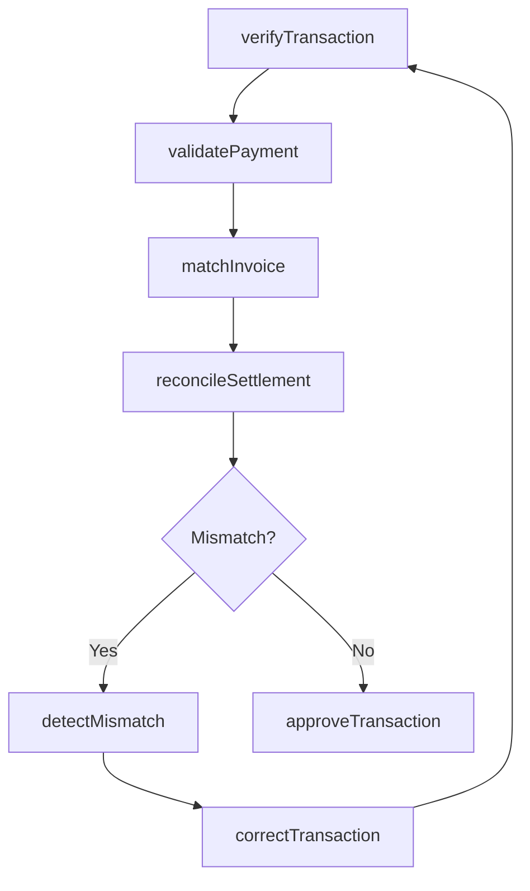
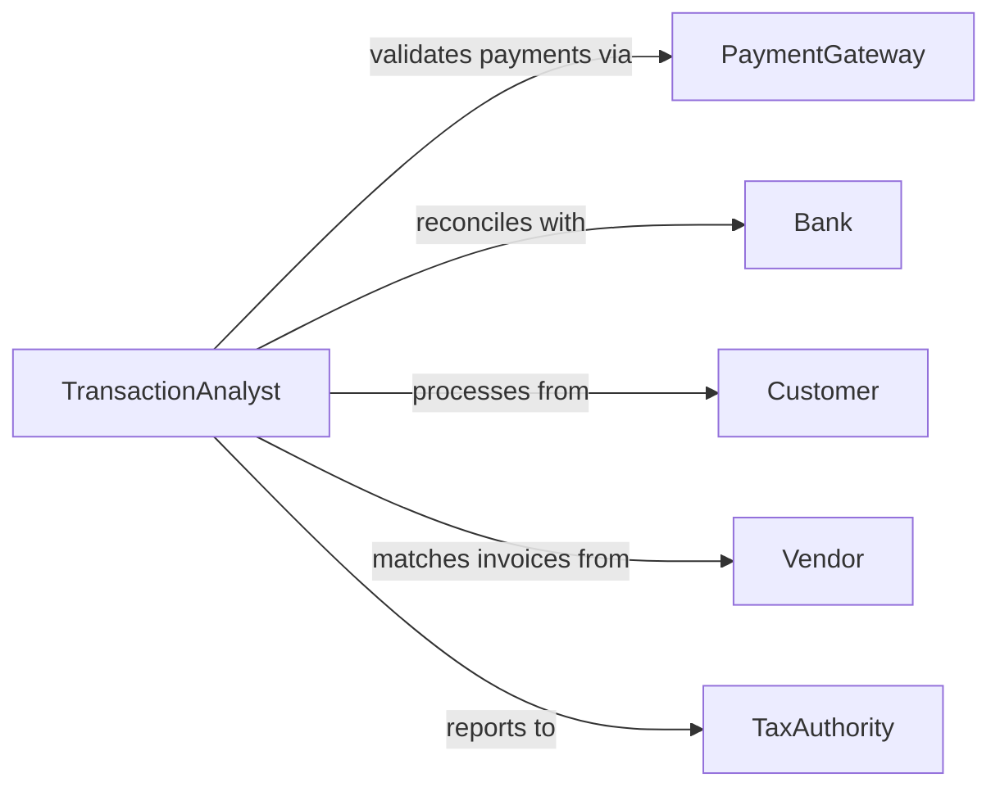

# Verify Accuracy Financial Transactional Data

> Business-as-Code definition for financial transaction data verification. Models validation workflows for payment processing, invoice matching, settlement reconciliation, and transactional compliance.

## Overview

Financial transactional data verification ensures that payments, invoices, receipts, and settlement records are accurate, complete, and properly matched. This definition provides actions for validating transactions at every stage from initiation through settlement and accounting.

## Actors

| Actor | Description |
|-------|-------------|
| PaymentGateway | Processes credit card and electronic payments |
| Bank | Settles funds and provides transaction records |
| Customer | Initiates payments for goods and services |
| Vendor | Receives payments and issues invoices |
| TaxAuthority | Requires accurate transaction reporting |
| Auditor | Reviews transaction compliance and accuracy |

## Roles

| Role | Description |
|------|-------------|
| TransactionAnalyst | Validates transaction data accuracy |
| AccountsPayable | Manages vendor payments and invoices |
| AccountsReceivable | Processes customer payments |
| TreasuryAnalyst | Reconciles bank settlements |

## Entities

| Entity | Description |
|--------|-------------|
| Transaction | A financial exchange of value |
| Invoice | Request for payment with itemized charges |
| Payment | Transfer of funds to settle obligation |
| Settlement | Final clearing of funds between parties |
| Receipt | Proof of payment and transaction completion |
| Mismatch | Discrepancy between transaction records |

## Actions

| Action | Description |
|--------|-------------|
| verifyTransaction | Validate transaction completeness and accuracy |
| matchInvoice | Connect invoice to corresponding payment |
| reconcileSettlement | Match settlement to individual transactions |
| validatePayment | Confirm payment amount and routing |
| detectMismatch | Identify discrepancies in transaction data |
| correctTransaction | Update transaction with verified information |
| approveTransaction | Finalize transaction as accurate and complete |

## Events

| Event | Description |
|-------|-------------|
| transactionVerified | Transaction validation complete |
| invoiceMatched | Invoice paired with corresponding payment |
| settlementReconciled | Settlement matched to transactions |
| paymentValidated | Payment details confirmed accurate |
| mismatchDetected | Discrepancy identified in transaction data |
| transactionCorrected | Transaction updated with corrections |
| transactionApproved | Transaction finalized as accurate |

## Searches

| Search | Description |
|--------|-------------|
| findUnmatchedInvoices | List invoices without paired payments |
| getMismatches | Retrieve transactions with identified discrepancies |
| getUnreconciled | Find settlements not matched to transactions |
| getPendingValidation | List transactions awaiting verification |

## Workflow



## Actor Relationships



## Usage

### Calling Actions

```typescript
import { verifyAccuracyFinancialTransactionalData } from '@headlessly/verify-accuracy-financial-transactional-data'

const transactions = verifyAccuracyFinancialTransactionalData()

// Verify transaction completeness
const result = await transactions.verifyTransaction({
  transactionId: 'txn_20260115_987654',
  includeRelatedDocuments: true
})

// Match invoice to payment
const match = await transactions.matchInvoice({
  invoiceId: 'inv_2026_001234',
  paymentId: 'pmt_567890',
  tolerance: 0.01
})

// Reconcile bank settlement
const reconciliation = await transactions.reconcileSettlement({
  settlementId: 'stl_daily_20260115',
  expectedAmount: 45000.00
})
```

### Event-Driven Automation

```typescript
// Auto-flag mismatched amounts
transactions.mismatchDetected(async ({ transactionId, expectedAmount, actualAmount }) => {
  const variance = Math.abs(expectedAmount - actualAmount)
  if (variance > 100) {
    await notify({
      to: 'treasury-team',
      priority: 'high',
      message: `Transaction ${transactionId} mismatch: $${variance}`
    })
  }
})

// Auto-approve small exact matches
transactions.invoiceMatched(async ({ invoiceId, paymentId, matchConfidence }) => {
  if (matchConfidence === 1.0 && invoice.amount < 500) {
    await transactions.approveTransaction({ transactionId: paymentId })
  }
})
```
