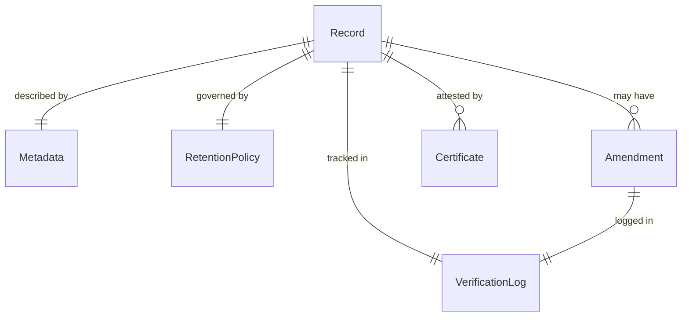
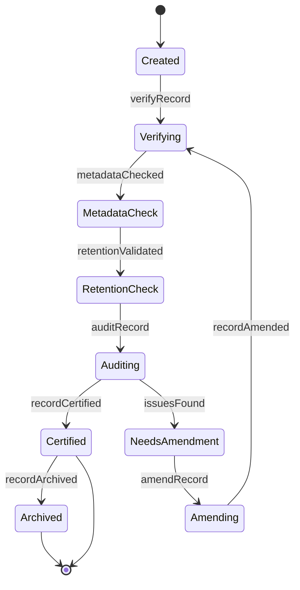
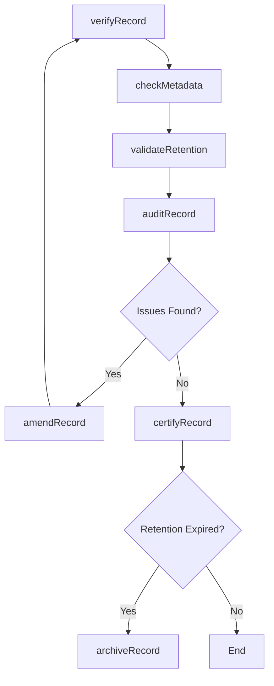
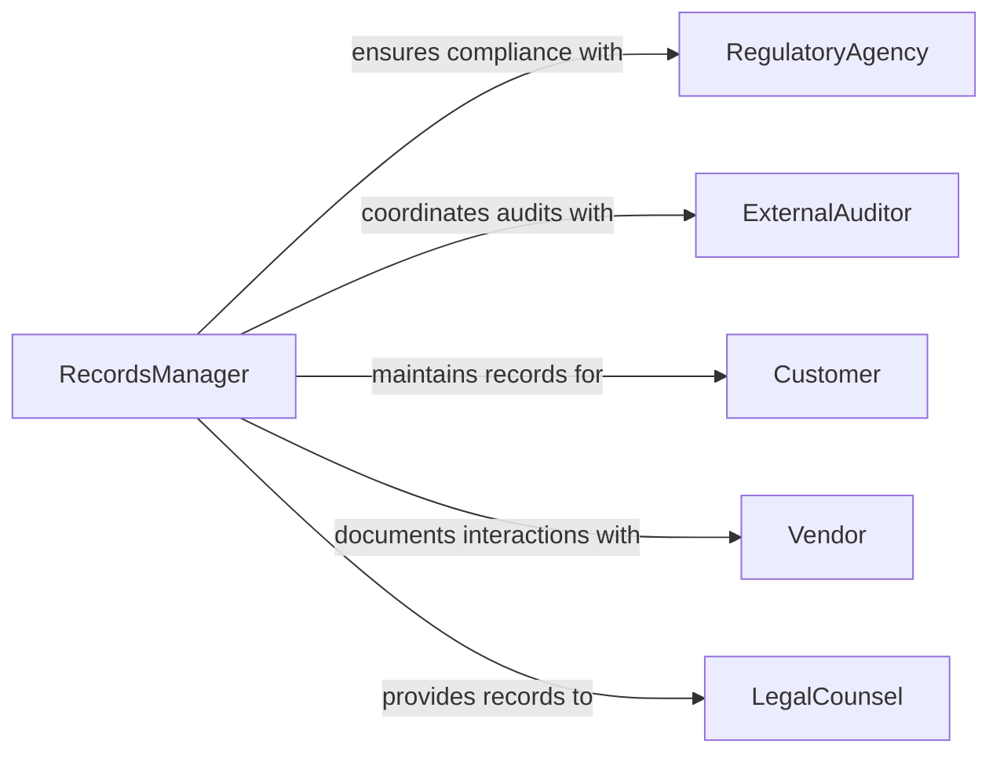

# Verify Accuracy Records

> Business-as-Code definition for general record accuracy verification. Models validation workflows for business records, compliance documentation, operational logs, and system-of-record integrity.

## Overview

Record accuracy verification ensures that business documents, compliance records, and operational logs are complete, current, and properly maintained. This definition provides actions for validating records against retention policies, regulatory requirements, and business standards.

## Actors

| Actor | Description |
|-------|-------------|
| RegulatoryAgency | Sets record-keeping requirements and standards |
| ExternalAuditor | Reviews records for compliance and accuracy |
| Customer | Subject of records or recipient of services documented |
| Vendor | Partner whose interactions are recorded |
| LegalCounsel | Reviews records for legal compliance |
| ArchiveService | Stores long-term or historical records |

## Roles

| Role | Description |
|------|-------------|
| RecordsManager | Oversees record accuracy and retention |
| ComplianceOfficer | Ensures records meet regulatory requirements |
| DataEntry | Creates and updates business records |
| QualityAssurance | Validates record completeness and accuracy |

## Entities

| Entity | Description |
|--------|-------------|
| Record | A documented business transaction or event |
| Metadata | Descriptive information about the record |
| RetentionPolicy | Rules governing record storage and disposal |
| VerificationLog | Audit trail of record validation activities |
| Amendment | Correction or update to existing record |
| Certificate | Attestation of record accuracy |

## Actions

| Action | Description |
|--------|-------------|
| verifyRecord | Validate record completeness and accuracy |
| checkMetadata | Confirm record metadata is current and correct |
| validateRetention | Ensure record complies with retention policy |
| auditRecord | Review record against compliance requirements |
| amendRecord | Update record with corrections |
| certifyRecord | Attest to record accuracy and completeness |
| archiveRecord | Transfer record to long-term storage |

## Events

| Event | Description |
|-------|-------------|
| recordVerified | Record validation complete |
| metadataChecked | Metadata accuracy confirmed |
| retentionValidated | Retention compliance verified |
| recordAudited | Compliance review complete |
| recordAmended | Record updated with corrections |
| recordCertified | Record accuracy attested |
| recordArchived | Record transferred to long-term storage |

## Searches

| Search | Description |
|--------|-------------|
| findIncompleteRecords | List records missing required fields |
| getExpiredRecords | Retrieve records past retention period |
| getPendingAmendments | Find records awaiting corrections |
| getUncertifiedRecords | List records requiring attestation |

## Entity Relationships



## State Diagram



## Workflow



## Actor Relationships



## Usage

### Calling Actions

```typescript
import { verifyAccuracyRecords } from '@headlessly/verify-accuracy-records'

const records = verifyAccuracyRecords()

// Verify a business record
const verification = await records.verifyRecord({
  recordId: 'rec_2026_customer_001234',
  includeHistory: true
})

// Check retention compliance
const retention = await records.validateRetention({
  recordId: 'rec_2026_customer_001234',
  currentDate: '2026-01-15'
})

// Certify record accuracy
await records.certifyRecord({
  recordId: 'rec_2026_customer_001234',
  certifiedBy: 'compliance-officer',
  certificationDate: '2026-01-15'
})
```

### Event-Driven Automation

```typescript
// Auto-archive expired records
records.retentionValidated(async ({ recordId, status }) => {
  if (status === 'expired') {
    await records.archiveRecord({
      recordId,
      archiveDestination: 'long-term-storage'
    })
  }
})

// Notify on critical incomplete records
records.recordVerified(async ({ recordId, completeness, recordType }) => {
  if (completeness < 0.9 && recordType === 'regulatory-filing') {
    await notify({
      to: 'compliance-team',
      priority: 'high',
      message: `Critical record ${recordId} incomplete: ${completeness * 100}%`
    })
  }
})
```
