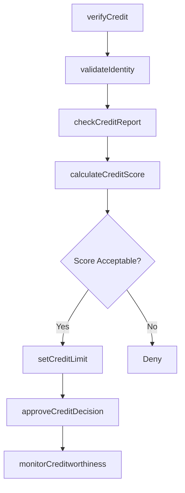
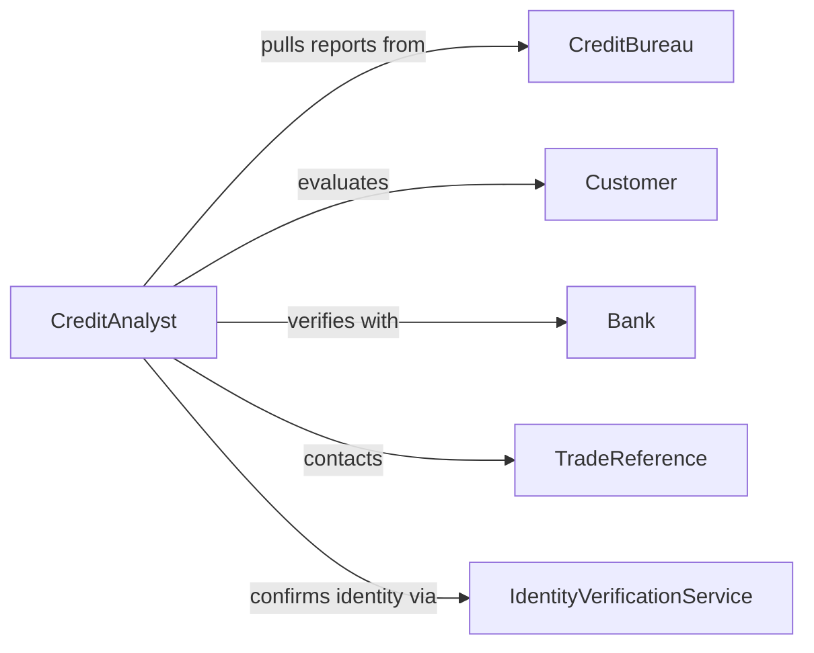

# Verify Customer Credit Information

> Business-as-Code definition for customer credit verification. Models workflows for credit checks, scoring, limit determination, and ongoing creditworthiness monitoring.

## Overview

Customer credit information verification ensures that credit decisions are based on accurate, current data from credit bureaus, financial statements, and payment history. This definition provides actions for validating creditworthiness, setting credit limits, and monitoring for credit risk changes.

## Actors

| Actor | Description |
|-------|-------------|
| CreditBureau | Provides consumer and commercial credit reports |
| Customer | Subject of credit evaluation |
| Bank | Provides financial references and account history |
| TradeReference | Prior vendors who share payment history |
| IdentityVerificationService | Confirms customer identity |
| FraudDetectionService | Screens for identity theft and fraud |

## Roles

| Role | Description |
|------|-------------|
| CreditAnalyst | Evaluates customer creditworthiness |
| CreditManager | Sets credit limits and payment terms |
| RiskOfficer | Monitors portfolio credit risk |
| SalesOperations | Requests credit approvals for orders |

## Entities

| Entity | Description |
|--------|-------------|
| CreditApplication | Formal request for credit terms |
| CreditReport | Detailed credit history from bureau |
| CreditScore | Numerical assessment of creditworthiness |
| CreditLimit | Maximum outstanding balance allowed |
| PaymentHistory | Record of past payment performance |
| CreditDecision | Approval or denial of credit terms |

## Actions

| Action | Description |
|--------|-------------|
| verifyCredit | Validate customer credit information |
| checkCreditReport | Pull and review credit bureau data |
| calculateCreditScore | Compute internal credit risk score |
| validateIdentity | Confirm customer identity and legitimacy |
| setCreditLimit | Establish approved credit terms |
| monitorCreditworthiness | Track ongoing changes in credit risk |
| approveCreditDecision | Finalize credit terms for customer |

## Events

| Event | Description |
|-------|-------------|
| creditVerified | Credit information validation complete |
| creditReportChecked | Credit bureau data reviewed |
| creditScoreCalculated | Internal risk score computed |
| identityValidated | Customer identity confirmed |
| creditLimitSet | Credit terms established |
| creditworthinessMonitored | Ongoing risk assessment updated |
| creditDecisionApproved | Credit terms finalized |

## Searches

| Search | Description |
|--------|-------------|
| findPendingApplications | List credit applications awaiting review |
| getHighRiskCustomers | Retrieve customers with credit scores below threshold |
| getCreditLimitExceeded | Find customers over approved credit limits |
| getRecentChanges | List customers with recent credit score changes |

## Workflow



## Actor Relationships



## Usage

### Calling Actions

```typescript
import { verifyCustomerCreditInformation } from '@headlessly/verify-customer-credit-information'

const credit = verifyCustomerCreditInformation()

// Verify credit for new customer
const verification = await credit.verifyCredit({
  customerId: 'cust_2026_12345',
  requestedCreditLimit: 50000
})

// Pull credit report
const report = await credit.checkCreditReport({
  customerId: 'cust_2026_12345',
  bureaus: ['Experian', 'Equifax', 'Dun & Bradstreet']
})

// Set approved credit limit
await credit.setCreditLimit({
  customerId: 'cust_2026_12345',
  limit: 25000,
  terms: 'Net 30'
})
```

### Event-Driven Automation

```typescript
// Auto-deny low scores
credit.creditScoreCalculated(async ({ customerId, score }) => {
  if (score < 550) {
    await notify({
      to: 'sales-team',
      message: `Credit application denied for ${customerId}: score ${score}`
    })
  }
})

// Alert on credit limit exceeded
credit.creditworthinessMonitored(async ({ customerId, currentBalance, creditLimit }) => {
  if (currentBalance > creditLimit * 0.95) {
    await notify({
      to: 'credit-manager',
      priority: 'high',
      message: `Customer ${customerId} at ${(currentBalance / creditLimit * 100).toFixed(0)}% of credit limit`
    })
  }
})
```
