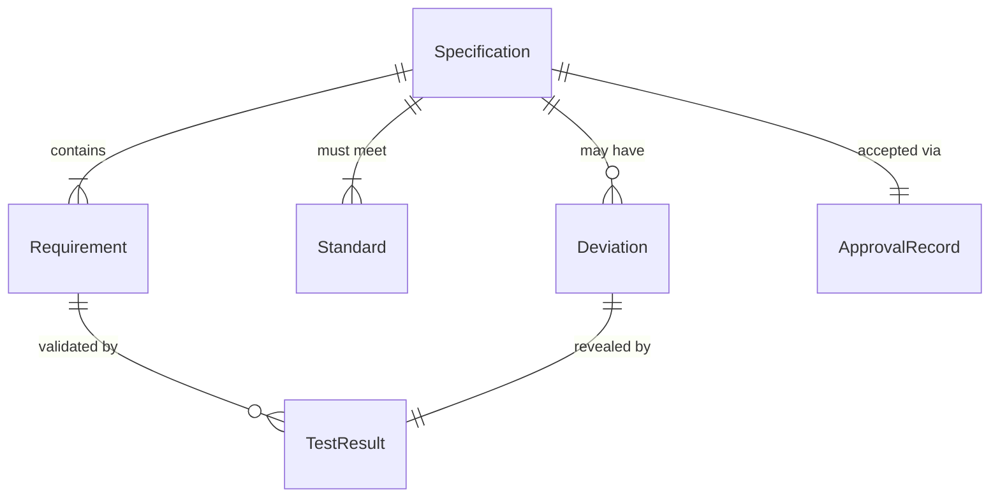
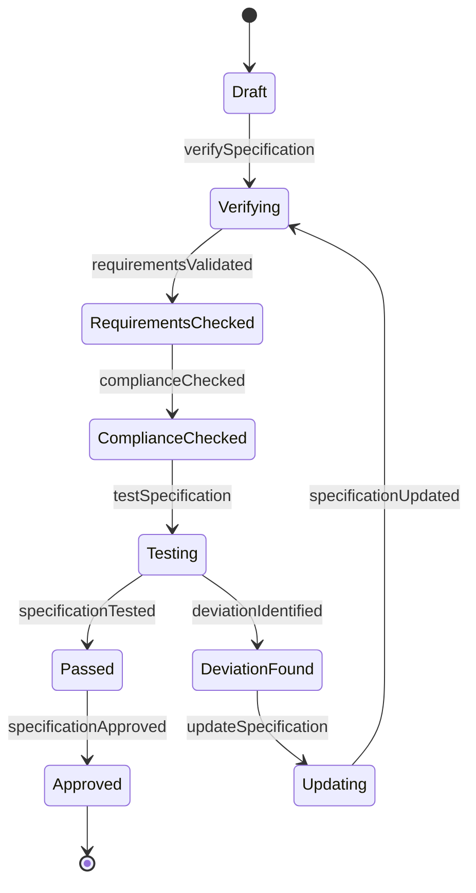
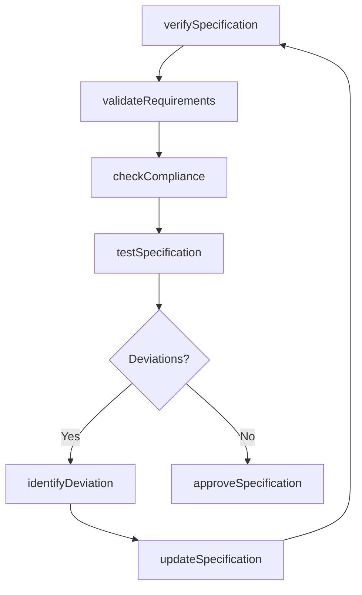
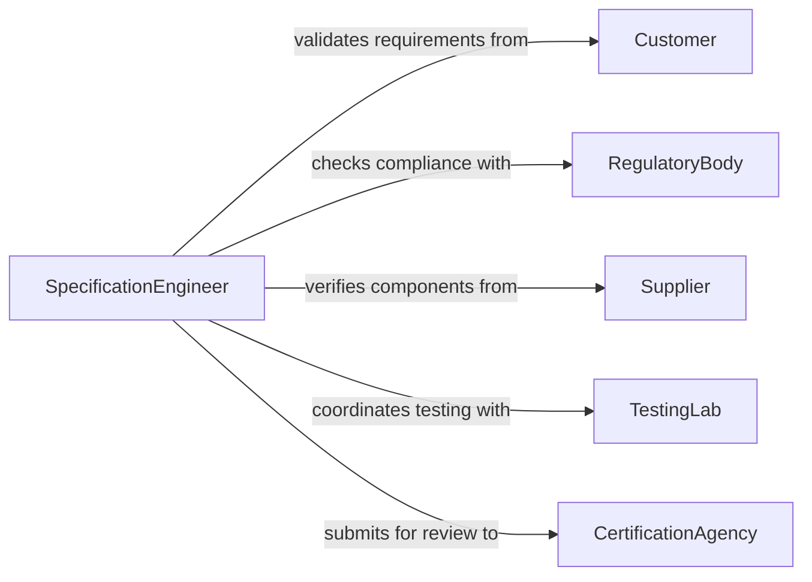

# Verify Information Specifications

> Business-as-Code definition for technical specification verification. Models validation workflows for product specs, engineering requirements, design documents, and technical compliance.

## Overview

Information and specification verification ensures that technical documentation, product requirements, and engineering specifications are accurate, complete, and consistent with standards. This definition provides actions for validating specifications against industry standards, design constraints, and customer requirements.

## Actors

| Actor | Description |
|-------|-------------|
| Customer | Provides requirements and acceptance criteria |
| RegulatoryBody | Sets industry standards and compliance requirements |
| Supplier | Provides component specifications |
| CertificationAgency | Validates compliance with standards |
| TestingLab | Performs verification testing |
| Designer | Creates original specification documents |

## Roles

| Role | Description |
|------|-------------|
| SpecificationEngineer | Validates technical documentation |
| QualityEngineer | Ensures specs meet quality standards |
| ComplianceOfficer | Verifies regulatory compliance |
| TechnicalWriter | Documents and maintains specifications |

## Entities

| Entity | Description |
|--------|-------------|
| Specification | Detailed technical requirement document |
| Requirement | Individual technical criterion or constraint |
| Standard | Industry or regulatory benchmark |
| TestResult | Outcome of specification validation testing |
| Deviation | Non-conformance to specification |
| ApprovalRecord | Formal acceptance of specification |

## Actions

| Action | Description |
|--------|-------------|
| verifySpecification | Validate specification completeness and accuracy |
| checkCompliance | Confirm conformance to standards |
| validateRequirements | Ensure requirements are testable and achievable |
| testSpecification | Perform verification testing |
| identifyDeviation | Document non-conformance to specification |
| updateSpecification | Revise specification with corrections |
| approveSpecification | Formally accept specification as valid |

## Events

| Event | Description |
|-------|-------------|
| specificationVerified | Specification validation complete |
| complianceChecked | Standards conformance confirmed |
| requirementsValidated | Requirements verified as testable |
| specificationTested | Verification testing complete |
| deviationIdentified | Non-conformance documented |
| specificationUpdated | Specification revised with corrections |
| specificationApproved | Specification formally accepted |

## Searches

| Search | Description |
|--------|-------------|
| findPendingSpecs | List specifications awaiting verification |
| getDeviations | Retrieve non-conformances by severity |
| getUnapprovedSpecs | Find specifications pending approval |
| getComplianceGaps | List specifications not meeting standards |

## Entity Relationships



## State Diagram



## Workflow



## Actor Relationships



## Usage

### Calling Actions

```typescript
import { verifyInformationSpecifications } from '@headlessly/verify-information-specifications'

const specs = verifyInformationSpecifications()

// Verify product specification
const verification = await specs.verifySpecification({
  specId: 'spec_2026_widget_v2',
  includeTestResults: true
})

// Check compliance with industry standards
const compliance = await specs.checkCompliance({
  specId: 'spec_2026_widget_v2',
  standards: ['ISO-9001', 'UL-1234', 'CE-EN-5678']
})

// Approve specification
await specs.approveSpecification({
  specId: 'spec_2026_widget_v2',
  approvedBy: 'chief-engineer',
  effectiveDate: '2026-02-01'
})
```

### Event-Driven Automation

```typescript
// Auto-flag critical deviations
specs.deviationIdentified(async ({ specId, severity, deviation }) => {
  if (severity === 'critical') {
    await notify({
      to: 'engineering-management',
      priority: 'urgent',
      message: `Critical deviation in ${specId}: ${deviation}`
    })
  }
})

// Trigger certification workflow
specs.specificationApproved(async ({ specId, requiresCertification }) => {
  if (requiresCertification) {
    await certificationWorkflow.initiate({
      specId,
      certificationBodies: ['UL', 'CE']
    })
  }
})
```
