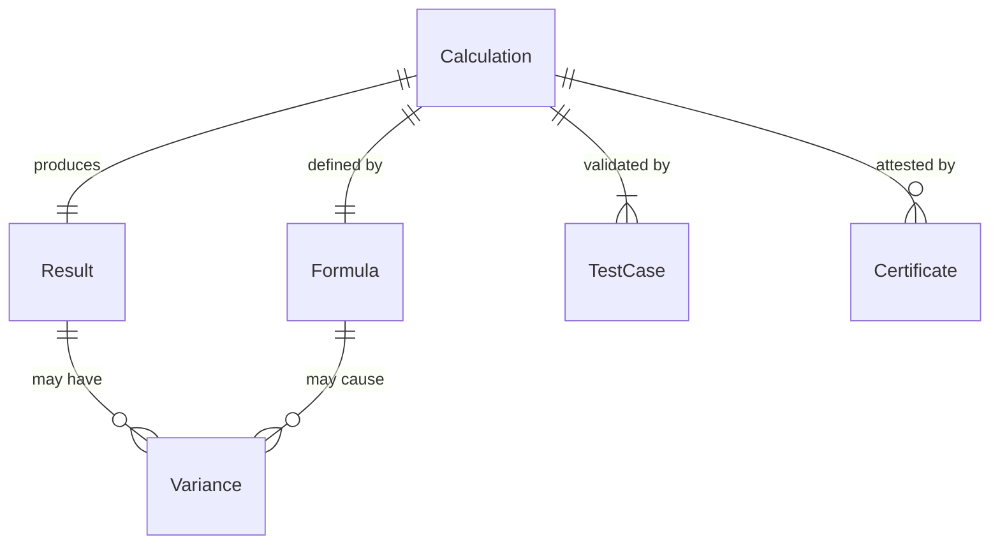
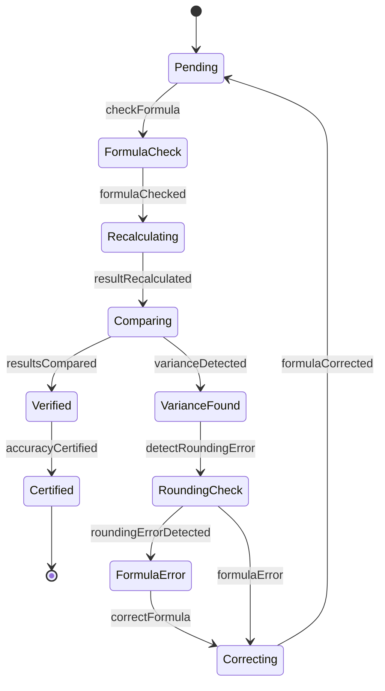
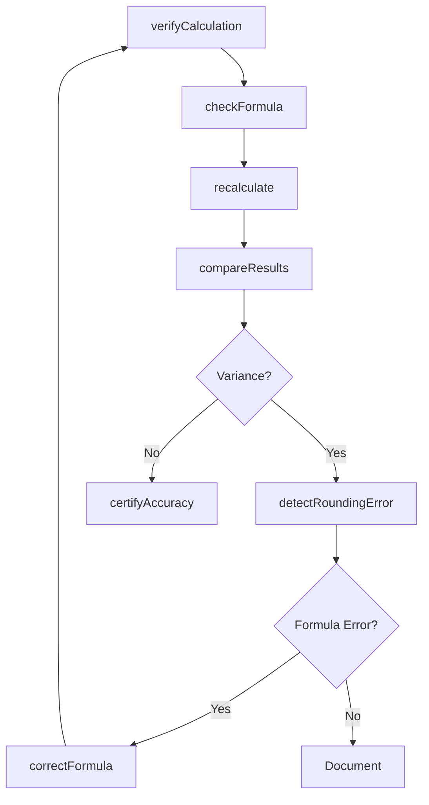
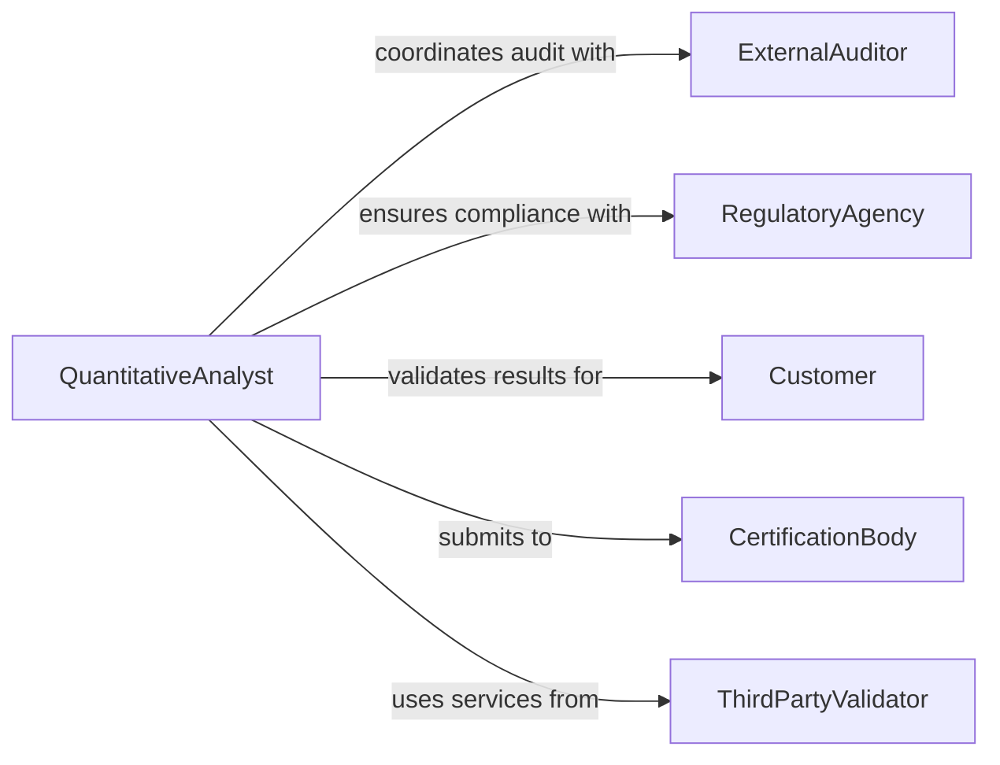

# Verify Mathematical Calculations

> Business-as-Code definition for mathematical calculation verification. Models validation workflows for financial formulas, engineering computations, statistical analysis, and algorithmic results.

## Overview

Mathematical calculation verification ensures that formulas, computations, and quantitative analyses produce accurate and reproducible results. This definition provides actions for validating calculations, detecting rounding errors, and certifying computational accuracy across business and technical domains.

## Actors

| Actor | Description |
|-------|-------------|
| ExternalAuditor | Reviews calculation accuracy for compliance |
| RegulatoryAgency | Sets standards for calculation methods |
| Customer | Relies on accurate pricing and billing calculations |
| CertificationBody | Validates algorithmic accuracy |
| ThirdPartyValidator | Provides independent verification services |
| Software | Executes automated calculations |

## Roles

| Role | Description |
|------|-------------|
| QuantitativeAnalyst | Validates complex mathematical models |
| Accountant | Verifies financial calculations |
| Engineer | Checks engineering computations |
| DataScientist | Validates statistical and algorithmic results |

## Entities

| Entity | Description |
|--------|-------------|
| Calculation | A mathematical computation or formula |
| Formula | Mathematical expression defining computation |
| Result | Output of calculation |
| Variance | Difference between expected and computed result |
| TestCase | Input and expected output for validation |
| Certificate | Attestation of calculation accuracy |

## Actions

| Action | Description |
|--------|-------------|
| verifyCalculation | Validate calculation accuracy and logic |
| checkFormula | Confirm formula correctness |
| recalculate | Re-execute calculation for verification |
| compareResults | Check calculation against expected values |
| detectRoundingError | Identify precision or rounding issues |
| certifyAccuracy | Attest to calculation correctness |
| correctFormula | Update formula with verified correction |

## Events

| Event | Description |
|-------|-------------|
| calculationVerified | Calculation validation complete |
| formulaChecked | Formula correctness confirmed |
| resultRecalculated | Calculation re-executed for verification |
| resultsCompared | Calculation checked against expected values |
| roundingErrorDetected | Precision issue identified |
| accuracyCertified | Calculation correctness attested |
| formulaCorrected | Formula updated with correction |

## Searches

| Search | Description |
|--------|-------------|
| findFailedCalculations | List calculations with incorrect results |
| getRoundingErrors | Retrieve calculations with precision issues |
| getUncertifiedResults | Find calculations pending attestation |
| getVariances | List calculations exceeding variance threshold |

## Entity Relationships



## State Diagram



## Workflow



## Actor Relationships



## Usage

### Calling Actions

```typescript
import { verifyMathematicalCalculations } from '@headlessly/verify-mathematical-calculations'

const calculations = verifyMathematicalCalculations()

// Verify pricing calculation
const verification = await calculations.verifyCalculation({
  calculationId: 'calc_price_discount_2026',
  inputs: { basePrice: 1000, discountPercent: 15 },
  expectedResult: 850
})

// Recalculate for independent verification
const result = await calculations.recalculate({
  calculationId: 'calc_price_discount_2026',
  method: 'independent'
})

// Certify calculation accuracy
await calculations.certifyAccuracy({
  calculationId: 'calc_price_discount_2026',
  certifiedBy: 'senior-analyst',
  certificationDate: '2026-01-15'
})
```

### Event-Driven Automation

```typescript
// Auto-flag significant variances
calculations.resultsCompared(async ({ calculationId, variance }) => {
  if (Math.abs(variance) > 0.01) {
    await notify({
      to: 'analytics-team',
      priority: 'high',
      message: `Calculation ${calculationId} variance: ${variance}`
    })
  }
})

// Auto-correct common rounding errors
calculations.roundingErrorDetected(async ({ calculationId, precision }) => {
  if (precision < 0.001) {
    await calculations.correctFormula({
      calculationId,
      fix: 'increase-decimal-precision'
    })
  }
})
```
