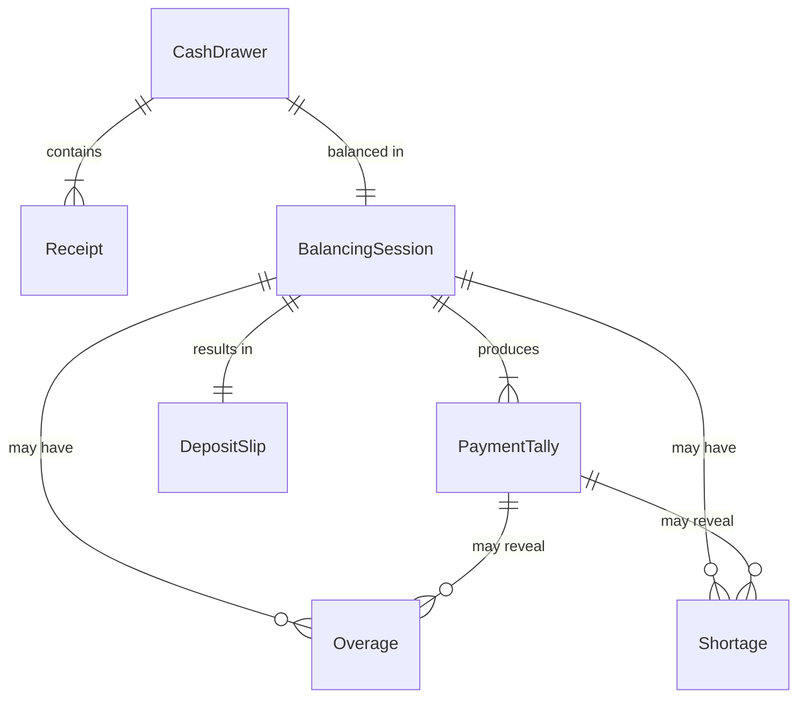
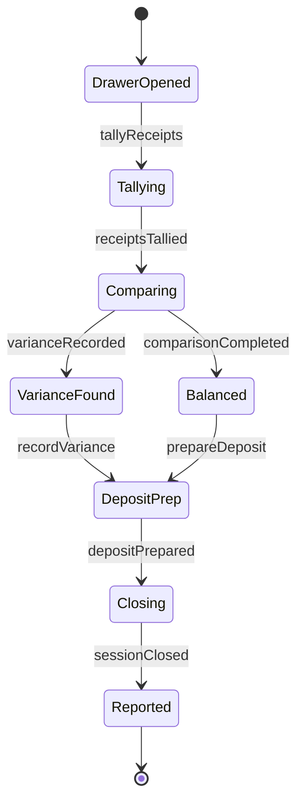
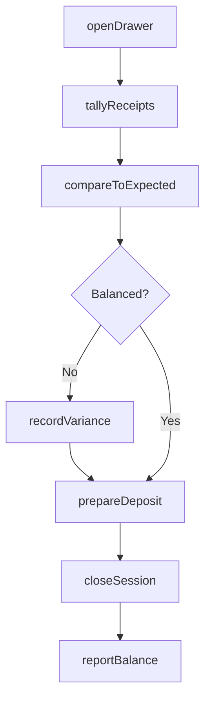
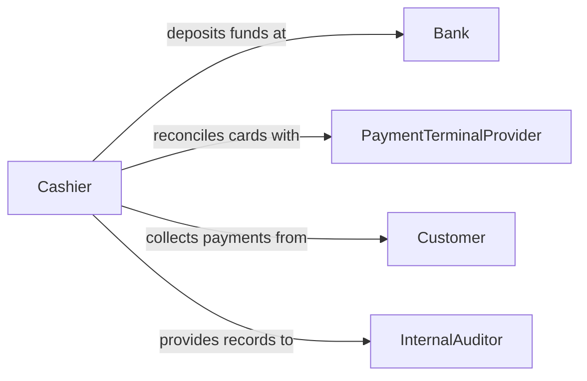

# Balance Receipts

> Business-as-Code definition for balancing receipts. Models the verification, tallying, and reconciliation of cash register tapes, payment receipts, and deposit records against expected totals at shift or period close.

## Overview

Balancing receipts involves counting and verifying all forms of payment received during a business period, comparing them against recorded sales transactions, and resolving any differences before preparing deposits. This definition provides actions for opening and closing cash drawers, tallying payment types, identifying overages or shortages, and preparing bank deposits. It supports retail cashiers, office administrators, and accounting staff who handle daily receipt balancing.

## Actors

| Actor | Description |
|-------|-------------|
| Bank | Receives balanced deposits and provides deposit confirmations |
| PaymentTerminalProvider | Supplies electronic payment processing and settlement data |
| Customer | Makes payments that generate receipts to be balanced |
| InternalAuditor | Reviews receipt balancing accuracy and controls |

## Roles

| Role | Description |
|------|-------------|
| Cashier | Handles payments and performs end-of-shift balancing |
| ShiftSupervisor | Verifies balanced totals and authorizes deposits |
| Bookkeeper | Records balanced receipt totals in the accounting system |

## Entities

| Entity | Description |
|--------|-------------|
| CashDrawer | A physical or logical register containing cash and payment records |
| Receipt | A record of an individual payment transaction |
| BalancingSession | A period-end process of tallying and verifying all receipts |
| PaymentTally | The counted total for a specific payment type such as cash, card, or check |
| Overage | An excess of actual cash over the expected balance |
| Shortage | A deficit of actual cash below the expected balance |
| DepositSlip | A prepared record of funds ready for bank deposit |

## Actions

| Action | Description |
|--------|-------------|
| openDrawer | Initialize a cash drawer with a starting balance for a shift |
| tallyReceipts | Count and categorize all payment receipts by type |
| compareToExpected | Match tallied totals against POS-recorded transaction sums |
| recordVariance | Document any overage or shortage found during balancing |
| prepareDeposit | Assemble balanced funds and documentation for bank deposit |
| closeSession | Finalize the balancing session and lock the record |
| reportBalance | Submit the balanced totals to accounting |

## Events

| Event | Description |
|-------|-------------|
| drawerOpened | A cash drawer has been initialized for a new shift |
| receiptsTallied | All payment receipts have been counted and categorized |
| comparisonCompleted | Tallied totals have been compared to expected values |
| varianceRecorded | An overage or shortage has been documented |
| depositPrepared | Funds and documentation are ready for bank deposit |
| sessionClosed | The balancing session has been finalized |
| balanceReported | Balanced totals have been submitted to accounting |

## Searches

| Search | Description |
|--------|-------------|
| findSessions | List balancing sessions by date, cashier, or register |
| getVariances | Retrieve overages and shortages by session or date range |
| getDepositHistory | Track bank deposits prepared from balanced sessions |
| getTallyByPaymentType | Break down receipt totals by cash, card, check, or other methods |
| findUnbalancedSessions | Identify sessions with unresolved variances |

## Entity Relationships



## State Diagram



## Workflow



## Actor Relationships



## Usage

### Calling Actions

```typescript
import { balanceReceipts } from '@headlessly/balance-receipts'

const balancer = balanceReceipts()

// Open a drawer for the morning shift
const drawer = await balancer.openDrawer({
  registerId: 'register-04',
  cashierId: 'emp-martinez-221',
  startingBalance: 200.00
})

// Tally receipts at end of shift
const tally = await balancer.tallyReceipts({
  drawerId: drawer.id,
  paymentTypes: ['cash', 'credit', 'debit', 'check']
})

// Compare and prepare deposit
const comparison = await balancer.compareToExpected({ drawerId: drawer.id })
await balancer.prepareDeposit({
  drawerId: drawer.id,
  cashAmount: tally.cash,
  checkAmount: tally.check
})
```

### Event-Driven Automation

```typescript
// Alert supervisor on significant shortage
balancer.varianceRecorded(async ({ drawerId, type, amount }) => {
  if (type === 'shortage' && amount > 20) {
    await notify({
      to: 'shift-supervisor',
      message: `Cash shortage of $${amount} on drawer ${drawerId}`
    })
  }
})

// Auto-submit to accounting after session close
balancer.sessionClosed(async ({ sessionId }) => {
  await balancer.reportBalance({ sessionId, destination: 'general-ledger' })
})
```
