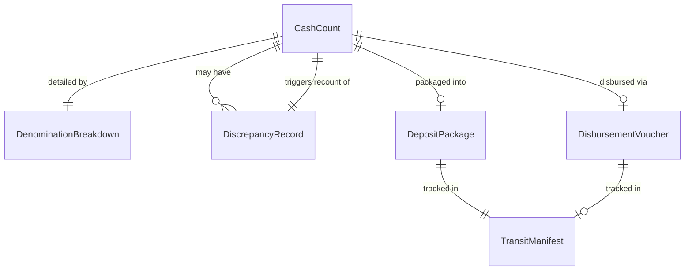
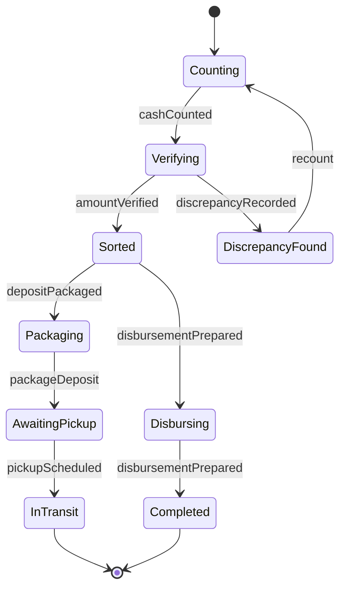
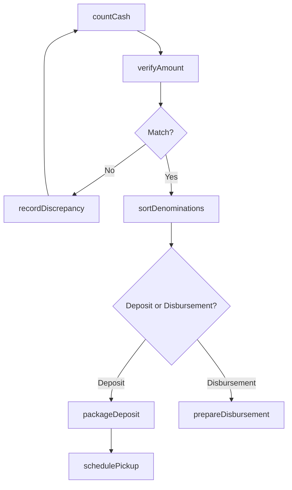
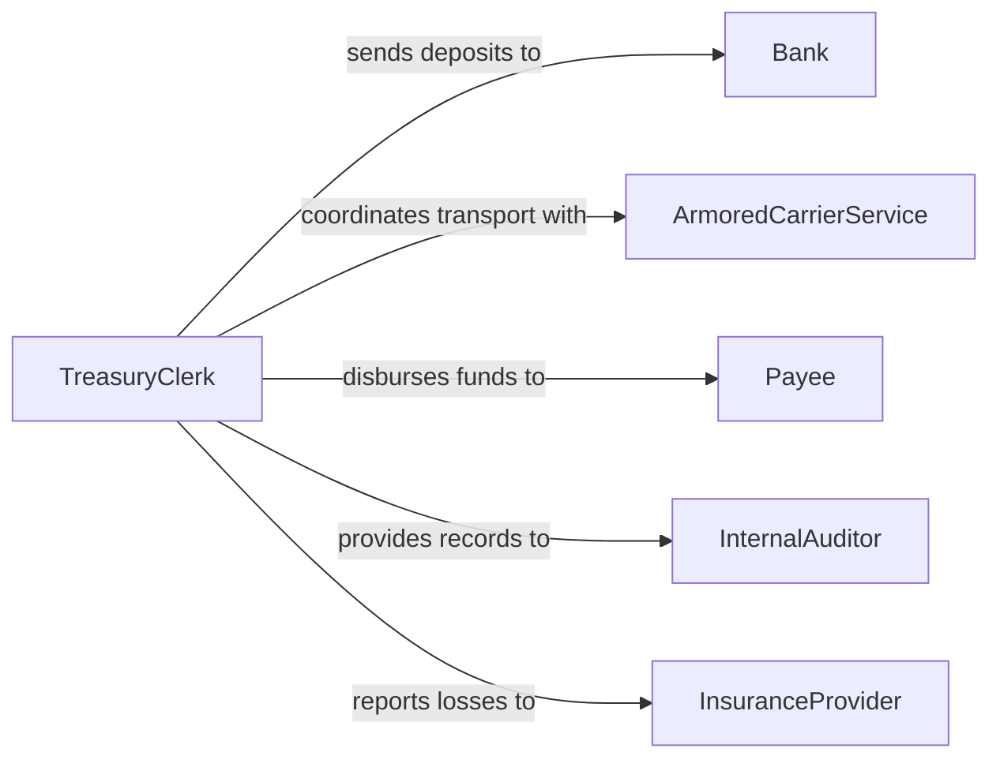

# Prepare Cash for Deposit or Disbursement

> Business-as-Code definition for preparing cash for deposit or disbursement. Models the counting, verification, packaging, and documentation of currency and coin for bank deposits or cash payouts.

## Overview

Preparing cash for deposit or disbursement involves counting currency and coin, verifying amounts against source records, packaging funds according to banking standards, and completing deposit slips or disbursement vouchers. This definition provides actions for cash counting, denomination sorting, discrepancy resolution, and secure handoff. It supports cash office personnel, bank tellers, and treasury operations staff.

## Actors

| Actor | Description |
|-------|-------------|
| Bank | Receives prepared deposits and processes cash transactions |
| ArmoredCarrierService | Transports prepared cash between locations and the bank |
| Payee | Receives cash disbursements for wages, refunds, or petty cash |
| InternalAuditor | Reviews cash handling procedures and documentation |
| InsuranceProvider | Covers losses from cash handling and transit |

## Roles

| Role | Description |
|------|-------------|
| CashHandler | Counts, sorts, and packages currency and coin |
| TreasuryClerk | Prepares deposit slips and disbursement vouchers |
| Supervisor | Verifies cash counts and authorizes large disbursements |

## Entities

| Entity | Description |
|--------|-------------|
| CashCount | A recorded tally of currency and coin by denomination |
| DepositPackage | A sealed container of verified cash with accompanying documentation |
| DisbursementVoucher | Authorization and record of a cash payout |
| DenominationBreakdown | A listing of bills and coins by face value |
| DiscrepancyRecord | Documentation of a difference between expected and counted cash |
| TransitManifest | A record of cash packages in transit to the bank or payee |

## Actions

| Action | Description |
|--------|-------------|
| countCash | Tally currency and coin by denomination |
| verifyAmount | Compare the counted total against the expected source amount |
| sortDenominations | Organize bills and coins into standard denomination groupings |
| packageDeposit | Seal counted and verified cash into a deposit-ready package |
| prepareDisbursement | Assemble cash and documentation for a payout |
| recordDiscrepancy | Document any difference between counted and expected amounts |
| schedulePickup | Arrange armored carrier or courier for cash transport |

## Events

| Event | Description |
|-------|-------------|
| cashCounted | Currency and coin have been tallied by denomination |
| amountVerified | Counted cash matches the expected total |
| denominationsSorted | Bills and coins have been organized by face value |
| depositPackaged | Cash has been sealed and documented for bank deposit |
| disbursementPrepared | Cash and voucher are ready for payout |
| discrepancyRecorded | A cash count variance has been documented |
| pickupScheduled | Armored carrier transport has been arranged |

## Searches

| Search | Description |
|--------|-------------|
| findDeposits | List deposit packages by date, amount, or status |
| getDisbursements | Retrieve cash payouts by date, payee, or purpose |
| getDiscrepancies | Find cash count variances by date or handler |
| getTransitStatus | Track cash packages currently in transit |
| getDenominationInventory | Summarize available cash by denomination |

## Entity Relationships



## State Diagram



## Workflow



## Actor Relationships



## Usage

### Calling Actions

```typescript
import { prepareCashDepositDisbursement } from '@headlessly/prepare-cash-deposit-disbursement'

const cashOps = prepareCashDepositDisbursement()

// Count and verify cash
const count = await cashOps.countCash({
  sourceId: 'register-04-shift-close',
  denominations: {
    hundreds: 12, fifties: 8, twenties: 45,
    tens: 22, fives: 30, ones: 88,
    quarters: 120, dimes: 200
  }
})

await cashOps.verifyAmount({
  countId: count.id,
  expectedTotal: 3247.50
})

// Package for deposit
await cashOps.packageDeposit({
  countId: count.id,
  depositSlipNumber: 'DS-2026-02-05-003',
  bankAccount: 'acct-7821'
})
```

### Event-Driven Automation

```typescript
// Flag discrepancies over threshold
cashOps.discrepancyRecorded(async ({ countId, difference }) => {
  if (Math.abs(difference) > 50) {
    await notify({
      to: 'treasury-supervisor',
      message: `Cash discrepancy of $${difference} on count ${countId}`
    })
  }
})

// Auto-schedule pickup when deposit is packaged
cashOps.depositPackaged(async ({ packageId, amount }) => {
  if (amount > 10000) {
    await cashOps.schedulePickup({ packageId, carrier: 'brinks' })
  }
})
```
