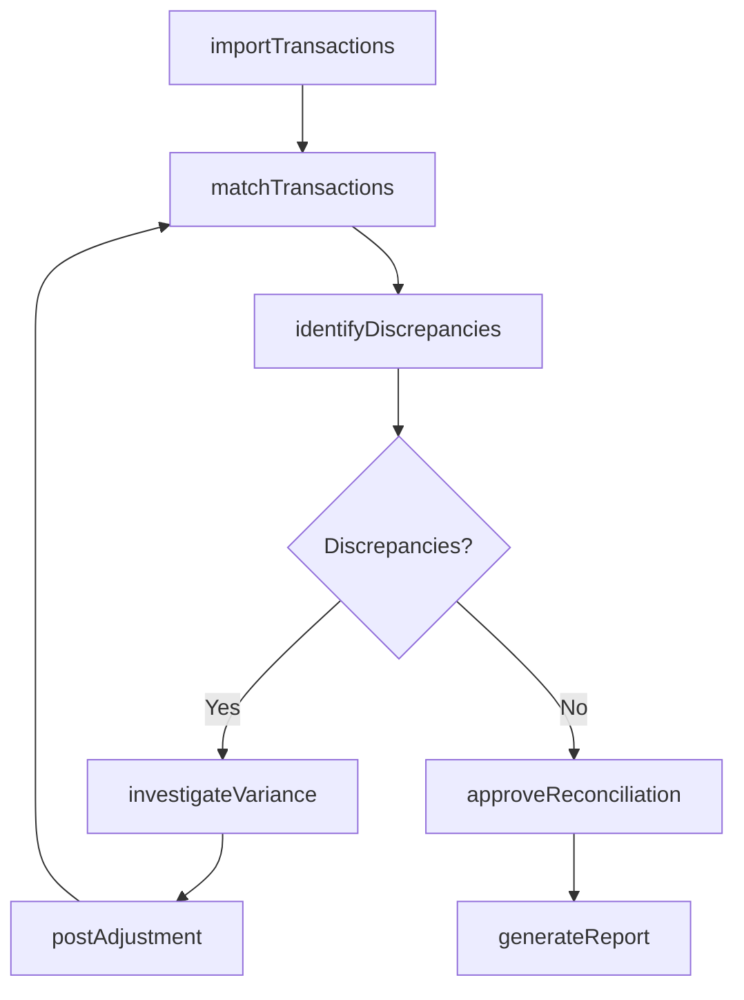
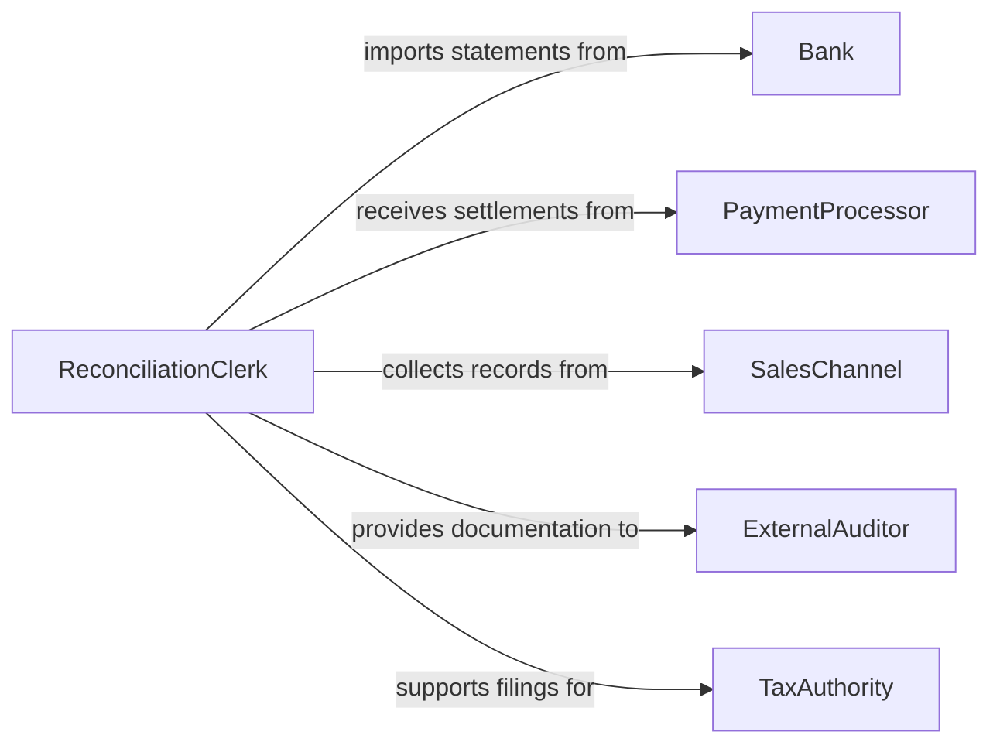

# Reconcile Records of Sales or Other Financial Transactions

> Business-as-Code definition for reconciling sales and financial transaction records. Models the matching, variance detection, and resolution of discrepancies between transaction sources such as point-of-sale systems, bank statements, and general ledger entries.

## Overview

Reconciling records of sales or other financial transactions involves comparing transaction data from multiple systems to ensure consistency and accuracy. This definition provides actions for importing transaction feeds, matching entries across sources, identifying discrepancies, investigating root causes, and posting adjustments. It supports accounting departments, controllers, and financial operations teams who must maintain accurate books across sales channels, payment processors, and banking records.

## Actors

| Actor | Description |
|-------|-------------|
| Bank | Provides statements and cleared transaction data |
| PaymentProcessor | Supplies settlement reports for credit card and digital payments |
| SalesChannel | Generates point-of-sale or e-commerce transaction records |
| ExternalAuditor | Reviews reconciliation accuracy and supporting documentation |
| TaxAuthority | Requires reconciled records for tax filing and compliance |
| CustomerServiceTeam | Reports disputed transactions that may affect reconciliation |

## Roles

| Role | Description |
|------|-------------|
| ReconciliationClerk | Performs day-to-day matching and variance investigation |
| AccountingManager | Oversees reconciliation processes and approves adjustments |
| FinancialController | Reviews reconciliation outcomes for period close |
| SystemsAdministrator | Manages data feeds and integration between transaction sources |

## Entities

| Entity | Description |
|--------|-------------|
| TransactionRecord | A single financial transaction from any source system |
| ReconciliationBatch | A set of transactions being reconciled for a specific period |
| MatchedPair | Two or more transaction records confirmed as representing the same event |
| Discrepancy | A difference between expected and actual transaction values |
| Adjustment | A correcting entry posted to resolve a reconciliation discrepancy |
| ReconciliationReport | A summary of matched, unmatched, and adjusted transactions |

## Actions

| Action | Description |
|--------|-------------|
| importTransactions | Load transaction data from sales, banking, and payment sources |
| matchTransactions | Compare records across sources to find matching pairs |
| identifyDiscrepancies | Flag unmatched or mismatched transaction records |
| investigateVariance | Research the root cause of a reconciliation discrepancy |
| postAdjustment | Create a correcting entry to resolve an identified discrepancy |
| approveReconciliation | Sign off on the reconciliation for the period |
| generateReport | Produce a reconciliation summary with match rates and exceptions |

## Events

| Event | Description |
|-------|-------------|
| transactionsImported | Transaction data has been loaded from source systems |
| transactionsMatched | Records have been paired across sources |
| discrepancyIdentified | An unmatched or mismatched record has been flagged |
| varianceInvestigated | Root cause analysis for a discrepancy has been completed |
| adjustmentPosted | A correcting entry has been recorded in the ledger |
| reconciliationApproved | The reconciliation for the period has been signed off |
| reportGenerated | A reconciliation summary has been produced |

## Searches

| Search | Description |
|--------|-------------|
| findUnmatchedRecords | List transactions that have not been paired to a counterpart |
| getDiscrepancies | Retrieve flagged discrepancies by amount, source, or date |
| getMatchRate | Calculate the percentage of successfully matched transactions |
| findAdjustments | Locate correcting entries by period or discrepancy type |
| getReconciliationHistory | Track reconciliation outcomes across multiple periods |

## Workflow



## Actor Relationships



## Usage

### Calling Actions

```typescript
import { reconcileRecordsSalesFinancialTransactions } from '@headlessly/reconcile-records-sales-financial-transactions'

const reconciler = reconcileRecordsSalesFinancialTransactions()

// Import transaction feeds for the period
await reconciler.importTransactions({
  period: { start: '2026-01-01', end: '2026-01-31' },
  sources: ['pos-system', 'stripe-settlements', 'chase-bank-statement']
})

// Run matching
const result = await reconciler.matchTransactions({
  period: '2026-01',
  tolerance: 0.01
})

// Investigate and resolve discrepancies
const discrepancies = await reconciler.identifyDiscrepancies({ period: '2026-01' })
for (const d of discrepancies) {
  await reconciler.investigateVariance({ discrepancyId: d.id })
}
```

### Event-Driven Automation

```typescript
// Escalate high-value discrepancies
reconciler.discrepancyIdentified(async ({ discrepancyId, amount }) => {
  if (Math.abs(amount) > 5000) {
    await notify({
      to: 'financial-controller',
      message: `High-value discrepancy of $${amount} requires review`
    })
  }
})

// Auto-generate report after approval
reconciler.reconciliationApproved(async ({ period }) => {
  await reconciler.generateReport({ period, format: 'pdf' })
})
```
