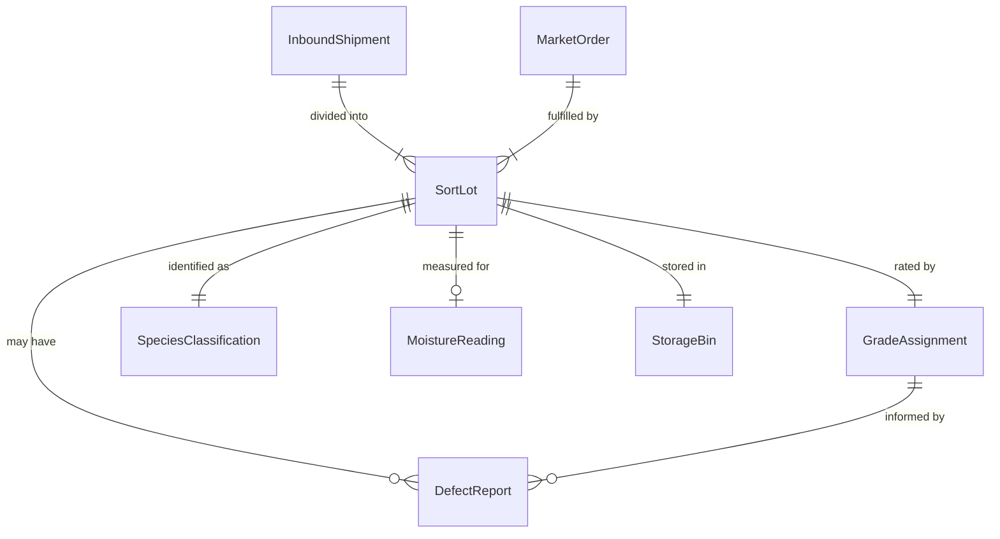
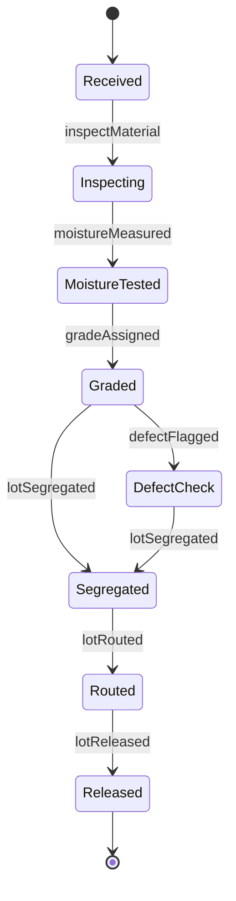
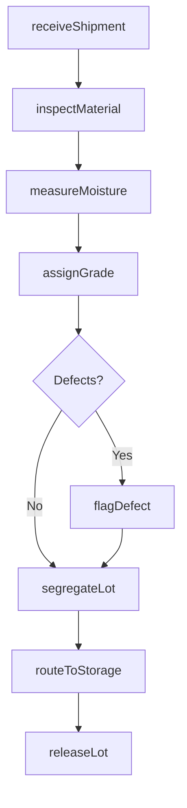
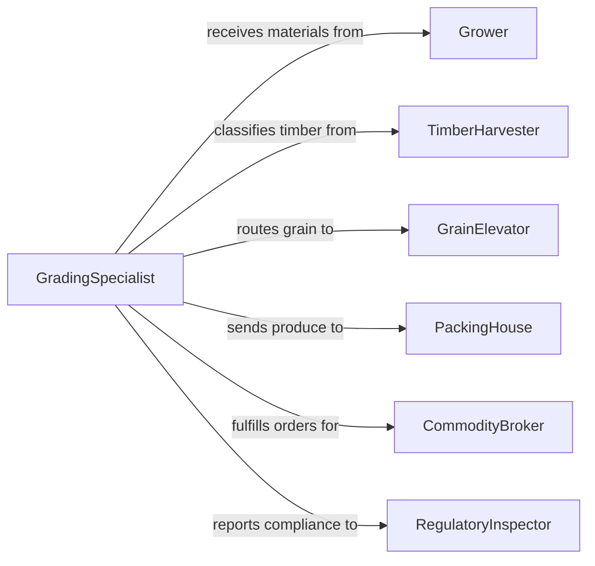

# Sort Forestry or Agricultural Materials

> Business-as-Code definition for sorting forestry and agricultural materials. Models the grading, classification, and routing of timber, produce, grain, and other natural commodities by quality, species, and market destination.

## Overview

Forestry and agricultural material sorting involves evaluating raw harvested goods and classifying them by species, grade, moisture content, size, and defect levels. This definition exposes actions for intake inspection, grade assignment, lot segregation, and routing to storage or market channels. It supports operations ranging from sawmill log sorting to grain elevator classification and produce packing house grading.

## Actors

| Actor | Description |
|-------|-------------|
| Grower | Delivers harvested agricultural products for grading and sorting |
| TimberHarvester | Supplies raw logs and forestry materials for classification |
| GrainElevator | Receives and stores sorted grain by class and moisture level |
| PackingHouse | Processes and packages sorted produce for retail distribution |
| CommodityBroker | Purchases sorted materials based on grade and specification |
| RegulatoryInspector | Verifies compliance with grading standards and phytosanitary requirements |

## Roles

| Role | Description |
|------|-------------|
| SortingOperator | Performs physical inspection and classification of incoming materials |
| GradingSpecialist | Assigns quality grades based on established commodity standards |
| InventoryCoordinator | Tracks sorted lots and manages storage allocation |
| QualityAssuranceManager | Oversees grading consistency and compliance with standards |

## Entities

| Entity | Description |
|--------|-------------|
| InboundShipment | A delivery of raw forestry or agricultural materials |
| SortLot | A grouped quantity of materials sharing the same classification |
| GradeAssignment | A quality rating applied to a lot based on inspection criteria |
| SpeciesClassification | Identification of timber species or crop variety |
| MoistureReading | Measured moisture content affecting grade and storage decisions |
| DefectReport | Documentation of physical defects such as knots, rot, or pest damage |
| StorageBin | A designated holding area for sorted material lots |
| MarketOrder | A buyer order specifying grade, species, and quantity requirements |

## Actions

| Action | Description |
|--------|-------------|
| receiveShipment | Log an inbound delivery of raw materials for sorting |
| inspectMaterial | Examine materials for species, size, defects, and moisture |
| assignGrade | Apply a quality grade based on commodity grading standards |
| segregateLot | Separate materials into distinct lots by grade and classification |
| measureMoisture | Record moisture content for grain, timber, or produce |
| routeToStorage | Direct sorted lots to appropriate storage facilities |
| flagDefect | Document physical defects that affect grading or marketability |
| releaseLot | Approve a sorted lot for sale or downstream processing |

## Events

| Event | Description |
|-------|-------------|
| shipmentReceived | Raw materials have arrived and been logged for processing |
| materialInspected | Physical inspection of incoming materials is complete |
| gradeAssigned | A quality grade has been applied to a material lot |
| lotSegregated | Materials have been separated into classified lots |
| moistureMeasured | Moisture content reading has been recorded |
| defectFlagged | A defect affecting grade or marketability has been documented |
| lotRouted | A sorted lot has been directed to its designated storage area |
| lotReleased | A lot has been approved for sale or further processing |

## Searches

| Search | Description |
|--------|-------------|
| findShipments | List inbound shipments by grower, date, or processing status |
| getLotsByGrade | Retrieve sorted lots filtered by quality grade |
| getMoistureReadings | Query moisture data by lot, commodity type, or date range |
| findDefects | Locate lots with flagged defects by type or severity |
| getInventoryBySpecies | Summarize current inventory by species or crop variety |

## Entity Relationships



## State Diagram



## Workflow



## Actor Relationships



## Usage

### Calling Actions

```typescript
import { sortForestryAgriculturalMaterials } from '@headlessly/sort-forestry-agricultural-materials'

const sorting = sortForestryAgriculturalMaterials()

// Receive a timber shipment
const shipment = await sorting.receiveShipment({
  supplierId: 'harvester-nw-017',
  materialType: 'douglas-fir-logs',
  estimatedVolume: 4200,
  unit: 'board-feet'
})

// Inspect and grade materials
const inspection = await sorting.inspectMaterial({
  shipmentId: shipment.id,
  criteria: ['species', 'diameter', 'straightness', 'defects']
})

// Assign grade and segregate
await sorting.assignGrade({
  lotId: inspection.lotId,
  grade: 'select-structural',
  standard: 'NHLA'
})
```

### Event-Driven Automation

```typescript
// Route high-moisture grain to drying facility
sorting.moistureMeasured(async ({ lotId, moisturePercent, commodity }) => {
  if (commodity === 'wheat' && moisturePercent > 14) {
    await sorting.routeToStorage({ lotId, destination: 'drying-facility-A' })
  }
})

// Notify broker when premium lots become available
sorting.lotReleased(async ({ lotId, grade, species }) => {
  if (grade === 'premium') {
    await notifyBrokers({ lotId, species, grade })
  }
})
```
