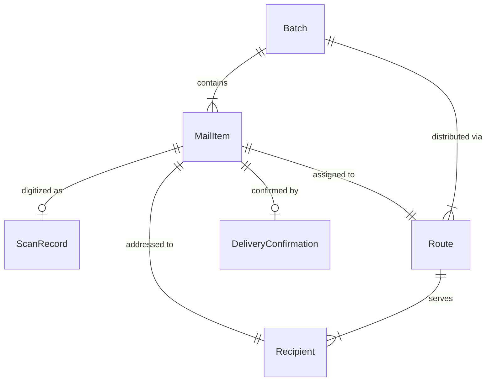
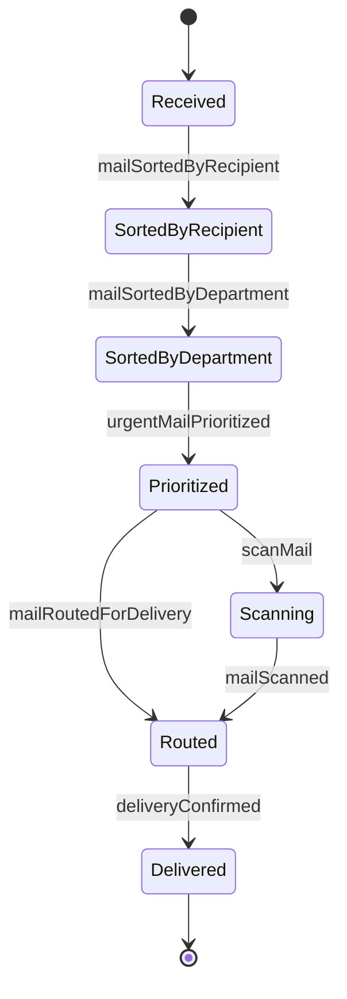
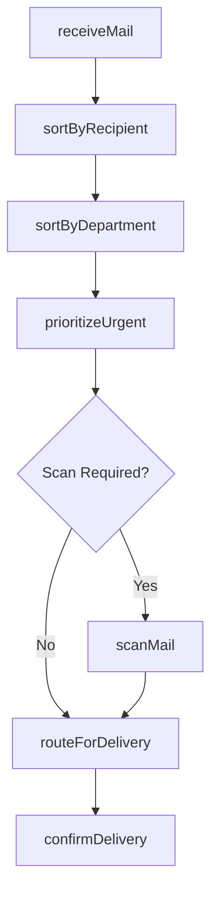
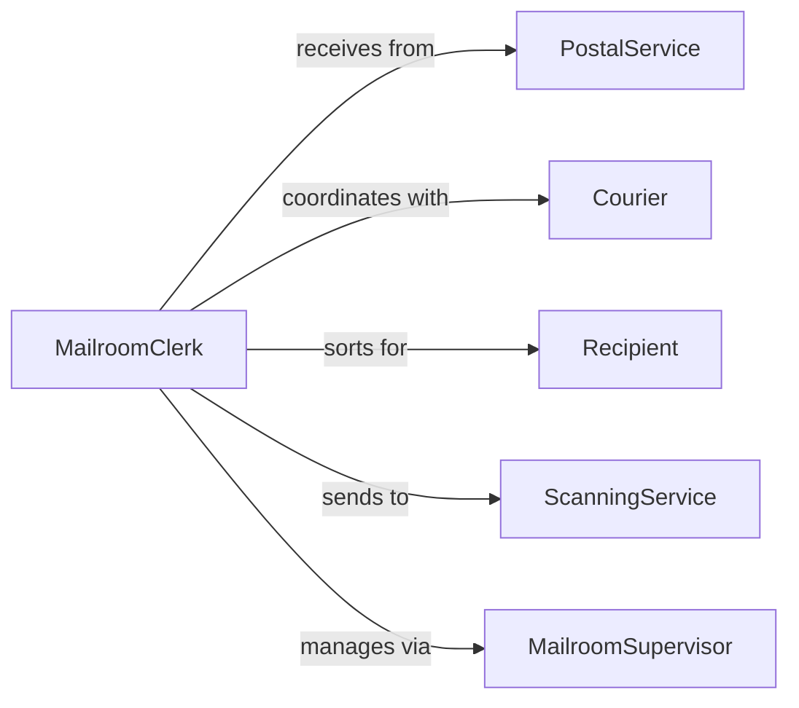

# Sort Mail

> Business-as-Code definition for mail sorting and distribution. Models workflows for incoming mail classification, routing, scanning, and delivery to recipients or departments.

## Overview

Mail sorting organizes incoming and internal correspondence by recipient, department, urgency, or delivery method. This definition provides actions for classifying mail, routing to destinations, digitizing documents, and tracking delivery status.

## Actors

| Actor | Description |
|-------|-------------|
| PostalService | Delivers mail to organization |
| Courier | Provides expedited or special delivery |
| Sender | Originates correspondence |
| Recipient | Intended receiver of mail item |
| ScanningService | Digitizes paper mail |
| ArchiveService | Stores historical correspondence |

## Roles

| Role | Description |
|------|-------------|
| MailroomClerk | Receives and sorts incoming mail |
| MailroomSupervisor | Manages mail processing operations |
| Messenger | Delivers mail to departments or individuals |
| RecordsCoordinator | Manages mail scanning and archiving |

## Entities

| Entity | Description |
|--------|-------------|
| MailItem | Individual piece of correspondence |
| Batch | Collection of mail items for processing |
| Recipient | Person or department receiving mail |
| Route | Delivery path for mail distribution |
| ScanRecord | Digital copy of physical mail |
| DeliveryConfirmation | Proof of mail receipt |

## Actions

| Action | Description |
|--------|-------------|
| receiveMail | Accept incoming mail delivery |
| sortByRecipient | Classify mail by intended receiver |
| sortByDepartment | Organize mail by destination department |
| prioritizeUrgent | Identify time-sensitive mail |
| scanMail | Create digital copy of mail item |
| routeForDelivery | Assign mail to delivery route |
| confirmDelivery | Record mail receipt by recipient |

## Events

| Event | Description |
|-------|-------------|
| mailReceived | Incoming mail accepted |
| mailSortedByRecipient | Mail classified by receiver |
| mailSortedByDepartment | Mail organized by department |
| urgentMailPrioritized | Time-sensitive mail identified |
| mailScanned | Digital copy created |
| mailRoutedForDelivery | Mail assigned to delivery route |
| deliveryConfirmed | Mail receipt recorded |

## Searches

| Search | Description |
|--------|-------------|
| findPendingMail | List mail awaiting sorting or delivery |
| getUrgentMail | Retrieve time-sensitive mail items |
| getMailByRecipient | Find mail for specific person or department |
| getUndeliveredMail | List mail not yet received by recipient |

## Entity Relationships



## State Diagram



## Workflow



## Actor Relationships



## Usage

### Calling Actions

```typescript
import { sortMail } from '@headlessly/sort-mail'

const mail = sortMail()

// Receive mail delivery
const batch = await mail.receiveMail({
  deliveryId: 'delivery_20260115_am',
  itemCount: 47,
  source: 'USPS'
})

// Sort by recipient
await mail.sortByRecipient({
  batchId: batch.id,
  sortingMethod: 'alphabetical'
})

// Prioritize urgent items
const urgent = await mail.prioritizeUrgent({
  batchId: batch.id,
  criteria: ['overnight', 'certified', 'registered']
})
```

### Event-Driven Automation

```typescript
// Auto-scan legal correspondence
mail.mailSortedByDepartment(async ({ mailItemId, department }) => {
  if (department === 'Legal') {
    await mail.scanMail({
      mailItemId,
      retentionPeriod: 'permanent'
    })
  }
})

// Notify on urgent mail arrival
mail.urgentMailPrioritized(async ({ mailItemId, recipient, urgencyLevel }) => {
  await notify({
    to: recipient,
    priority: urgencyLevel,
    message: `Urgent mail item ${mailItemId} received`
  })
})
```
