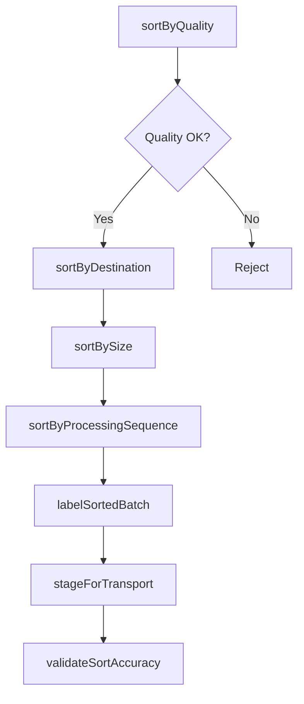
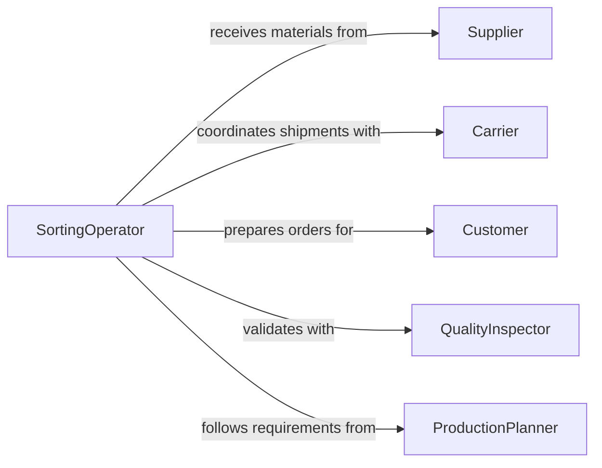

# Sort Materials Objects Processing Transport

> Business-as-Code definition for materials and objects sorting. Models workflows for warehouse sorting, production line organization, quality-based classification, and transport preparation.

## Overview

Materials and objects sorting organizes inventory, raw materials, finished goods, and work-in-process by destination, quality grade, processing sequence, or shipment. This definition provides actions for classification, routing, quality grading, and preparation for downstream operations.

## Actors

| Actor | Description |
|-------|-------------|
| Supplier | Provides raw materials for sorting |
| Carrier | Transports sorted materials to destinations |
| Customer | Receives sorted and shipped goods |
| QualityInspector | Grades materials by quality standards |
| ProductionPlanner | Specifies sorting requirements for manufacturing |
| WarehouseManagement | Coordinates storage and retrieval |

## Roles

| Role | Description |
|------|-------------|
| SortingOperator | Performs material classification and organization |
| WarehouseAssociate | Handles material movement and staging |
| QualityController | Validates sorting accuracy |
| LogisticsCoordinator | Manages transport preparation |

## Entities

| Entity | Description |
|--------|-------------|
| Material | Raw material, component, or finished good |
| Batch | Collection of materials for sorting |
| SortCriteria | Rules defining classification method |
| Destination | Target location for sorted materials |
| QualityGrade | Classification by quality standards |
| TransportOrder | Shipment requiring sorted materials |

## Actions

| Action | Description |
|--------|-------------|
| sortByDestination | Classify materials by delivery location |
| sortByQuality | Grade materials by quality standards |
| sortBySize | Organize materials by dimensions or weight |
| sortByProcessingSequence | Order materials for production flow |
| labelSortedBatch | Mark sorted materials with identification |
| stageForTransport | Prepare sorted materials for shipment |
| validateSortAccuracy | Verify sorting correctness |

## Events

| Event | Description |
|-------|-------------|
| materialsSortedByDestination | Materials classified by location |
| materialsSortedByQuality | Materials graded by standards |
| materialsSortedBySize | Materials organized by dimensions |
| materialsSortedBySequence | Materials ordered for processing |
| sortedBatchLabeled | Sorted materials marked with ID |
| materialsStaged | Materials prepared for shipment |
| sortAccuracyValidated | Sorting correctness verified |

## Searches

| Search | Description |
|--------|-------------|
| findUnsortedMaterials | List materials awaiting classification |
| getMaterialsByDestination | Retrieve materials sorted for specific location |
| getRejectMaterials | Find materials sorted as defective or non-conforming |
| getStagedBatches | List materials ready for transport |

## Workflow



## Actor Relationships



## Usage

### Calling Actions

```typescript
import { sortMaterialsObjectsProcessingTransport } from '@headlessly/sort-materials-objects-processing-transport'

const sorting = sortMaterialsObjectsProcessingTransport()

// Sort incoming materials by quality
const qualitySort = await sorting.sortByQuality({
  batchId: 'batch_20260115_001',
  standards: 'ISO-9001',
  rejectCriteria: ['defect', 'dimension-out-of-spec']
})

// Sort by destination
await sorting.sortByDestination({
  batchId: 'batch_20260115_001',
  destinations: ['warehouse-a', 'production-line-3', 'customer-shipment']
})

// Stage for transport
await sorting.stageForTransport({
  batchId: 'batch_20260115_001',
  transportOrderId: 'ship_2026_5678'
})
```

### Event-Driven Automation

```typescript
// Auto-route reject materials
sorting.materialsSortedByQuality(async ({ batchId, rejects }) => {
  if (rejects.length > 0) {
    await sorting.sortByDestination({
      batchId,
      materials: rejects,
      destination: 'quality-review'
    })
  }
})

// Notify when staging complete
sorting.materialsStaged(async ({ batchId, destination, itemCount }) => {
  await notify({
    to: 'logistics-team',
    message: `Batch ${batchId} staged for ${destination}: ${itemCount} items`
  })
})
```
