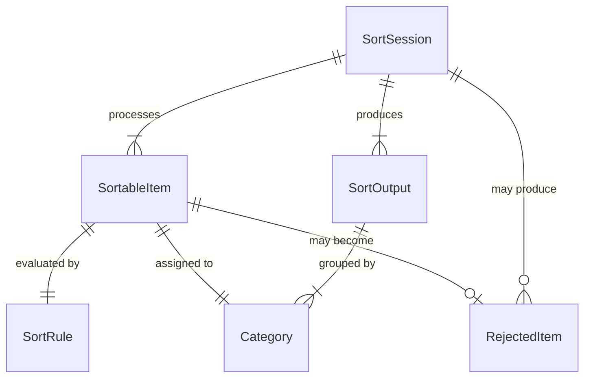
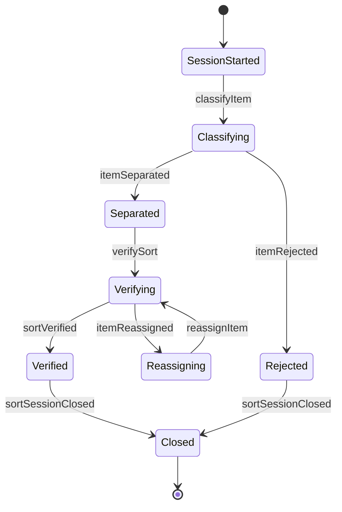
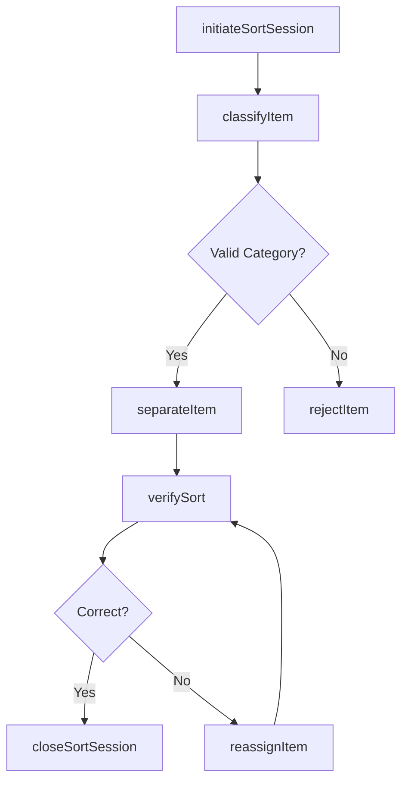
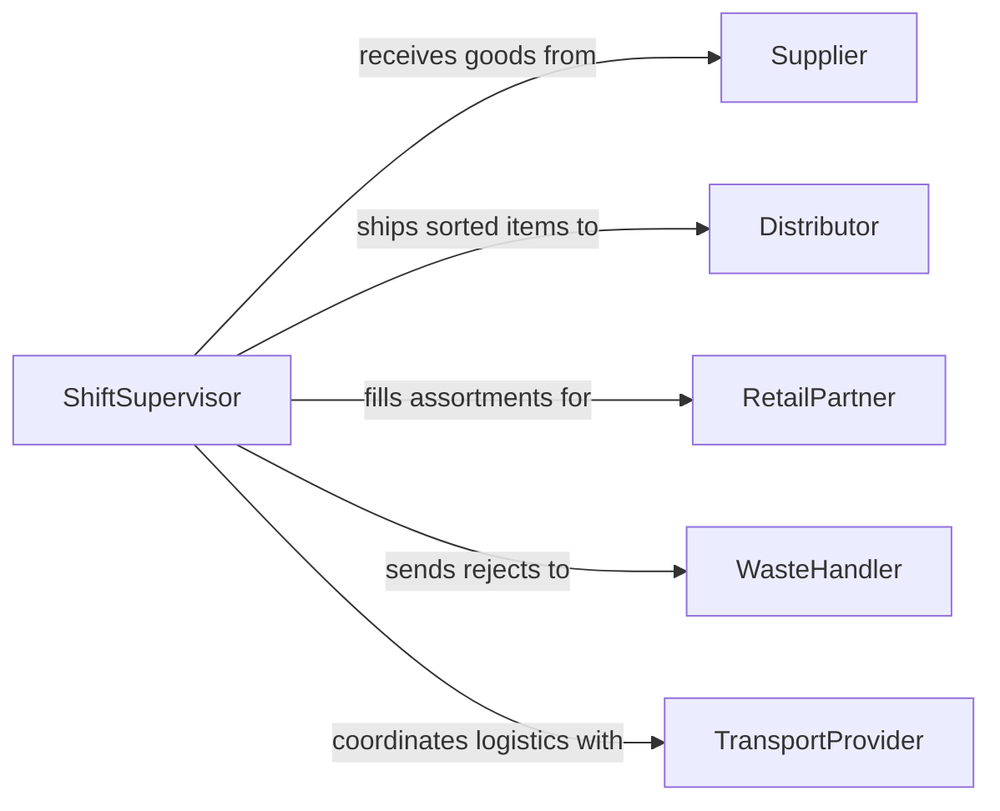

# Sort Materials or Products

> Business-as-Code definition for general material and product sorting. Models the systematic classification, separation, and routing of diverse goods based on type, condition, specification, or intended use.

## Overview

Sorting materials or products is a general-purpose classification activity applicable across manufacturing, warehousing, retail, and distribution operations. This definition covers the intake of mixed items, application of sorting rules, physical or logical separation, and verification of correct placement. It serves as a broad operational model for any context where goods must be categorized and directed to appropriate downstream channels.

## Actors

| Actor | Description |
|-------|-------------|
| Supplier | Provides raw materials or finished products for sorting |
| Distributor | Receives sorted products for onward distribution |
| RetailPartner | Orders specific product assortments from sorted inventory |
| WasteHandler | Collects rejected or non-conforming items from the sort process |
| TransportProvider | Moves sorted goods between facilities or to end destinations |

## Roles

| Role | Description |
|------|-------------|
| SortOperator | Classifies and physically separates materials or products |
| ShiftSupervisor | Manages sorting line throughput and staffing |
| QualityChecker | Verifies that sorted items meet classification criteria |
| DataEntryClerk | Records sorting outcomes and updates inventory systems |

## Entities

| Entity | Description |
|--------|-------------|
| SortableItem | Any material or product subject to classification |
| SortRule | A defined criterion for classifying items into categories |
| Category | A target classification bucket for sorted items |
| SortSession | A time-bounded period of sorting activity |
| RejectedItem | An item that fails to meet any classification standard |
| SortOutput | The aggregated results of a sorting session by category |

## Actions

| Action | Description |
|--------|-------------|
| initiateSortSession | Begin a new sorting session with defined rules and targets |
| classifyItem | Apply sort rules to determine an item's category |
| separateItem | Physically or logically place an item into its assigned category |
| rejectItem | Remove an item that does not conform to any sort category |
| verifySort | Confirm that items in a category match the classification criteria |
| closeSortSession | Finalize a sorting session and generate output summary |
| reassignItem | Move a misclassified item to the correct category |

## Events

| Event | Description |
|-------|-------------|
| sortSessionInitiated | A new sorting session has been started |
| itemClassified | An item has been assigned to a category |
| itemSeparated | An item has been placed in its designated category bin |
| itemRejected | An item has been removed from the sorting flow |
| sortVerified | Category contents have been confirmed as correctly sorted |
| sortSessionClosed | A sorting session has been finalized with output recorded |
| itemReassigned | A misclassified item has been moved to the correct category |

## Searches

| Search | Description |
|--------|-------------|
| findSortSessions | List sorting sessions by date, operator, or status |
| getItemsByCategory | Retrieve items classified into a specific category |
| getRejectedItems | Find items that were removed during sorting |
| getSortOutput | Get aggregated counts and weights by category for a session |
| findMisclassifications | Identify items that were reassigned after initial classification |

## Entity Relationships



## State Diagram



## Workflow



## Actor Relationships



## Usage

### Calling Actions

```typescript
import { sortMaterialsProducts } from '@headlessly/sort-materials-products'

const sorting = sortMaterialsProducts()

// Start a sorting session
const session = await sorting.initiateSortSession({
  rules: [
    { field: 'material', values: ['plastic', 'metal', 'glass'] },
    { field: 'condition', values: ['new', 'refurbished', 'damaged'] }
  ],
  operatorId: 'op-jones-114'
})

// Classify an item
const result = await sorting.classifyItem({
  sessionId: session.id,
  itemId: 'item-00482',
  attributes: { material: 'metal', condition: 'new' }
})

// Close the session
const output = await sorting.closeSortSession({
  sessionId: session.id
})
```

### Event-Driven Automation

```typescript
// Track rejection rates in real time
sorting.itemRejected(async ({ sessionId, itemId, reason }) => {
  const stats = await sorting.getSortOutput({ sessionId })
  if (stats.rejectionRate > 10) {
    await alert({
      to: 'quality-team',
      message: `Rejection rate exceeds 10% for session ${sessionId}`
    })
  }
})

// Auto-notify distributor when sorted batch is ready
sorting.sortSessionClosed(async ({ sessionId, categories }) => {
  for (const category of categories) {
    await notifyDistributor({ category: category.name, quantity: category.count })
  }
})
```
