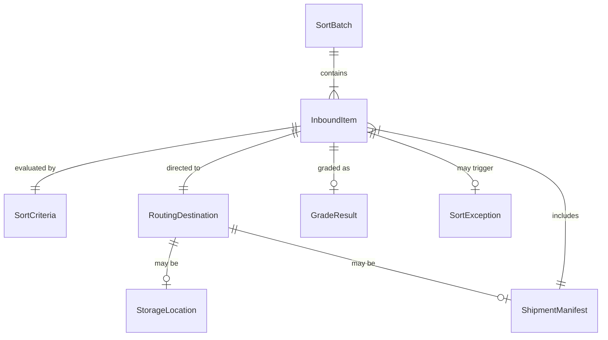
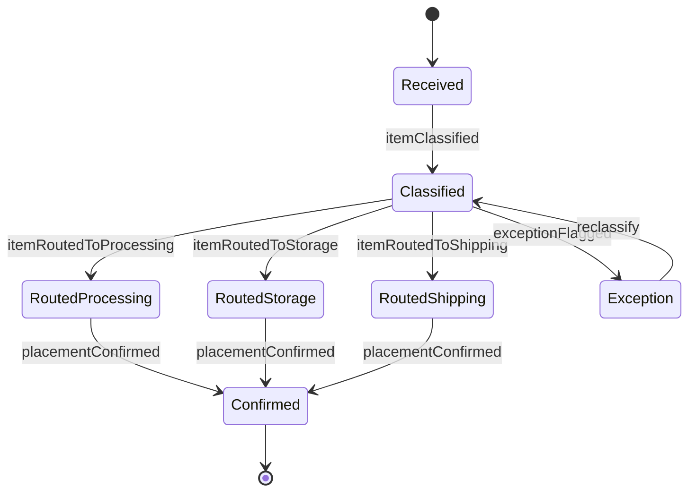
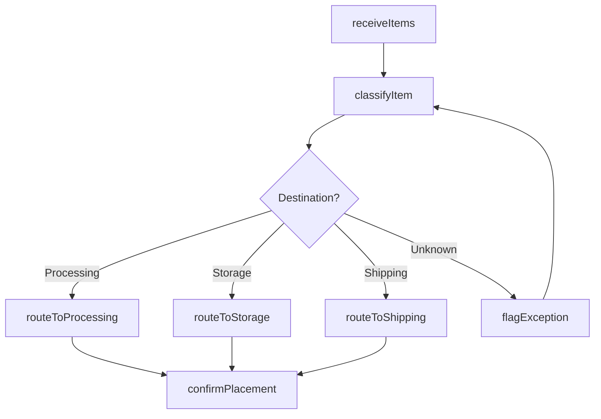
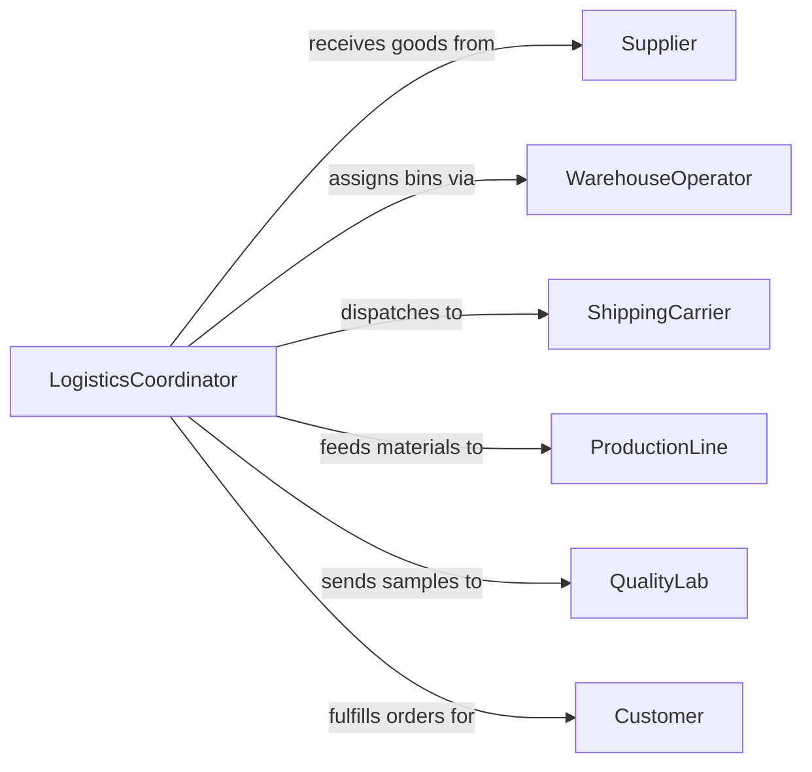

# Sort Materials or Products for Processing, Storing, Shipping, or Grading

> Business-as-Code definition for sorting materials and products across supply chain stages. Models the classification and routing of goods for downstream processing, warehouse storage, outbound shipping, or quality grading.

## Overview

Sorting materials and products for processing, storing, shipping, or grading is a foundational logistics activity that ensures goods flow to their correct next destination within a supply chain. This definition provides actions for receiving inbound items, classifying them by destination purpose, applying routing rules, and confirming placement. It supports warehouse operations, manufacturing intake, distribution centers, and quality control checkpoints.

## Actors

| Actor | Description |
|-------|-------------|
| Supplier | Delivers raw materials or semi-finished goods for sorting |
| WarehouseOperator | Manages storage locations and bin assignments |
| ShippingCarrier | Transports sorted goods to their next destination |
| ProductionLine | Receives sorted materials for manufacturing or assembly |
| QualityLab | Evaluates product samples pulled during the sorting process |
| Customer | Places orders that drive sorting priorities and shipping routes |

## Roles

| Role | Description |
|------|-------------|
| SortOperator | Physically or systematically classifies items by routing criteria |
| LogisticsCoordinator | Plans sort priorities based on production schedules and shipping deadlines |
| InventoryClerk | Updates stock records as items are sorted into storage |
| QualityTechnician | Inspects items during sorting to verify grade and condition |

## Entities

| Entity | Description |
|--------|-------------|
| InboundItem | A material or product arriving for sorting and classification |
| SortCriteria | Rules defining how items should be classified and routed |
| RoutingDestination | The designated next step such as processing, storage, or shipping |
| SortBatch | A group of items processed together in a single sorting pass |
| StorageLocation | A bin, shelf, or zone where sorted items are placed |
| ShipmentManifest | A list of sorted items assigned to an outbound shipment |
| GradeResult | The quality classification assigned during the sorting process |
| SortException | An item that does not match any defined sorting rule |

## Actions

| Action | Description |
|--------|-------------|
| receiveItems | Log inbound materials or products for the sorting queue |
| classifyItem | Determine the routing destination based on sort criteria |
| routeToProcessing | Direct items to a production line or manufacturing stage |
| routeToStorage | Assign items to a warehouse location for inventory holding |
| routeToShipping | Place items on an outbound shipment manifest |
| gradeItem | Evaluate item quality and assign a grade classification |
| flagException | Mark items that do not match standard sorting rules |
| confirmPlacement | Verify that sorted items have reached their assigned destination |

## Events

| Event | Description |
|-------|-------------|
| itemsReceived | Inbound materials or products have been logged for sorting |
| itemClassified | An item has been assigned a routing destination |
| itemRoutedToProcessing | An item has been directed to a production line |
| itemRoutedToStorage | An item has been assigned to a warehouse location |
| itemRoutedToShipping | An item has been placed on a shipment manifest |
| itemGraded | Quality grade has been assigned to an item |
| exceptionFlagged | An item has been marked as not matching sorting rules |
| placementConfirmed | Sorted items have been verified at their destination |

## Searches

| Search | Description |
|--------|-------------|
| findPendingItems | List items awaiting sorting by priority or arrival date |
| getItemsByDestination | Retrieve items routed to a specific processing, storage, or shipping target |
| getSortExceptions | Find items that could not be classified by standard rules |
| getBatchSummary | Summarize a sort batch by destination type, grade, and count |
| getStorageUtilization | Query warehouse bin occupancy after sorting operations |

## Entity Relationships



## State Diagram



## Workflow



## Actor Relationships



## Usage

### Calling Actions

```typescript
import { sortMaterialsProductsProcessingStoring } from '@headlessly/sort-materials-products-processing-storing'

const sorting = sortMaterialsProductsProcessingStoring()

// Receive inbound items
const batch = await sorting.receiveItems({
  supplierId: 'supplier-acme-055',
  items: [
    { sku: 'RAW-STEEL-440C', quantity: 500, unit: 'kg' },
    { sku: 'WIDGET-CAST-A12', quantity: 200, unit: 'pieces' }
  ]
})

// Classify and route items
await sorting.classifyItem({
  itemId: batch.items[0].id,
  criteria: { priority: 'production-urgent', grade: 'industrial' },
  destination: 'processing'
})

// Route to shipping for a customer order
await sorting.routeToShipping({
  itemId: batch.items[1].id,
  manifestId: 'manifest-2026-02-05-019',
  carrier: 'fedex-freight'
})
```

### Event-Driven Automation

```typescript
// Auto-assign storage locations for non-urgent items
sorting.itemClassified(async ({ itemId, destination }) => {
  if (destination === 'storage') {
    const bin = await findAvailableBin({ itemId })
    await sorting.routeToStorage({ itemId, locationId: bin.id })
  }
})

// Escalate sort exceptions
sorting.exceptionFlagged(async ({ itemId, reason }) => {
  await notify({
    to: 'logistics-supervisor',
    message: `Sort exception for item ${itemId}: ${reason}`
  })
})
```
