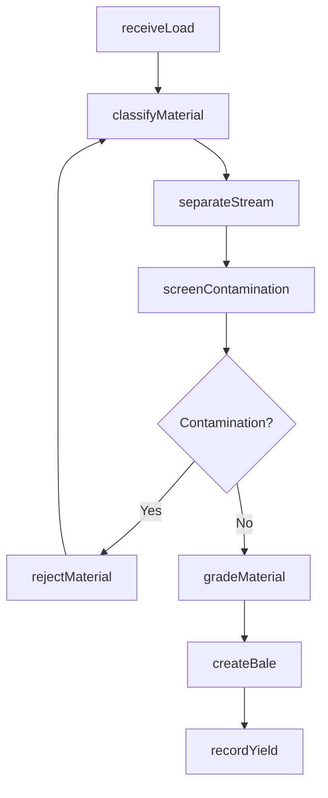
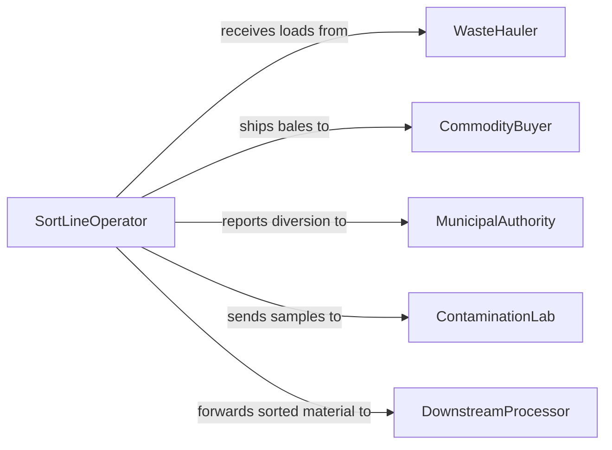

# Sort Recyclable Materials

> Business-as-Code definition for recyclable material sorting operations. Models the classification, separation, and routing of recyclable waste streams by material type, contamination level, and market grade.

## Overview

Recyclable material sorting involves receiving mixed waste streams and systematically separating them into distinct commodity categories such as paper, plastics, metals, and glass. This definition provides actions for intake processing, contamination screening, grade classification, and bale routing. It enables material recovery facilities to automate sorting decisions, track commodity yields, and optimize diversion rates.

## Actors

| Actor | Description |
|-------|-------------|
| WasteHauler | Delivers mixed recyclable loads to the sorting facility |
| CommodityBuyer | Purchases sorted and baled recyclable materials |
| MunicipalAuthority | Sets recycling mandates and diversion targets |
| EquipmentVendor | Supplies sorting machinery such as optical sorters and eddy current separators |
| ContaminationLab | Tests material purity and contamination rates |
| DownstreamProcessor | Receives sorted materials for remanufacturing |

## Roles

| Role | Description |
|------|-------------|
| SortLineOperator | Operates sorting equipment and performs manual quality picks |
| PlantSupervisor | Oversees daily sorting operations and throughput targets |
| QualityInspector | Evaluates material purity and contamination levels |
| MaterialsManager | Manages inventory of sorted commodities and coordinates shipments |

## Entities

| Entity | Description |
|--------|-------------|
| InboundLoad | A delivery of mixed recyclable materials arriving at the facility |
| MaterialStream | A classified category of recyclable material such as HDPE, OCC, or aluminum |
| SortBatch | A group of materials processed through a sorting line in one session |
| ContaminationReport | Assessment of non-target materials found in a sorted stream |
| Bale | A compressed unit of sorted material ready for sale or shipment |
| GradeSpecification | Quality standards defining acceptable purity levels for a commodity |
| DivertedWeight | Measured tonnage of material diverted from landfill |

## Actions

| Action | Description |
|--------|-------------|
| receiveLoad | Log an inbound mixed recyclable load for processing |
| classifyMaterial | Identify material type using optical, magnetic, or manual methods |
| separateStream | Route materials into designated commodity bins or conveyors |
| screenContamination | Check sorted streams for non-target material contamination |
| gradeMaterial | Assign a market grade based on purity and condition |
| createBale | Compress sorted materials into a standardized bale |
| rejectMaterial | Flag and remove materials that fail contamination thresholds |
| recordYield | Log the weight and grade of sorted output by stream |

## Events

| Event | Description |
|-------|-------------|
| loadReceived | A mixed recyclable load has been checked in for sorting |
| materialClassified | Material type identification has been completed |
| streamSeparated | Materials have been routed to their designated commodity line |
| contaminationDetected | Non-target material contamination exceeds acceptable threshold |
| materialGraded | A sorted stream has been assigned a market grade |
| baleCreated | A compressed bale of sorted material is ready for shipment |
| materialRejected | A batch has been removed from the recyclable stream due to contamination |
| yieldRecorded | Sorted output weights and grades have been logged |

## Searches

| Search | Description |
|--------|-------------|
| findLoads | List inbound loads by date, hauler, or processing status |
| getBatchYields | Retrieve sorted output weights by material stream and grade |
| getContaminationRates | Query contamination percentages across streams or time periods |
| findBales | Locate bales by commodity type, grade, or shipment status |
| getDiversionMetrics | Calculate diversion rates and landfill avoidance totals |

## Workflow



## Actor Relationships



## Usage

### Calling Actions

```typescript
import { sortRecyclableMaterials } from '@headlessly/sort-recyclable-materials'

const sorting = sortRecyclableMaterials()

// Receive a mixed recyclable load
const load = await sorting.receiveLoad({
  haulerId: 'hauler-wmx-042',
  estimatedWeight: 18500,
  sourceType: 'single-stream-residential',
  arrivalDate: '2026-02-05'
})

// Classify and separate materials
await sorting.classifyMaterial({
  loadId: load.id,
  method: 'optical-nir',
  streams: ['PET', 'HDPE', 'OCC', 'aluminum', 'glass']
})

// Grade a sorted stream
const grade = await sorting.gradeMaterial({
  streamId: 'stream-pet-001',
  purityPercentage: 96.2,
  grade: 'A'
})
```

### Event-Driven Automation

```typescript
// Alert when contamination exceeds threshold
sorting.contaminationDetected(async ({ streamId, contaminationRate }) => {
  if (contaminationRate > 8) {
    await notify({
      to: 'quality-team',
      message: `Stream ${streamId} contamination at ${contaminationRate}% - manual re-sort required`
    })
  }
})

// Auto-route bales to buyers when grade is confirmed
sorting.baleCreated(async ({ baleId, materialType, grade }) => {
  const buyer = await matchBuyer({ materialType, grade })
  await scheduleShipment({ baleId, buyerId: buyer.id })
})
```
