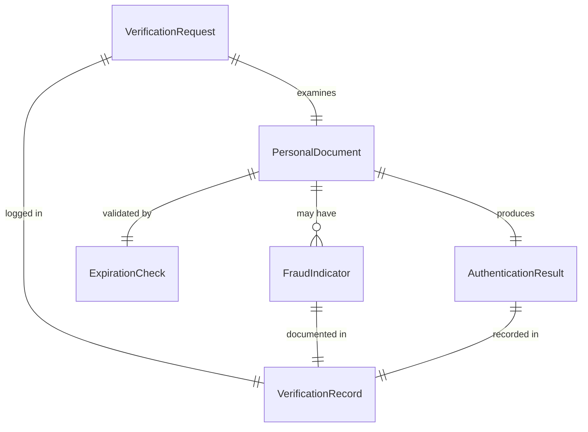
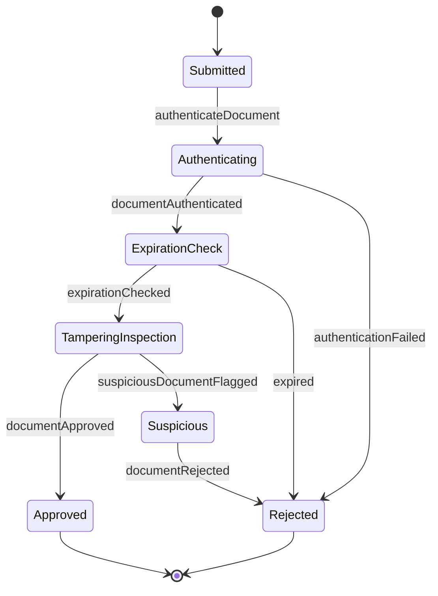
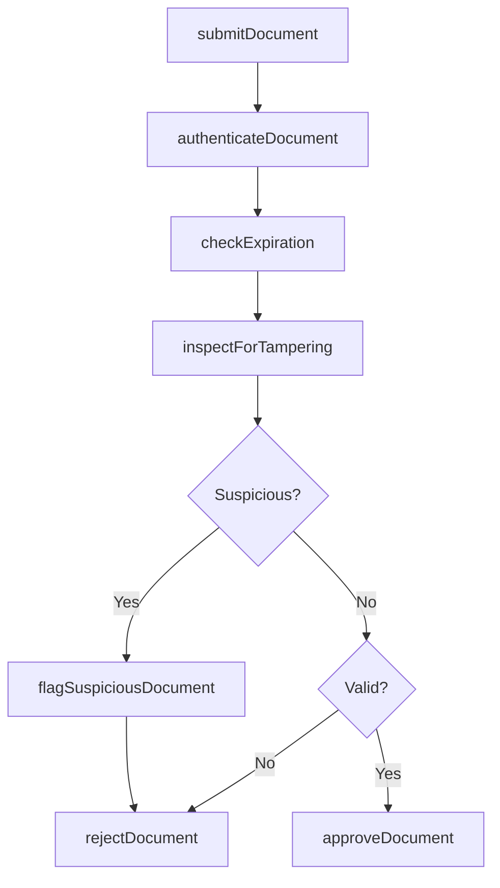
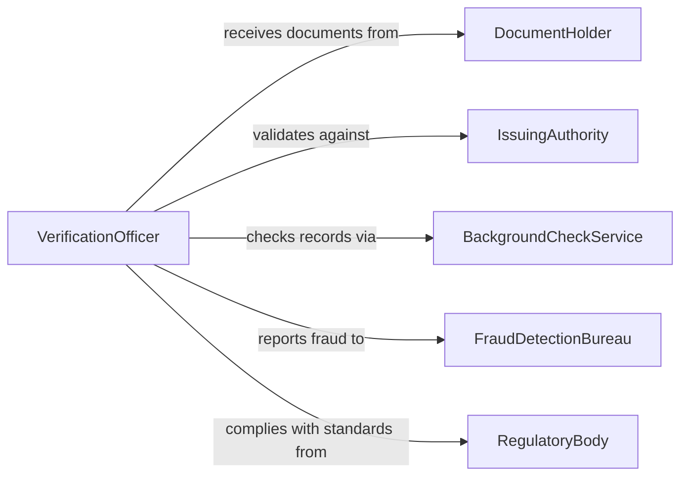

# Examine Personal Documentation to Ensure Validity

> Business-as-Code definition for examining personal documentation for validity. Models the inspection, authentication, and verification of identity documents, licenses, certifications, and other personal credentials.

## Overview

Examining personal documentation to ensure validity involves inspecting government-issued IDs, professional licenses, educational certificates, and other personal records to confirm they are authentic, current, and accurate. This definition provides actions for document intake, authentication checks, expiration verification, and fraud detection. It supports HR departments, security checkpoints, licensing agencies, and any organization that must verify personal credentials.

## Actors

| Actor | Description |
|-------|-------------|
| DocumentHolder | The individual presenting personal documentation for verification |
| IssuingAuthority | The government agency or institution that issued the document |
| BackgroundCheckService | Third-party service that validates credentials against official records |
| FraudDetectionBureau | Provides tools or databases for identifying forged or altered documents |
| RegulatoryBody | Mandates documentation requirements and verification standards |

## Roles

| Role | Description |
|------|-------------|
| VerificationOfficer | Inspects and authenticates submitted personal documents |
| ComplianceSpecialist | Ensures verification processes meet regulatory requirements |
| SecurityAnalyst | Investigates potential document fraud or tampering |
| RecordsClerk | Maintains files of verified documentation |

## Entities

| Entity | Description |
|--------|-------------|
| PersonalDocument | An ID, license, certificate, or credential submitted for verification |
| VerificationRequest | A formal submission of documents for examination |
| AuthenticationResult | The outcome of checking a document against issuing authority records |
| ExpirationCheck | Verification that a document has not passed its valid-through date |
| FraudIndicator | A sign of document alteration, forgery, or misuse |
| VerificationRecord | A logged record of the examination outcome and decision |

## Actions

| Action | Description |
|--------|-------------|
| submitDocument | Accept personal documentation for examination |
| authenticateDocument | Verify the document against issuing authority records or databases |
| checkExpiration | Confirm the document has not expired |
| inspectForTampering | Examine physical or digital security features for signs of alteration |
| flagSuspiciousDocument | Mark a document that shows indicators of fraud |
| approveDocument | Confirm the document is valid and record the verification |
| rejectDocument | Deny validity due to expiration, fraud, or authentication failure |

## Events

| Event | Description |
|-------|-------------|
| documentSubmitted | Personal documentation has been received for examination |
| documentAuthenticated | The document has been verified against official records |
| expirationChecked | The document validity date has been confirmed |
| tamperingInspected | Security features have been examined for signs of alteration |
| suspiciousDocumentFlagged | A document has been marked as potentially fraudulent |
| documentApproved | The document has been confirmed as valid |
| documentRejected | The document has been denied due to verification failure |

## Searches

| Search | Description |
|--------|-------------|
| findVerificationRequests | List submitted documents by holder, type, or status |
| getSuspiciousDocuments | Retrieve documents flagged for potential fraud |
| getExpiringDocuments | Find documents approaching their expiration date |
| getVerificationHistory | Track examination outcomes for a specific holder |
| getApprovalRate | Calculate the percentage of documents approved vs rejected |

## Entity Relationships



## State Diagram



## Workflow



## Actor Relationships



## Usage

### Calling Actions

```typescript
import { examinePersonalDocumentationEnsureIt } from '@headlessly/examine-personal-documentation-ensure-it'

const examiner = examinePersonalDocumentationEnsureIt()

// Submit a document for verification
const request = await examiner.submitDocument({
  holderId: 'applicant-chen-0042',
  documentType: 'drivers-license',
  issuingState: 'CA',
  documentNumber: 'D1234567',
  expirationDate: '2028-06-15'
})

// Authenticate and check
await examiner.authenticateDocument({ requestId: request.id })
await examiner.checkExpiration({ requestId: request.id })
await examiner.inspectForTampering({ requestId: request.id })

// Approve
await examiner.approveDocument({ requestId: request.id })
```

### Event-Driven Automation

```typescript
// Escalate suspicious documents to security
examiner.suspiciousDocumentFlagged(async ({ requestId, holderId, indicators }) => {
  await notify({
    to: 'security-team',
    message: `Suspicious document from ${holderId}: ${indicators.join(', ')}`
  })
})

// Track expiring documents for renewal reminders
examiner.documentApproved(async ({ holderId, documentType, expirationDate }) => {
  await scheduleReminder({
    holderId,
    type: documentType,
    reminderDate: daysBeforeExpiration(expirationDate, 90)
  })
})
```
