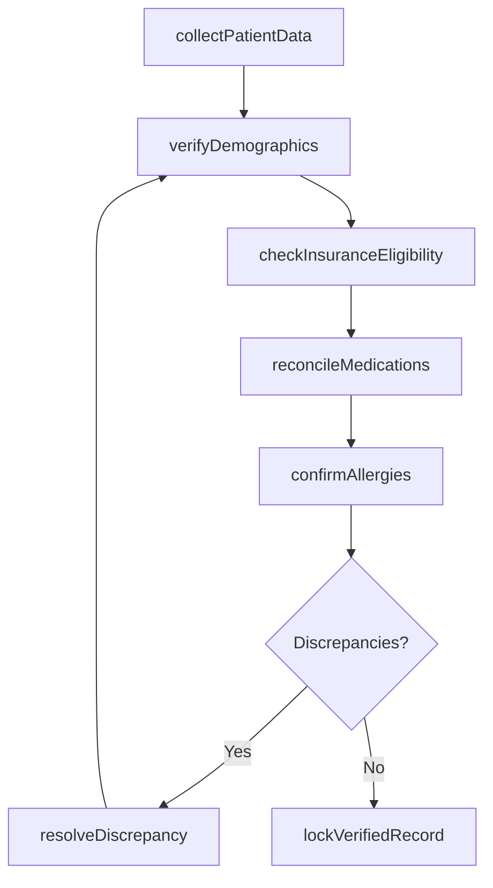
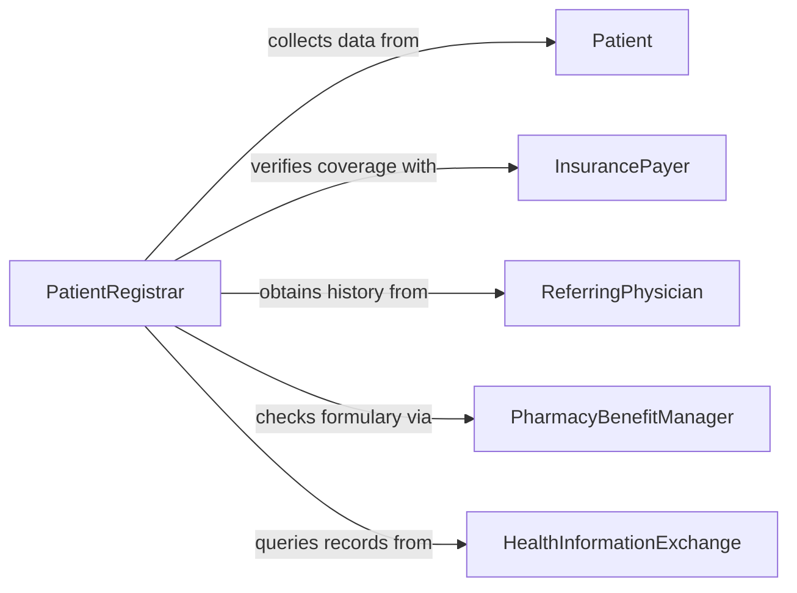

# Verify Accuracy of Patient Information

> Business-as-Code definition for verifying patient information accuracy. Models the validation of demographics, insurance coverage, medical history, and consent records to ensure correct and safe healthcare delivery.

## Overview

Verifying the accuracy of patient information involves confirming demographic details, insurance eligibility, medication lists, allergy records, and consent forms against authoritative sources before clinical encounters or administrative processing. This definition provides actions for data intake, cross-referencing with payer systems, identity matching, and discrepancy resolution. It supports medical registrars, nursing staff, billing departments, and health information management teams.

## Actors

| Actor | Description |
|-------|-------------|
| Patient | Provides personal, insurance, and medical history information |
| InsurancePayer | Confirms coverage eligibility and policy details |
| ReferringPhysician | Supplies clinical referral information and medical history |
| PharmacyBenefitManager | Validates prescription coverage and formulary data |
| HealthInformationExchange | Provides access to shared patient records across providers |

## Roles

| Role | Description |
|------|-------------|
| PatientRegistrar | Collects and verifies patient demographic and insurance data |
| MedicalRecordsSpecialist | Validates clinical history and medication records |
| BillingCoordinator | Confirms insurance eligibility before services are rendered |
| ComplianceOfficer | Ensures patient data verification meets HIPAA and regulatory standards |

## Entities

| Entity | Description |
|--------|-------------|
| PatientRecord | The comprehensive data file for an individual patient |
| DemographicData | Name, date of birth, address, and contact information |
| InsuranceVerification | Confirmation of active coverage, copays, and deductibles |
| MedicationList | Current and historical prescription records for the patient |
| AllergyRecord | Documented allergies and adverse reactions |
| ConsentForm | Signed authorization for treatment, data sharing, or procedures |
| DataDiscrepancy | An identified inconsistency between reported and verified data |

## Actions

| Action | Description |
|--------|-------------|
| collectPatientData | Gather demographic, insurance, and medical information from the patient |
| verifyDemographics | Confirm name, date of birth, and contact details against official records |
| checkInsuranceEligibility | Validate active insurance coverage with the payer |
| reconcileMedications | Compare the patient's reported medication list with pharmacy records |
| confirmAllergies | Verify documented allergies against prior clinical records |
| resolveDiscrepancy | Investigate and correct inconsistencies in patient data |
| lockVerifiedRecord | Finalize the verified patient record for clinical use |

## Events

| Event | Description |
|-------|-------------|
| patientDataCollected | Patient information has been gathered for verification |
| demographicsVerified | Personal identification details have been confirmed |
| insuranceEligibilityChecked | Coverage status has been validated with the payer |
| medicationsReconciled | Medication records have been compared and aligned |
| allergiesConfirmed | Allergy documentation has been verified |
| discrepancyResolved | An inconsistency in patient data has been corrected |
| recordLocked | The verified patient record has been finalized |

## Searches

| Search | Description |
|--------|-------------|
| findPatientVerifications | List verification activities by patient, date, or status |
| getPendingVerifications | Retrieve records awaiting confirmation from external sources |
| getDiscrepancies | Find unresolved data inconsistencies by type or patient |
| getInsuranceStatus | Check current coverage eligibility for a patient |
| getMedicationHistory | Retrieve reconciled medication records for a patient |

## Workflow



## Actor Relationships



## Usage

### Calling Actions

```typescript
import { verifyAccuracyPatientInformation } from '@headlessly/verify-accuracy-patient-information'

const verifier = verifyAccuracyPatientInformation()

// Collect patient data at check-in
const record = await verifier.collectPatientData({
  patientId: 'pt-thompson-4419',
  demographics: {
    name: 'James Thompson',
    dob: '1978-04-12',
    phone: '555-0142'
  },
  insuranceId: 'BCBS-IL-99281774'
})

// Verify demographics and insurance
await verifier.verifyDemographics({ recordId: record.id })
const insurance = await verifier.checkInsuranceEligibility({
  recordId: record.id,
  serviceDate: '2026-02-05'
})

// Reconcile medications
await verifier.reconcileMedications({
  recordId: record.id,
  reportedMedications: ['lisinopril-10mg', 'metformin-500mg']
})
```

### Event-Driven Automation

```typescript
// Alert clinical staff on allergy discrepancies
verifier.discrepancyResolved(async ({ patientId, field, previousValue, newValue }) => {
  if (field === 'allergies') {
    await notify({
      to: 'clinical-team',
      message: `Allergy record updated for ${patientId}: ${previousValue} -> ${newValue}`
    })
  }
})

// Notify billing when insurance is confirmed
verifier.insuranceEligibilityChecked(async ({ patientId, eligible, copay }) => {
  if (eligible) {
    await notify({ to: 'billing', message: `Insurance confirmed for ${patientId}, copay: $${copay}` })
  }
})
```
