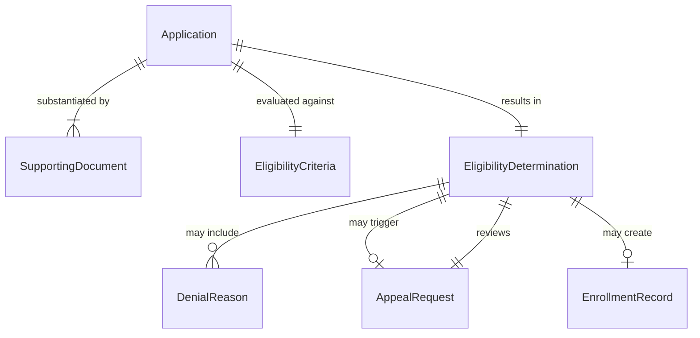
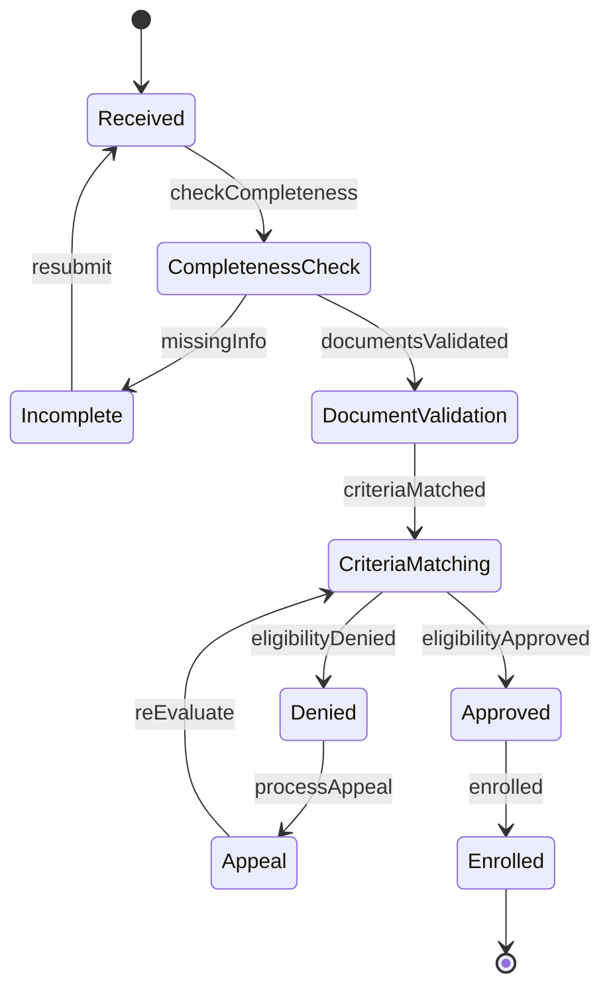
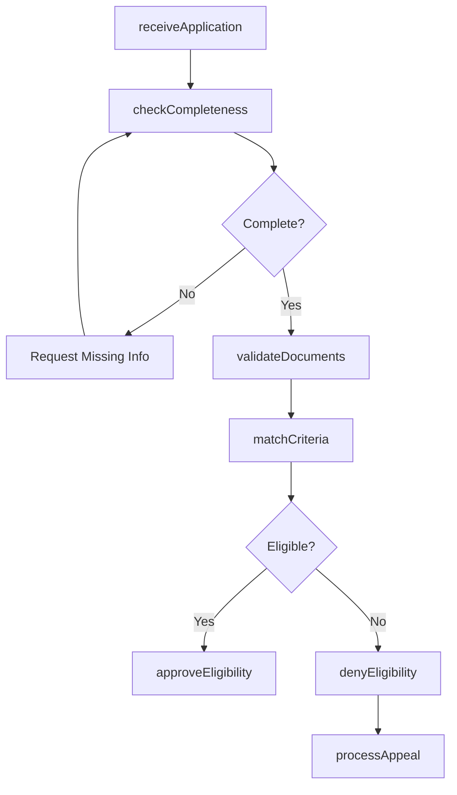
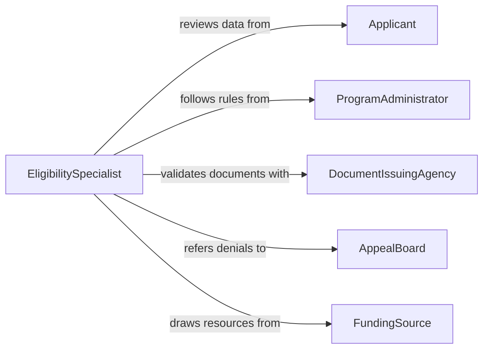

# Verify Application Data to Determine Program Eligibility

> Business-as-Code definition for verifying application data to determine program eligibility. Models the intake, validation, and adjudication of applicant information against program criteria for benefits, services, or enrollment.

## Overview

Verifying application data to determine program eligibility involves reviewing submitted applications, validating supporting documents, cross-referencing applicant information against program rules, and rendering an eligibility determination. This definition provides actions for application intake, document verification, criteria matching, and decision notification. It supports government agencies, healthcare organizations, educational institutions, and social services that administer eligibility-based programs.

## Actors

| Actor | Description |
|-------|-------------|
| Applicant | Submits personal and financial data for program eligibility review |
| ProgramAdministrator | Defines eligibility criteria and program rules |
| DocumentIssuingAgency | Confirms the authenticity of supporting documents such as tax returns or IDs |
| AppealBoard | Reviews contested eligibility decisions |
| FundingSource | Provides resources for approved program enrollments |

## Roles

| Role | Description |
|------|-------------|
| EligibilitySpecialist | Reviews applications and makes eligibility determinations |
| IntakeCoordinator | Receives applications and checks for completeness |
| QualityReviewer | Audits eligibility decisions for accuracy and consistency |
| CaseManager | Tracks applicants through the eligibility process |

## Entities

| Entity | Description |
|--------|-------------|
| Application | A submitted request for program enrollment or benefits |
| EligibilityCriteria | The defined rules and thresholds for program qualification |
| SupportingDocument | A document provided by the applicant to substantiate their data |
| EligibilityDetermination | The formal decision on whether an applicant qualifies |
| DenialReason | The specific criterion or deficiency that led to ineligibility |
| AppealRequest | A formal challenge to an eligibility denial |
| EnrollmentRecord | A confirmed program enrollment for an approved applicant |

## Actions

| Action | Description |
|--------|-------------|
| receiveApplication | Accept and log a new application submission |
| checkCompleteness | Verify that all required fields and documents have been submitted |
| validateDocuments | Confirm the authenticity and accuracy of supporting documents |
| matchCriteria | Compare applicant data against program eligibility rules |
| approveEligibility | Grant program eligibility and initiate enrollment |
| denyEligibility | Reject the application with documented denial reasons |
| processAppeal | Review an applicant's challenge to a denial decision |

## Events

| Event | Description |
|-------|-------------|
| applicationReceived | A new application has been logged for review |
| completenessChecked | The application has been assessed for required information |
| documentsValidated | Supporting documents have been confirmed as authentic |
| criteriaMatched | Applicant data has been compared against eligibility rules |
| eligibilityApproved | The applicant has been determined eligible |
| eligibilityDenied | The applicant has been determined ineligible |
| appealProcessed | An appeal of a denial decision has been reviewed |

## Searches

| Search | Description |
|--------|-------------|
| findApplications | List applications by applicant, program, date, or status |
| getPendingReviews | Retrieve applications awaiting eligibility determination |
| getDenials | Find denied applications by reason or program |
| getAppeals | Locate pending or resolved appeal requests |
| getEnrollmentStats | Summarize approval and denial rates by program or period |

## Entity Relationships



## State Diagram



## Workflow



## Actor Relationships



## Usage

### Calling Actions

```typescript
import { verifyApplicationDataDetermineProgram } from '@headlessly/verify-application-data-determine-program'

const verifier = verifyApplicationDataDetermineProgram()

// Receive an application
const app = await verifier.receiveApplication({
  programId: 'medicaid-expansion-2026',
  applicantId: 'app-rivera-8821',
  householdSize: 4,
  annualIncome: 38000,
  documents: ['tax-return-2025', 'proof-of-residency']
})

// Check and validate
await verifier.checkCompleteness({ applicationId: app.id })
await verifier.validateDocuments({ applicationId: app.id })

// Determine eligibility
const decision = await verifier.matchCriteria({
  applicationId: app.id,
  criteria: { maxIncome: 42000, residencyRequired: true }
})
```

### Event-Driven Automation

```typescript
// Notify applicant of decision
verifier.eligibilityApproved(async ({ applicationId, applicantId }) => {
  await notify({
    to: applicantId,
    message: 'Your application has been approved. Enrollment details will follow.'
  })
})

verifier.eligibilityDenied(async ({ applicationId, applicantId, reasons }) => {
  await notify({
    to: applicantId,
    message: `Your application was denied: ${reasons.join(', ')}. You may file an appeal.`
  })
})
```
