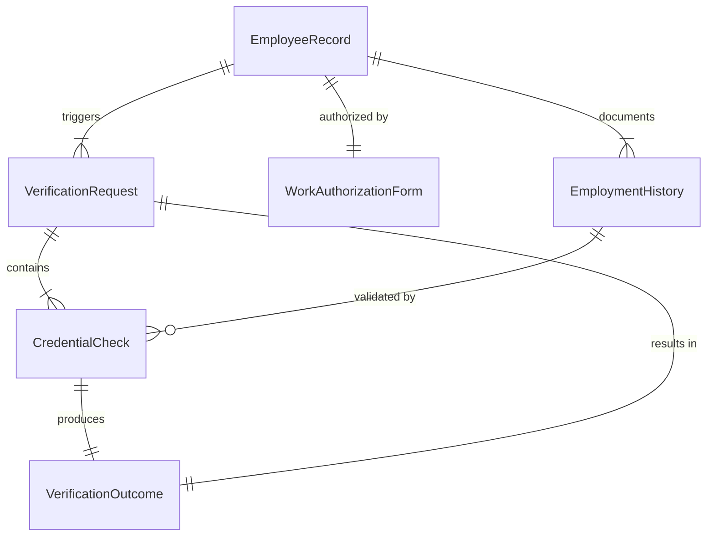
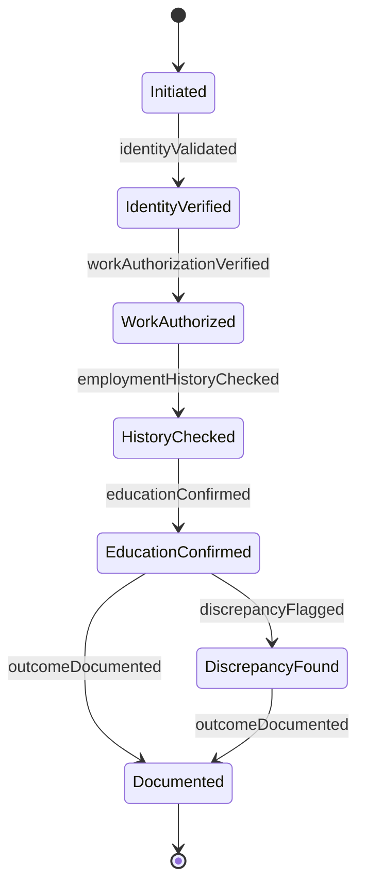
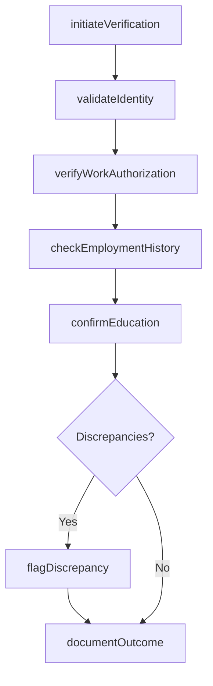
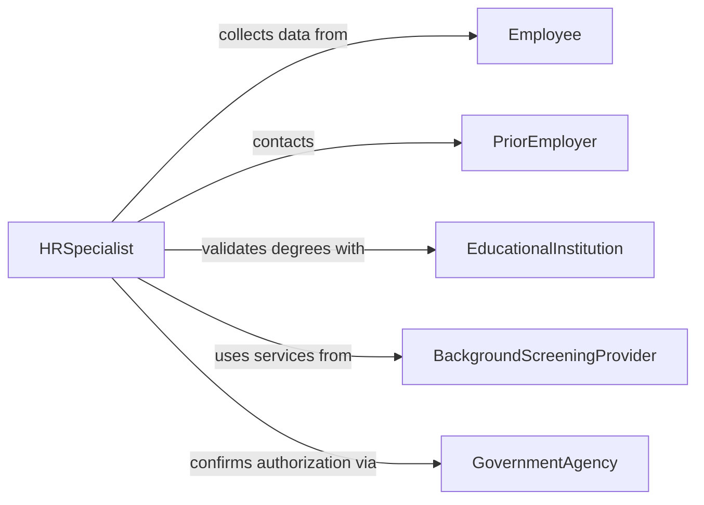

# Verify Employee Information

> Business-as-Code definition for verifying employee information. Models the validation of employment eligibility, work history, educational credentials, and personal data for HR compliance and onboarding.

## Overview

Verifying employee information involves confirming the accuracy of data provided by current or prospective employees, including identity documents, work authorization, employment history, educational degrees, and professional certifications. This definition provides actions for initiating verification requests, checking credentials against authoritative sources, documenting results, and flagging discrepancies. It supports human resources departments, compliance teams, and staffing agencies.

## Actors

| Actor | Description |
|-------|-------------|
| Employee | Provides personal and professional information for verification |
| PriorEmployer | Confirms employment dates, titles, and eligibility for rehire |
| EducationalInstitution | Validates degrees, diplomas, and enrollment records |
| BackgroundScreeningProvider | Conducts comprehensive employment and credential checks |
| GovernmentAgency | Provides work authorization and identity verification services |

## Roles

| Role | Description |
|------|-------------|
| HRSpecialist | Initiates and manages employee verification processes |
| ComplianceOfficer | Ensures verification meets legal and regulatory requirements |
| OnboardingCoordinator | Collects employee documentation during the hiring process |
| RecordsAdministrator | Maintains verified employee files and audit trails |

## Entities

| Entity | Description |
|--------|-------------|
| EmployeeRecord | The complete set of personal and professional data for an individual |
| VerificationRequest | A formal request to validate specific employee information |
| CredentialCheck | A validation of a specific credential such as a degree or license |
| WorkAuthorizationForm | Documentation confirming eligibility to work such as I-9 or visa |
| EmploymentHistory | A record of prior positions, employers, and dates |
| VerificationOutcome | The result of a credential or information check |

## Actions

| Action | Description |
|--------|-------------|
| initiateVerification | Start the verification process for an employee or candidate |
| validateIdentity | Confirm the individual's identity against government records |
| checkEmploymentHistory | Verify prior employment dates and positions with former employers |
| confirmEducation | Validate educational degrees and certifications with institutions |
| verifyWorkAuthorization | Confirm legal eligibility to work in the jurisdiction |
| documentOutcome | Record the results of each verification check |
| flagDiscrepancy | Mark information that could not be verified or conflicts with records |

## Events

| Event | Description |
|-------|-------------|
| verificationInitiated | An employee verification process has been started |
| identityValidated | The individual's identity has been confirmed |
| employmentHistoryChecked | Prior employment details have been verified |
| educationConfirmed | Educational credentials have been validated |
| workAuthorizationVerified | Legal work eligibility has been confirmed |
| outcomeDocumented | Verification results have been recorded |
| discrepancyFlagged | Conflicting or unverifiable information has been identified |

## Searches

| Search | Description |
|--------|-------------|
| findVerifications | List verification requests by employee, date, or status |
| getPendingChecks | Retrieve verifications awaiting response from external sources |
| getDiscrepancies | Find flagged information conflicts by type or severity |
| getVerificationHistory | Track all checks performed for a specific employee |
| getComplianceStatus | Check whether all required verifications are complete for an employee |

## Entity Relationships



## State Diagram



## Workflow



## Actor Relationships



## Usage

### Calling Actions

```typescript
import { verifyEmployeeInformation } from '@headlessly/verify-employee-information'

const verifier = verifyEmployeeInformation()

// Start verification for a new hire
const verification = await verifier.initiateVerification({
  employeeId: 'emp-new-2026-0412',
  name: 'Sarah Mitchell',
  checks: ['identity', 'work-authorization', 'employment-history', 'education']
})

// Validate identity and work authorization
await verifier.validateIdentity({ verificationId: verification.id })
await verifier.verifyWorkAuthorization({
  verificationId: verification.id,
  formType: 'I-9',
  documentA: 'us-passport'
})

// Check employment history
await verifier.checkEmploymentHistory({
  verificationId: verification.id,
  employers: [
    { name: 'Acme Corp', startDate: '2022-03-01', endDate: '2025-12-31' }
  ]
})
```

### Event-Driven Automation

```typescript
// Escalate unresolved discrepancies
verifier.discrepancyFlagged(async ({ verificationId, employeeId, field }) => {
  await notify({
    to: 'hr-compliance',
    message: `Verification discrepancy for ${employeeId} on ${field}`
  })
})

// Auto-complete onboarding when all checks pass
verifier.outcomeDocumented(async ({ verificationId, allPassed }) => {
  if (allPassed) {
    await completeOnboarding({ verificationId })
  }
})
```
