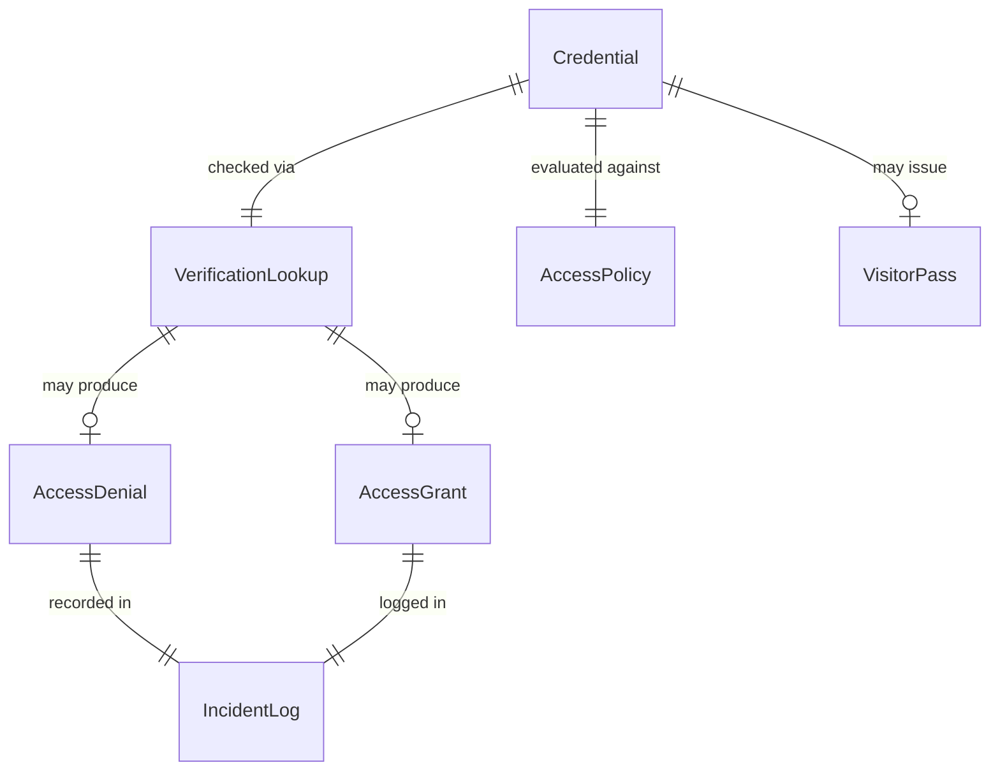
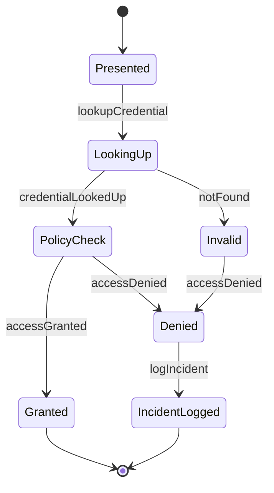
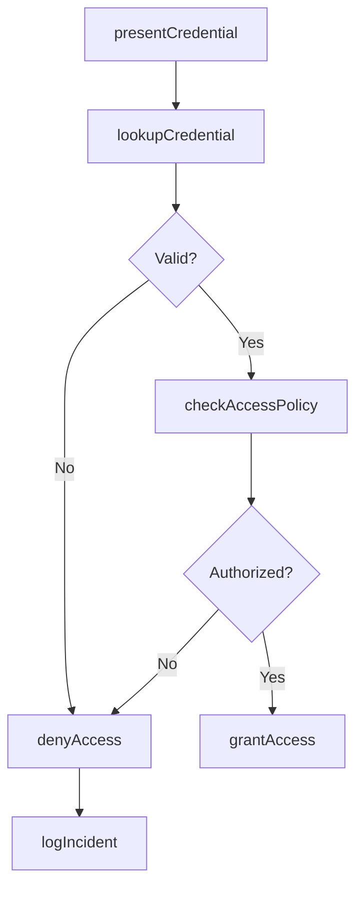
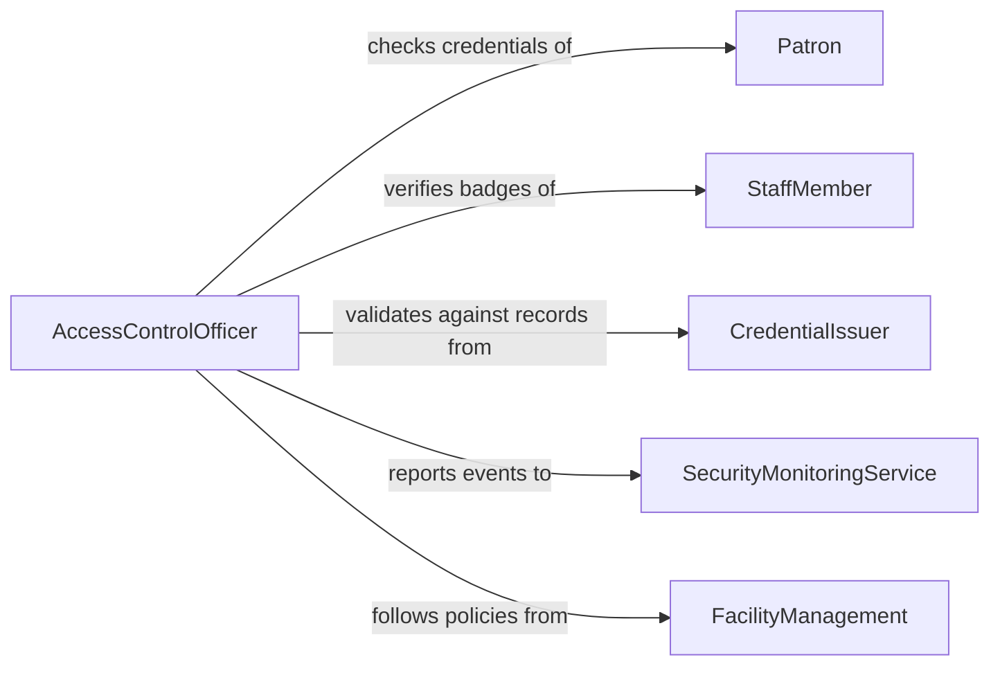

# Verify Patron or Staff Credentials

> Business-as-Code definition for verifying patron and staff credentials. Models the authentication of membership cards, access badges, professional licenses, and other credentials that grant access to facilities, services, or restricted areas.

## Overview

Verifying patron or staff credentials involves checking presented identification, membership cards, badges, or professional licenses against registration databases and access control lists to confirm authorization. This definition provides actions for credential presentation, database lookup, access granting or denial, and incident logging. It supports security personnel, front desk staff, library systems, and facility access management.

## Actors

| Actor | Description |
|-------|-------------|
| Patron | Presents credentials to access facilities or services |
| StaffMember | Presents employment credentials for workplace access |
| CredentialIssuer | Organization that issues badges, cards, or licenses |
| SecurityMonitoringService | Monitors credential verification events and access patterns |
| FacilityManagement | Defines access policies and restricted area designations |

## Roles

| Role | Description |
|------|-------------|
| AccessControlOfficer | Verifies credentials at entry points and checkpoints |
| FrontDeskAgent | Checks patron memberships and visitor registrations |
| SecurityAdministrator | Manages credential databases and access policies |
| IncidentReporter | Documents access denials and unauthorized access attempts |

## Entities

| Entity | Description |
|--------|-------------|
| Credential | A badge, card, license, or certificate presented for verification |
| AccessPolicy | Rules defining who may enter specific areas or use services |
| VerificationLookup | A database query to confirm credential validity |
| AccessGrant | Authorization to proceed into a facility or service area |
| AccessDenial | Rejection of entry due to invalid or expired credentials |
| IncidentLog | A record of denied access attempts or security events |
| VisitorPass | A temporary credential issued to non-registered individuals |

## Actions

| Action | Description |
|--------|-------------|
| presentCredential | Accept a credential for verification at a checkpoint |
| lookupCredential | Query the registration database for credential validity |
| checkAccessPolicy | Determine whether the credential holder is authorized for the requested area |
| grantAccess | Authorize entry and log the access event |
| denyAccess | Reject entry and document the reason |
| issueVisitorPass | Generate a temporary credential for an unregistered individual |
| logIncident | Record a security event related to credential verification |

## Events

| Event | Description |
|-------|-------------|
| credentialPresented | A credential has been submitted for verification |
| credentialLookedUp | The credential has been checked against the registration database |
| accessPolicyChecked | Authorization rules have been evaluated for the credential holder |
| accessGranted | Entry has been authorized and logged |
| accessDenied | Entry has been rejected with reasons documented |
| visitorPassIssued | A temporary credential has been generated |
| incidentLogged | A security event has been recorded |

## Searches

| Search | Description |
|--------|-------------|
| findAccessEvents | List entry and denial events by person, location, or date |
| getActiveCredentials | Retrieve valid credentials for a specific individual |
| getExpiredCredentials | Find credentials that have passed their validity period |
| getIncidentLogs | Query security incidents by type, location, or date |
| getAccessPatterns | Analyze entry frequency and timing for a credential holder |

## Entity Relationships



## State Diagram



## Workflow



## Actor Relationships



## Usage

### Calling Actions

```typescript
import { verifyPatronStaffCredentials } from '@headlessly/verify-patron-staff-credentials'

const verifier = verifyPatronStaffCredentials()

// Present a staff badge at building entrance
const check = await verifier.presentCredential({
  credentialType: 'employee-badge',
  credentialId: 'badge-eng-0847',
  location: 'main-entrance',
  timestamp: '2026-02-05T08:30:00Z'
})

// Lookup and verify
const lookup = await verifier.lookupCredential({ credentialId: check.credentialId })
const policy = await verifier.checkAccessPolicy({
  credentialId: check.credentialId,
  requestedArea: 'engineering-lab-b'
})

// Grant or deny
if (policy.authorized) {
  await verifier.grantAccess({ checkId: check.id })
}
```

### Event-Driven Automation

```typescript
// Alert security on repeated access denials
verifier.accessDenied(async ({ credentialId, location, reason }) => {
  const recentDenials = await verifier.findAccessEvents({
    credentialId,
    type: 'denial',
    since: hoursAgo(1)
  })
  if (recentDenials.length >= 3) {
    await notify({
      to: 'security-dispatch',
      message: `Multiple access denials for credential ${credentialId} at ${location}`
    })
  }
})

// Auto-issue visitor pass for pre-registered guests
verifier.credentialPresented(async ({ credentialType, credentialId }) => {
  if (credentialType === 'visitor-registration') {
    await verifier.issueVisitorPass({ registrationId: credentialId, validHours: 8 })
  }
})
```
