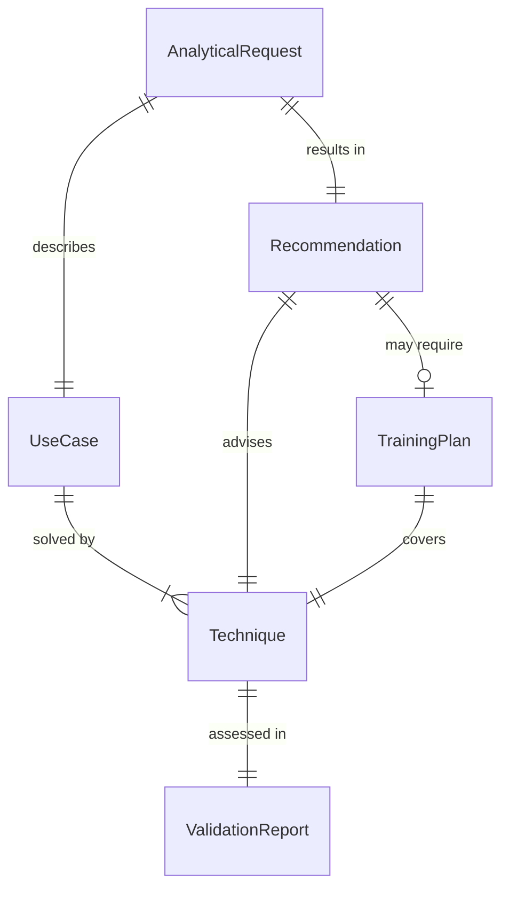
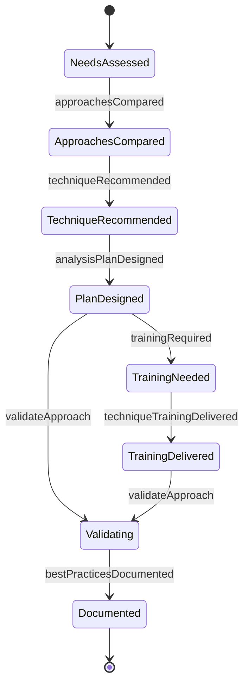
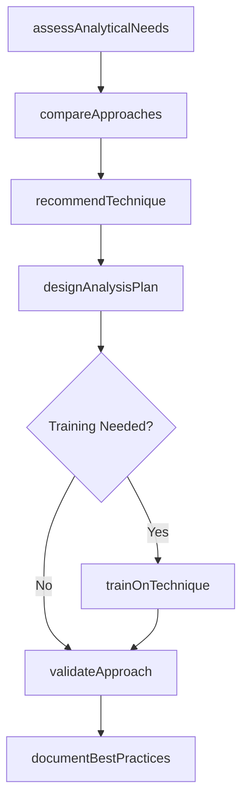
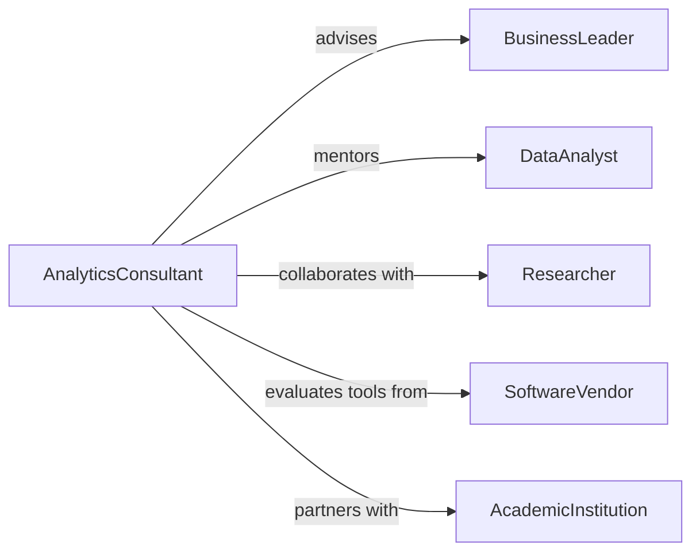

# Advise Others Analytical Techniques

> Business-as-Code definition for analytical techniques consultation. Models workflows for advising on data analysis methods, statistical approaches, modeling techniques, and analytical tool selection.

## Overview

Analytical techniques consultation provides guidance on selecting and applying appropriate methods for data analysis, forecasting, optimization, and decision support. This definition provides actions for assessing analytical needs, recommending techniques, training users, and validating analytical approaches.

## Actors

| Actor | Description |
|-------|-------------|
| BusinessLeader | Seeks analytical insights for decisions |
| DataAnalyst | Requests guidance on analysis methods |
| Researcher | Needs statistical or modeling expertise |
| SoftwareVendor | Provides analytical tools and platforms |
| AcademicInstitution | Offers training and certification |
| IndustryExpert | Shares best practices and benchmarks |

## Roles

| Role | Description |
|------|-------------|
| AnalyticsConsultant | Provides analytical methodology guidance |
| DataScientist | Advises on advanced analytical techniques |
| StatisticalAdvisor | Recommends statistical methods |
| TrainingCoordinator | Delivers analytical skills development |

## Entities

| Entity | Description |
|--------|-------------|
| AnalyticalRequest | Request for methodology guidance |
| Technique | Specific analytical method or approach |
| UseCase | Business problem requiring analytical solution |
| Recommendation | Advised technique with rationale |
| TrainingPlan | Curriculum for analytical skills development |
| ValidationReport | Assessment of analytical approach effectiveness |

## Actions

| Action | Description |
|--------|-------------|
| assessAnalyticalNeeds | Evaluate business problem and data requirements |
| recommendTechnique | Suggest appropriate analytical method |
| compareApproaches | Evaluate multiple techniques for suitability |
| designAnalysisPlan | Create methodology for analytical project |
| trainOnTechnique | Provide instruction on analytical method |
| validateApproach | Verify analytical methodology effectiveness |
| documentBestPractices | Capture recommended analytical standards |

## Events

| Event | Description |
|-------|-------------|
| analyticalNeedsAssessed | Business requirements evaluated |
| techniqueRecommended | Analytical method suggested |
| approachesCompared | Multiple techniques evaluated |
| analysisPlanDesigned | Methodology created for project |
| techniqueTrainingDelivered | Instruction on method provided |
| approachValidated | Methodology effectiveness verified |
| bestPracticesDocumented | Analytical standards captured |

## Searches

| Search | Description |
|--------|-------------|
| findRecommendations | List advised techniques by use case or domain |
| getTechniques | Retrieve analytical methods by category |
| getTrainingPlans | Find available analytical skills curricula |
| getBestPractices | List documented analytical standards |

## Entity Relationships



## State Diagram



## Workflow



## Actor Relationships



## Usage

### Calling Actions

```typescript
import { adviseOthersAnalyticalTechniques } from '@headlessly/advise-others-analytical-techniques'

const advisory = adviseOthersAnalyticalTechniques()

// Assess analytical needs
const assessment = await advisory.assessAnalyticalNeeds({
  businessProblem: 'Forecast quarterly sales by region',
  dataAvailability: '5 years historical sales data',
  constraints: ['limited statistical expertise', 'monthly refresh required']
})

// Recommend technique
const recommendation = await advisory.recommendTechnique({
  assessmentId: assessment.id,
  techniques: ['time-series-regression', 'arima', 'prophet']
})

// Train team on recommended approach
await advisory.trainOnTechnique({
  technique: 'prophet',
  audience: 'sales-analytics-team',
  format: 'workshop'
})
```

### Event-Driven Automation

```typescript
// Auto-schedule training on new recommendations
advisory.techniqueRecommended(async ({ technique, audience, complexity }) => {
  if (complexity === 'advanced') {
    await advisory.trainOnTechnique({
      technique,
      audience,
      duration: '2-days'
    })
  }
})

// Document successful approaches
advisory.approachValidated(async ({ technique, useCase, effectiveness }) => {
  if (effectiveness > 0.85) {
    await advisory.documentBestPractices({
      technique,
      useCase,
      recommendedFor: 'similar-business-problems'
    })
  }
})
```
