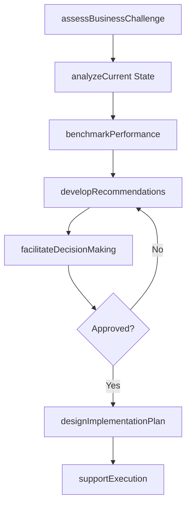
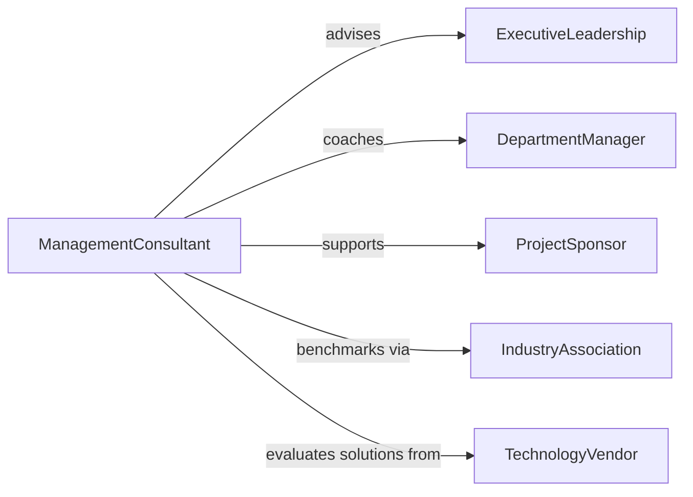

# Advise Others Business Operational Matters

> Business-as-Code definition for business and operational consulting. Models workflows for strategic advice, process improvement recommendations, operational assessments, and implementation guidance.

## Overview

Business and operational consultation provides expert guidance on strategy, operations, process optimization, and organizational effectiveness. This definition provides actions for assessing business challenges, developing recommendations, facilitating decision-making, and supporting implementation.

## Actors

| Actor | Description |
|-------|-------------|
| ExecutiveLeadership | Seeks strategic and operational guidance |
| DepartmentManager | Requests process improvement advice |
| ProjectSponsor | Needs implementation planning support |
| IndustryAssociation | Provides benchmarking and best practices |
| TechnologyVendor | Offers solutions for operational challenges |
| CompetitorAnalyst | Shares market intelligence and trends |

## Roles

| Role | Description |
|------|-------------|
| ManagementConsultant | Provides strategic and operational advice |
| ProcessAdvisor | Recommends workflow and efficiency improvements |
| ChangeManagementCoach | Guides organizational transformation |
| ImplementationSpecialist | Supports execution of recommendations |

## Entities

| Entity | Description |
|--------|-------------|
| Engagement | Consultation project with defined scope |
| Assessment | Evaluation of current business or operational state |
| Recommendation | Advised course of action with rationale |
| ImplementationPlan | Roadmap for executing recommendations |
| Deliverable | Report, presentation, or documentation |
| FollowUp | Post-implementation review and support |

## Actions

| Action | Description |
|--------|-------------|
| assessBusinessChallenge | Evaluate operational or strategic issue |
| analyzeCurrent State | Document existing processes and performance |
| benchmarkPerformance | Compare to industry standards and best practices |
| developRecommendations | Create advised solutions and action plans |
| facilitateDecisionMaking | Guide stakeholders through options evaluation |
| designImplementationPlan | Create roadmap for executing recommendations |
| supportExecution | Provide ongoing guidance during implementation |

## Events

| Event | Description |
|-------|-------------|
| businessChallengeAssessed | Operational issue evaluated |
| currentStateAnalyzed | Existing processes documented |
| performanceBenchmarked | Comparison to standards completed |
| recommendationsDeveloped | Advised solutions created |
| decisionMakingFacilitated | Stakeholder options review completed |
| implementationPlanDesigned | Execution roadmap created |
| executionSupported | Implementation guidance provided |

## Searches

| Search | Description |
|--------|-------------|
| findActiveEngagements | List ongoing consultation projects |
| getRecommendations | Retrieve advised solutions by domain or client |
| getImplementationPlans | Find execution roadmaps by status |
| getBenchmarks | List industry standards and best practices |

## Workflow



## Actor Relationships



## Usage

### Calling Actions

```typescript
import { adviseOthersBusinessOperationalMatters } from '@headlessly/advise-others-business-operational-matters'

const consulting = adviseOthersBusinessOperationalMatters()

// Assess business challenge
const assessment = await consulting.assessBusinessChallenge({
  client: 'acme-manufacturing',
  challenge: 'High production costs vs competitors',
  urgency: 'high'
})

// Develop recommendations
const recommendations = await consulting.developRecommendations({
  assessmentId: assessment.id,
  includeCostBenefit: true,
  includeRiskAnalysis: true
})

// Design implementation plan
const plan = await consulting.designImplementationPlan({
  recommendationId: recommendations.id,
  timeline: '6-months',
  resources: 'existing-staff-plus-contractors'
})
```

### Event-Driven Automation

```typescript
// Auto-schedule follow-up reviews
consulting.implementationPlanDesigned(async ({ planId, duration }) => {
  const reviewDates = calculateMilestones(duration)
  await reviewDates.forEach(date =>
    scheduleFollowUp({ planId, reviewDate: date })
  )
})

// Alert on implementation delays
consulting.executionSupported(async ({ planId, milestoneStatus }) => {
  const delayed = milestoneStatus.filter(m => m.status === 'behind-schedule')
  if (delayed.length > 0) {
    await notify({
      to: 'project-sponsor',
      priority: 'high',
      message: `${delayed.length} milestones behind schedule for ${planId}`
    })
  }
})
```
