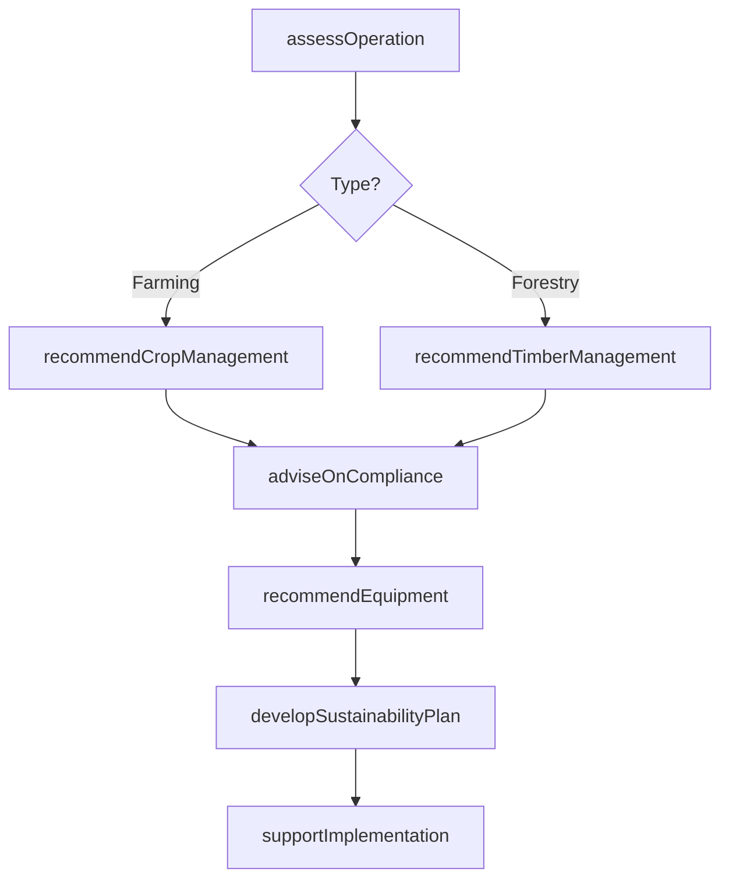
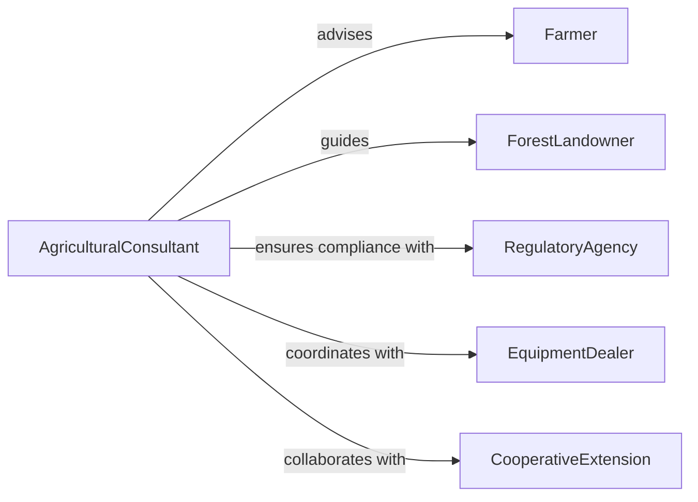

# Advise Others Farming Forestry Operations

> Business-as-Code definition for agricultural and forestry consulting. Models workflows for advising on crop management, sustainable practices, equipment selection, regulatory compliance, and land stewardship.

## Overview

Farming and forestry operations consultation provides expert guidance on agricultural practices, forest management, equipment optimization, regulatory compliance, and sustainable resource stewardship. This definition provides actions for assessing operations, recommending practices, and supporting implementation.

## Actors

| Actor | Description |
|-------|-------------|
| Farmer | Operates agricultural production |
| ForestLandowner | Manages timber and forest resources |
| RegulatoryAgency | Enforces environmental and agricultural regulations |
| EquipmentDealer | Provides farming and forestry machinery |
| CooperativeExtension | Offers research-based agricultural education |
| CertificationBody | Validates sustainable or organic practices |

## Roles

| Role | Description |
|------|-------------|
| AgriculturalConsultant | Provides crop and livestock management advice |
| ForestryAdvisor | Recommends timber and land management practices |
| ComplianceSpecialist | Ensures regulatory adherence |
| EquipmentSpecialist | Advises on machinery selection and operation |

## Entities

| Entity | Description |
|--------|-------------|
| Farm | Agricultural operation with crops or livestock |
| ForestLand | Timberland or conservation property |
| CropPlan | Planting, growing, and harvest strategy |
| TimberHarvestPlan | Sustainable logging and reforestation strategy |
| Regulation | Environmental or agricultural compliance requirement |
| EquipmentRecommendation | Advised machinery with cost-benefit analysis |

## Actions

| Action | Description |
|--------|-------------|
| assessOperation | Evaluate current farming or forestry practices |
| recommendCropManagement | Advise on planting, fertilization, and harvest |
| recommendTimberManagement | Suggest sustainable logging and reforestation |
| adviseOnCompliance | Provide regulatory guidance |
| recommendEquipment | Suggest machinery for operational needs |
| developSustainabilityPlan | Create strategy for environmental stewardship |
| supportImplementation | Provide ongoing operational guidance |

## Events

| Event | Description |
|-------|-------------|
| operationAssessed | Farming or forestry practices evaluated |
| cropManagementRecommended | Planting and harvest advice provided |
| timberManagementRecommended | Logging and reforestation guidance given |
| complianceAdvised | Regulatory guidance provided |
| equipmentRecommended | Machinery suggestions delivered |
| sustainabilityPlanDeveloped | Environmental stewardship strategy created |
| implementationSupported | Operational guidance provided |

## Searches

| Search | Description |
|--------|-------------|
| findActiveConsultations | List ongoing advisory engagements |
| getComplianceRequirements | Retrieve regulations by jurisdiction or practice |
| getEquipmentRecommendations | Find machinery suggestions by operation type |
| getSustainabilityPlans | List environmental stewardship strategies |

## Workflow



## Actor Relationships



## Usage

### Calling Actions

```typescript
import { adviseOthersFarmingForestryOperations } from '@headlessly/advise-others-farming-forestry-operations'

const advisory = adviseOthersFarmingForestryOperations()

// Assess farming operation
const assessment = await advisory.assessOperation({
  operatorId: 'farmer_johnson',
  operationType: 'row-crop',
  acreage: 500,
  currentPractices: ['corn', 'soybeans', 'conventional-tillage']
})

// Recommend crop management
const cropPlan = await advisory.recommendCropManagement({
  assessmentId: assessment.id,
  goals: ['increase-yield', 'reduce-input-costs'],
  soilType: 'clay-loam'
})

// Advise on compliance
await advisory.adviseOnCompliance({
  operatorId: 'farmer_johnson',
  regulations: ['nutrient-management', 'buffer-zones', 'pesticide-application']
})
```

### Event-Driven Automation

```typescript
// Auto-recommend equipment upgrades
advisory.cropManagementRecommended(async ({ operatorId, practiceChanges }) => {
  if (practiceChanges.includes('no-till')) {
    await advisory.recommendEquipment({
      operatorId,
      equipmentType: 'no-till-planter',
      includeFinancing: true
    })
  }
})

// Track sustainability certifications
advisory.sustainabilityPlanDeveloped(async ({ operatorId, certificationEligible }) => {
  if (certificationEligible.includes('organic')) {
    await notify({
      to: operatorId,
      message: 'Your sustainability plan qualifies for organic certification'
    })
  }
})
```
