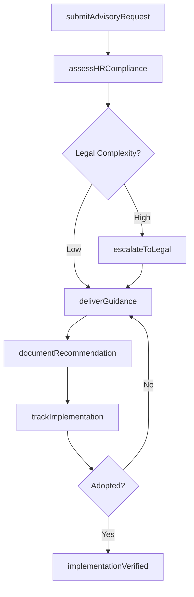
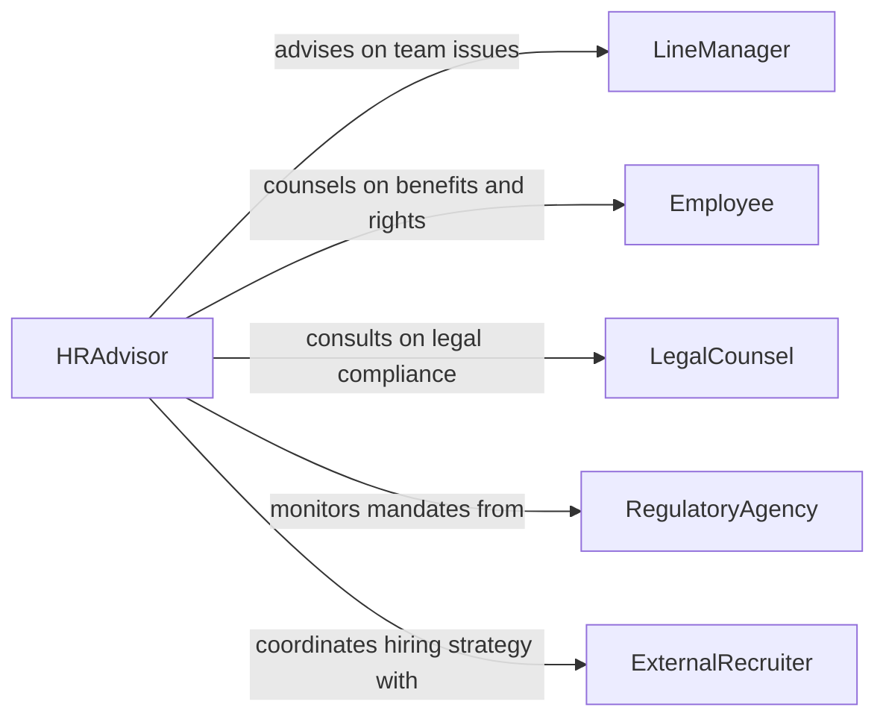

# Advise Others Human Resources Topics

> Business-as-Code definition for human resources advisory services. Models the complete cycle of providing HR guidance on employment law, benefits administration, talent management, and workplace policy compliance.

## Overview

Advising others on human resources topics encompasses providing expert guidance on workforce planning, employee relations, compensation and benefits, regulatory compliance, and organizational development. This definition exposes actions for delivering HR consultations, documenting recommendations, and tracking implementation of advised changes. It supports both reactive advisory (responding to specific HR questions) and proactive strategic guidance on talent management practices.

## Actors

| Actor | Description |
|-------|-------------|
| Employee | Seeks guidance on benefits, workplace rights, or career development |
| LineManager | Requests HR advice on team management, performance issues, or disciplinary matters |
| LegalCounsel | Provides employment law interpretations and compliance requirements |
| RegulatoryAgency | Issues workforce regulations and compliance mandates |
| ExternalRecruiter | Partners on talent acquisition strategies and market benchmarking |

## Roles

| Role | Description |
|------|-------------|
| HRAdvisor | Delivers expert guidance on human resources policies and practices |
| HRBusinessPartner | Aligns HR strategy with departmental business objectives |
| ComplianceSpecialist | Ensures HR recommendations meet regulatory requirements |
| TalentManager | Focuses on workforce planning and employee development advisory |

## Entities

| Entity | Description |
|--------|-------------|
| AdvisoryRequest | A formal request for HR guidance on a specific topic |
| Recommendation | A documented HR recommendation with rationale and implementation steps |
| PolicyReference | An applicable HR policy or regulatory requirement cited in guidance |
| ConsultationRecord | A log of advisory interactions including topics, advice given, and outcomes |
| ComplianceAssessment | An evaluation of current practices against HR regulations |

## Actions

| Action | Description |
|--------|-------------|
| submitAdvisoryRequest | Initiate a request for HR guidance on a specific topic |
| assessHRCompliance | Evaluate current practices against employment regulations |
| deliverGuidance | Provide expert HR recommendations to the requesting party |
| documentRecommendation | Record formal HR advice with supporting policy references |
| escalateToLegal | Route complex employment law questions to legal counsel |
| trackImplementation | Monitor whether advised HR changes have been adopted |
| benchmarkPractices | Compare organizational HR practices against industry standards |

## Events

| Event | Description |
|-------|-------------|
| advisoryRequestSubmitted | A new HR advisory request has been received |
| complianceAssessed | HR compliance evaluation has been completed |
| guidanceDelivered | HR recommendations have been communicated to the requester |
| recommendationDocumented | Formal HR advice has been recorded and filed |
| escalationTriggered | A complex HR matter has been routed to legal counsel |
| implementationVerified | Advised HR changes have been confirmed as adopted |
| policyGapIdentified | A gap between current practices and HR regulations has been found |

## Searches

| Search | Description |
|--------|-------------|
| findAdvisoryRequests | List HR advisory requests by topic, requester, or status |
| getRecommendations | Retrieve documented HR recommendations by subject area or date |
| getComplianceGaps | Find areas where current HR practices fall short of regulations |
| findConsultationHistory | Search past advisory interactions by employee, manager, or topic |

## Workflow



## Actor Relationships



## Usage

### Calling Actions

```typescript
import { adviseOthersHumanResourcesTopics } from '@headlessly/advise-others-human-resources-topics'

const hrAdvisory = adviseOthersHumanResourcesTopics()

// Submit a new advisory request
const request = await hrAdvisory.submitAdvisoryRequest({
  topic: 'Remote Work Policy Compliance',
  requester: 'operations-director',
  urgency: 'medium',
  description: 'Need guidance on updating remote work policies for multi-state employees'
})

// Assess compliance against current regulations
const assessment = await hrAdvisory.assessHRCompliance({
  requestId: request.id,
  jurisdiction: ['CA', 'NY', 'TX'],
  policyArea: 'remote-work'
})

// Deliver formal guidance
await hrAdvisory.deliverGuidance({
  requestId: request.id,
  recommendations: [
    { area: 'Tax Withholding', action: 'Register for payroll tax in each employee state' },
    { area: 'Workers Compensation', action: 'Obtain coverage in all applicable jurisdictions' }
  ]
})
```

### Event-Driven Automation

```typescript
// Notify legal when complex compliance issues arise
hrAdvisory.escalationTriggered(async ({ requestId, topic, complexity }) => {
  await notify({
    to: 'legal-team',
    message: `HR advisory escalation: ${topic} requires legal review`,
    priority: complexity
  })
})

// Follow up on unimplemented recommendations
hrAdvisory.guidanceDelivered(async ({ requestId, recommendations }) => {
  await scheduleFollowUp({
    requestId,
    checkDate: addDays(new Date(), 30),
    items: recommendations.map(r => r.area)
  })
})
```
