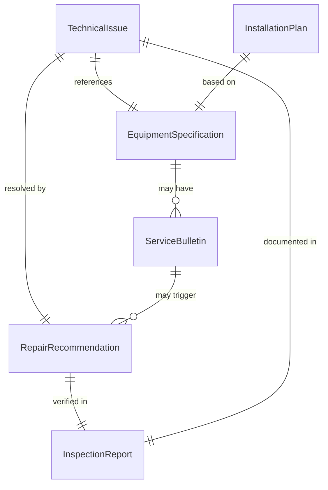
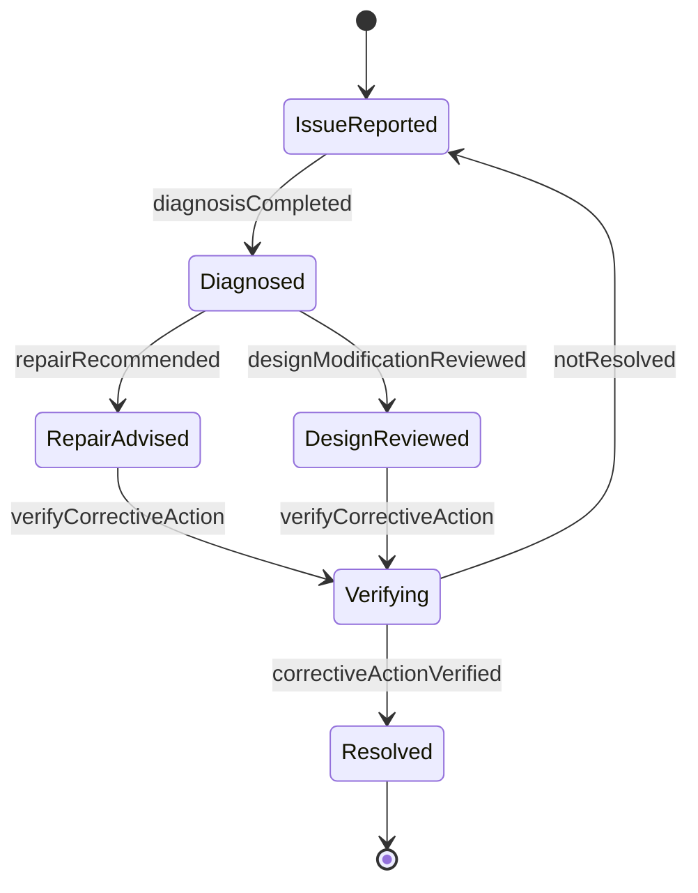
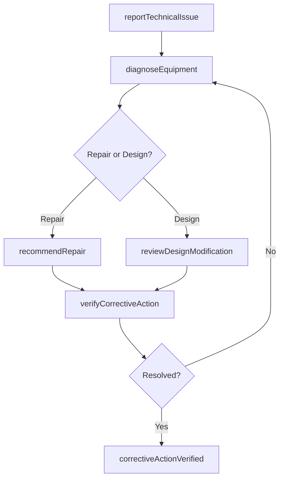
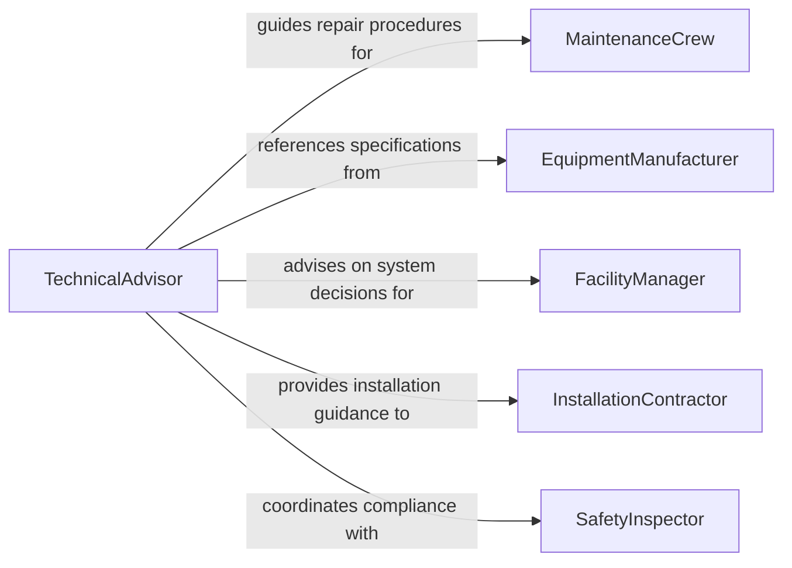

# Advise Others Issues Related Repairs

> Business-as-Code definition for technical advisory services on repairs, installation, and equipment design. Models the process of diagnosing issues, recommending solutions, and guiding maintenance and installation decisions.

## Overview

Advising others on issues related to repairs, installation, or equipment design involves providing expert technical guidance to maintenance crews, installation teams, engineers, and facility managers. This definition covers the full advisory lifecycle from initial problem assessment through solution recommendation and verification of corrective actions. It enables structured consultation on equipment failures, installation best practices, and design modifications to improve reliability and performance.

## Actors

| Actor | Description |
|-------|-------------|
| MaintenanceCrew | Performs hands-on repairs and seeks technical guidance on complex issues |
| EquipmentManufacturer | Provides specifications, warranty terms, and technical documentation |
| FacilityManager | Oversees building systems and requests advice on equipment decisions |
| InstallationContractor | Executes equipment installations and needs design and placement guidance |
| SafetyInspector | Verifies that repairs and installations meet regulatory safety standards |

## Roles

| Role | Description |
|------|-------------|
| TechnicalAdvisor | Provides expert guidance on repair methods, installation procedures, and design choices |
| MaintenanceEngineer | Diagnoses equipment issues and recommends corrective actions |
| DesignConsultant | Advises on equipment specifications and system design modifications |
| QualityAssuranceReviewer | Validates that recommended repairs and installations meet standards |

## Entities

| Entity | Description |
|--------|-------------|
| TechnicalIssue | A reported equipment failure, malfunction, or design concern |
| RepairRecommendation | A documented advisory on how to resolve a specific equipment problem |
| InstallationPlan | A set of guidelines and specifications for equipment installation |
| EquipmentSpecification | Technical parameters and requirements for a piece of equipment |
| ServiceBulletin | A manufacturer-issued notice about known issues or required modifications |
| InspectionReport | A record of equipment condition and compliance findings |

## Actions

| Action | Description |
|--------|-------------|
| reportTechnicalIssue | Log an equipment problem requiring expert advisory input |
| diagnoseEquipment | Analyze equipment data and symptoms to identify root causes |
| recommendRepair | Provide specific repair procedures and parts requirements |
| advisOnInstallation | Guide installation teams on proper equipment placement and setup |
| reviewDesignModification | Evaluate proposed equipment design changes for feasibility |
| issueServiceBulletin | Publish technical guidance on known equipment issues |
| verifyCorrectiveAction | Confirm that recommended repairs or changes were properly executed |

## Events

| Event | Description |
|-------|-------------|
| technicalIssueReported | A new equipment problem has been logged for advisory review |
| diagnosisCompleted | Root cause analysis of an equipment issue has been finalized |
| repairRecommended | A specific repair procedure has been advised |
| installationAdvised | Installation guidance has been provided to the contractor |
| designModificationReviewed | A proposed design change has been evaluated and feedback issued |
| serviceBulletinIssued | A technical advisory notice has been published |
| correctiveActionVerified | Recommended repairs or changes have been confirmed as complete |

## Searches

| Search | Description |
|--------|-------------|
| findTechnicalIssues | List reported equipment issues by type, severity, or status |
| getRepairHistory | Retrieve past repair recommendations for a specific piece of equipment |
| getServiceBulletins | Find active service bulletins by equipment model or issue category |
| findPendingVerifications | List recommended repairs or installations awaiting verification |

## Entity Relationships



## State Diagram



## Workflow



## Actor Relationships



## Usage

### Calling Actions

```typescript
import { adviseOthersIssuesRelatedRepairs } from '@headlessly/advise-others-issues-related-repairs'

const techAdvisory = adviseOthersIssuesRelatedRepairs()

// Report a technical issue
const issue = await techAdvisory.reportTechnicalIssue({
  equipment: 'HVAC-Unit-3B',
  facility: 'Building 7',
  symptoms: 'Intermittent cooling failure during peak load',
  severity: 'high'
})

// Diagnose the equipment problem
const diagnosis = await techAdvisory.diagnoseEquipment({
  issueId: issue.id,
  dataPoints: ['compressor-pressure', 'refrigerant-level', 'thermostat-readings']
})

// Recommend specific repair
await techAdvisory.recommendRepair({
  issueId: issue.id,
  procedure: 'Replace expansion valve and recharge refrigerant',
  parts: [{ partNumber: 'EXV-4420', quantity: 1 }],
  estimatedDowntime: '4 hours'
})
```

### Event-Driven Automation

```typescript
// Alert facility manager on critical diagnoses
techAdvisory.diagnosisCompleted(async ({ issueId, rootCause, severity }) => {
  if (severity === 'critical') {
    await notify({
      to: 'facility-manager',
      message: `Critical equipment diagnosis: ${rootCause}`
    })
  }
})

// Schedule verification after repair recommendation
techAdvisory.repairRecommended(async ({ issueId, estimatedDowntime }) => {
  await scheduleVerification({
    issueId,
    verifyAfter: addHours(new Date(), parseInt(estimatedDowntime) + 2)
  })
})
```
