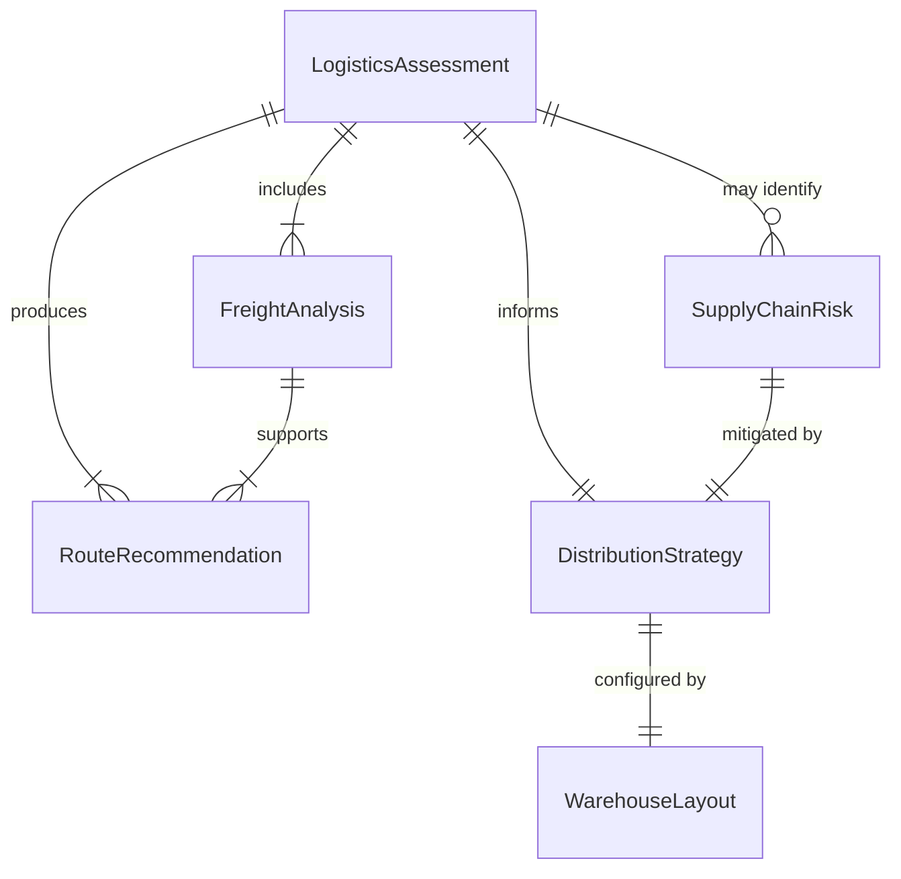
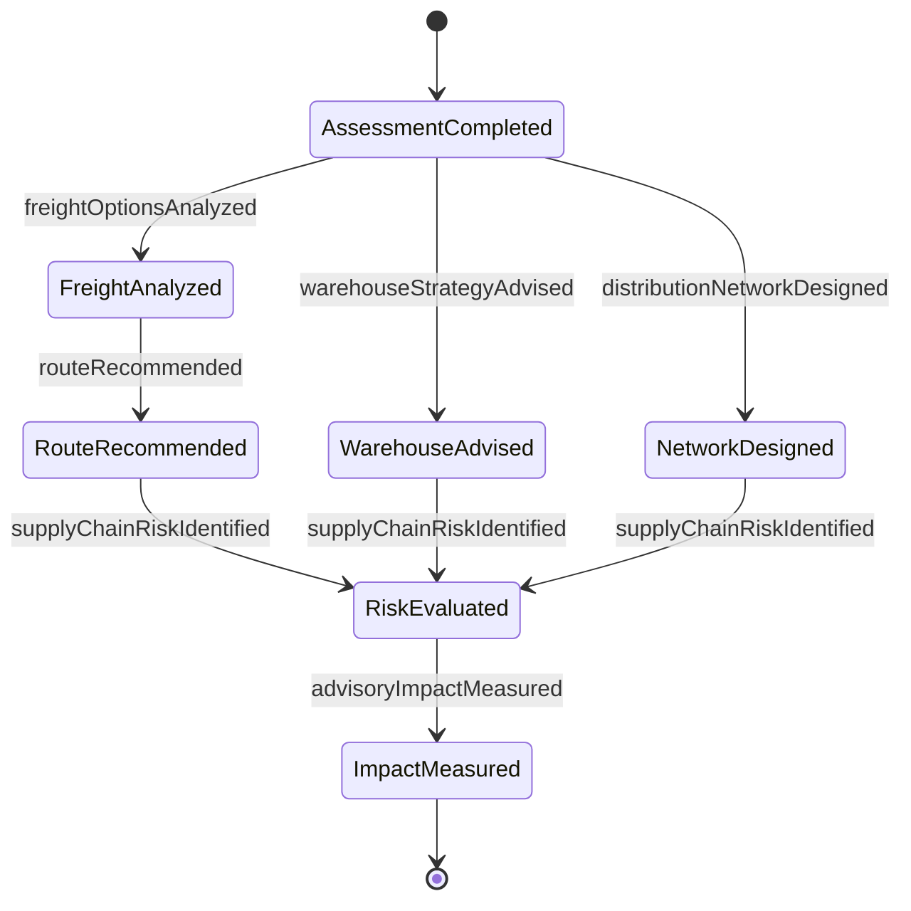
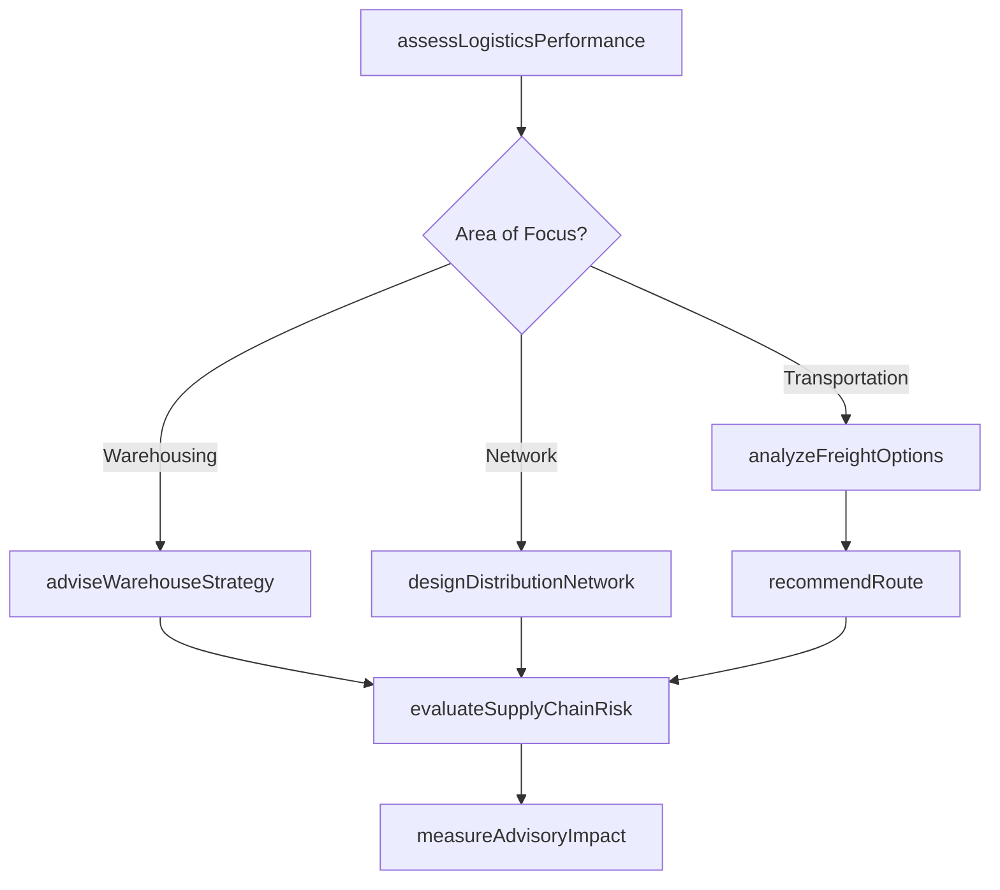
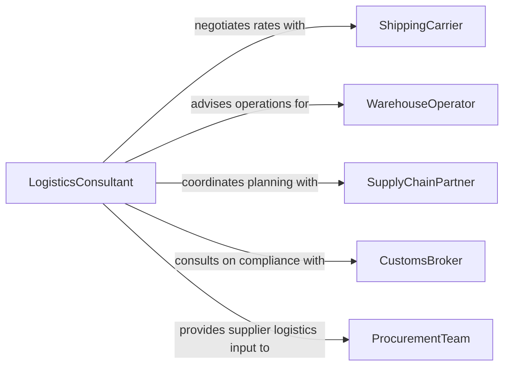

# Advise Others Logistics Topics

> Business-as-Code definition for logistics advisory services. Models the process of providing expert guidance on supply chain operations, transportation routing, warehousing strategies, and distribution optimization.

## Overview

Advising others on logistics topics involves providing expert consultation on supply chain management, freight routing, inventory positioning, warehouse operations, and distribution network design. This definition supports both strategic logistics planning and tactical operational guidance, enabling organizations to optimize transportation costs, reduce delivery lead times, and improve supply chain resilience. It covers the full advisory cycle from assessment of current logistics performance through recommendation delivery and impact measurement.

## Actors

| Actor | Description |
|-------|-------------|
| ShippingCarrier | Provides transportation services and rate structures for freight movement |
| WarehouseOperator | Manages storage facilities and seeks guidance on layout and throughput |
| SupplyChainPartner | Collaborates on end-to-end logistics planning across organizations |
| CustomsBroker | Handles import/export compliance and cross-border logistics requirements |
| ProcurementTeam | Sources materials and needs logistics input on supplier selection |

## Roles

| Role | Description |
|------|-------------|
| LogisticsConsultant | Provides expert advisory on transportation, warehousing, and distribution |
| SupplyChainAnalyst | Analyzes logistics data to identify optimization opportunities |
| TransportationPlanner | Advises on freight routing, carrier selection, and mode optimization |
| DistributionManager | Oversees network design and fulfillment strategy advisory |

## Entities

| Entity | Description |
|--------|-------------|
| LogisticsAssessment | An evaluation of current logistics performance and capabilities |
| RouteRecommendation | A proposed transportation route with cost and time analysis |
| DistributionStrategy | A plan for positioning inventory and fulfilling orders across a network |
| FreightAnalysis | A cost-benefit analysis of shipping modes and carrier options |
| WarehouseLayout | A recommended configuration for storage and picking operations |
| SupplyChainRisk | An identified vulnerability in the logistics network |

## Actions

| Action | Description |
|--------|-------------|
| assessLogisticsPerformance | Evaluate current supply chain metrics and identify bottlenecks |
| recommendRoute | Propose optimal transportation routes based on cost, time, and reliability |
| adviseWarehouseStrategy | Provide guidance on warehouse layout, automation, and throughput |
| analyzeFreightOptions | Compare shipping modes and carrier alternatives for specific lanes |
| designDistributionNetwork | Recommend network structure for fulfillment centers and transit points |
| evaluateSupplyChainRisk | Identify and assess vulnerabilities in the logistics chain |
| measureAdvisoryImpact | Track improvements resulting from implemented logistics recommendations |

## Events

| Event | Description |
|-------|-------------|
| logisticsAssessmentCompleted | A supply chain performance evaluation has been finalized |
| routeRecommended | An optimal transportation route has been proposed |
| warehouseStrategyAdvised | Warehousing guidance has been delivered to the operator |
| freightOptionsAnalyzed | Shipping mode and carrier comparison has been completed |
| distributionNetworkDesigned | A fulfillment network configuration has been recommended |
| supplyChainRiskIdentified | A logistics vulnerability has been flagged for attention |
| advisoryImpactMeasured | Results of implemented logistics recommendations have been quantified |

## Searches

| Search | Description |
|--------|-------------|
| findLogisticsAssessments | List assessments by region, client, or performance category |
| getRouteRecommendations | Retrieve route proposals by origin, destination, or shipping mode |
| getSupplyChainRisks | Find identified logistics vulnerabilities by severity or category |
| findFreightAnalyses | Search freight comparisons by lane, carrier, or cost threshold |

## Entity Relationships



## State Diagram



## Workflow



## Actor Relationships



## Usage

### Calling Actions

```typescript
import { adviseOthersLogisticsTopics } from '@headlessly/advise-others-logistics-topics'

const logistics = adviseOthersLogisticsTopics()

// Assess current logistics performance
const assessment = await logistics.assessLogisticsPerformance({
  client: 'acme-manufacturing',
  regions: ['US-West', 'US-Central'],
  metrics: ['cost-per-unit', 'on-time-delivery', 'transit-time']
})

// Analyze freight options for a key lane
const freightAnalysis = await logistics.analyzeFreightOptions({
  origin: 'Los Angeles, CA',
  destination: 'Chicago, IL',
  volume: { weight: 42000, unit: 'lbs' },
  modes: ['FTL', 'intermodal', 'LTL']
})

// Recommend optimal route
await logistics.recommendRoute({
  analysisId: freightAnalysis.id,
  preferredMode: 'intermodal',
  maxTransitDays: 5
})
```

### Event-Driven Automation

```typescript
// Alert on identified supply chain risks
logistics.supplyChainRiskIdentified(async ({ riskId, category, severity }) => {
  if (severity === 'high') {
    await notify({
      to: 'supply-chain-leadership',
      message: `High-severity logistics risk identified: ${category}`
    })
  }
})

// Schedule impact review after recommendations are implemented
logistics.routeRecommended(async ({ recommendationId, client }) => {
  await scheduleReview({
    recommendationId,
    reviewDate: addDays(new Date(), 90),
    type: 'advisory-impact'
  })
})
```
