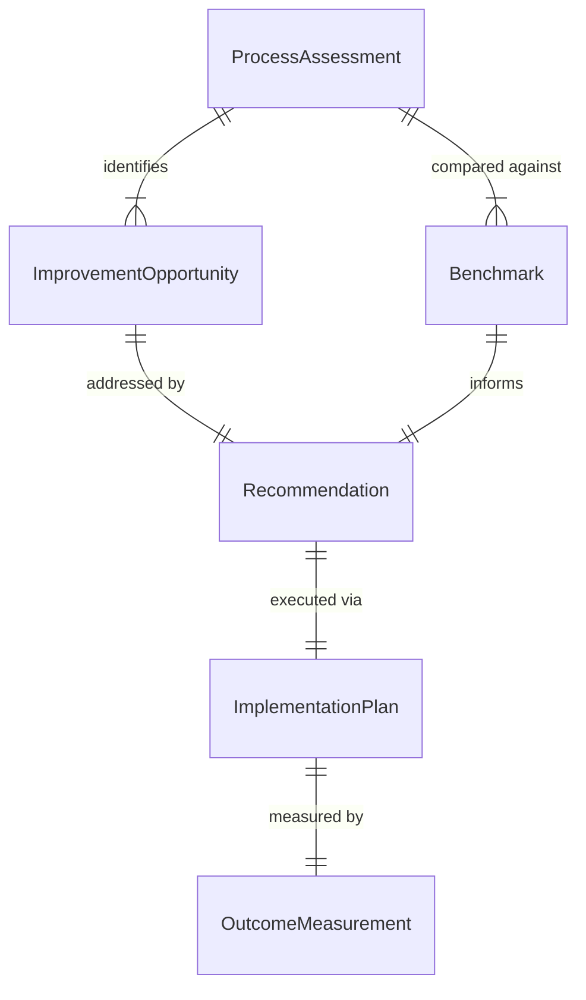
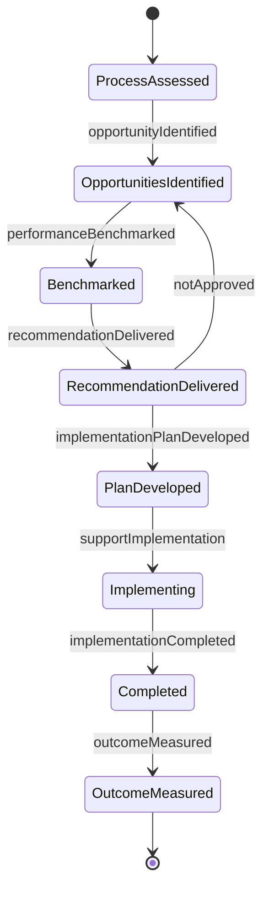
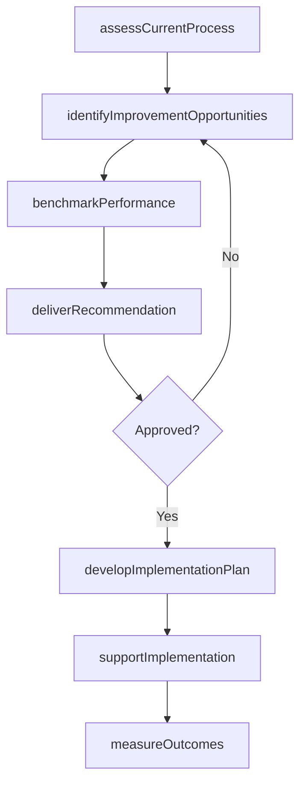
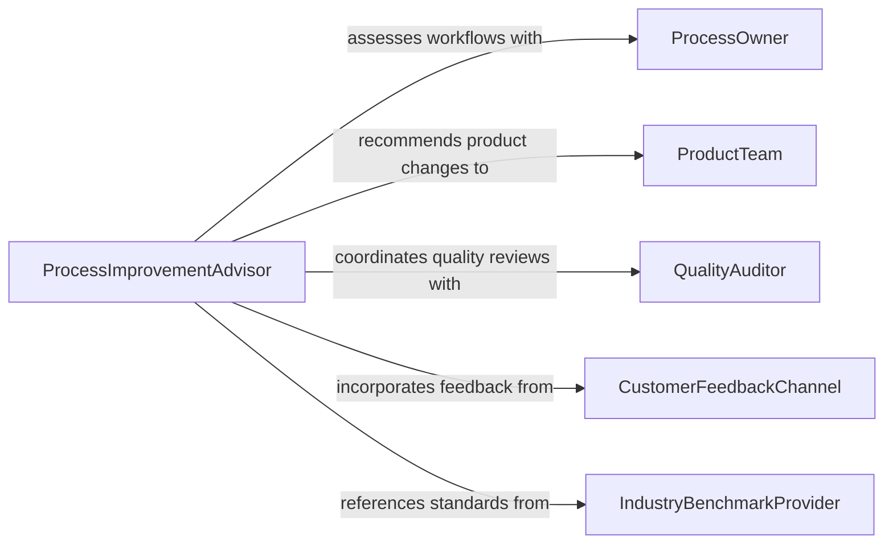

# Advise Others Ways Improve Processes

> Business-as-Code definition for process and product improvement advisory. Models the complete cycle of analyzing current operations, identifying improvement opportunities, recommending changes, and measuring outcomes.

## Overview

Advising others on ways to improve processes or products involves conducting operational assessments, benchmarking against best practices, and delivering actionable recommendations for efficiency gains, quality improvements, and cost reductions. This definition covers continuous improvement methodologies including Lean, Six Sigma, and Kaizen, applied across manufacturing, service delivery, and product development contexts. It enables structured advisory engagements from initial assessment through implementation support and results verification.

## Actors

| Actor | Description |
|-------|-------------|
| ProcessOwner | Manages the operational process under review and implements changes |
| ProductTeam | Develops and iterates on products based on improvement recommendations |
| QualityAuditor | Evaluates process and product quality against defined standards |
| CustomerFeedbackChannel | Provides end-user input that drives improvement priorities |
| IndustryBenchmarkProvider | Supplies comparative performance data for similar operations |

## Roles

| Role | Description |
|------|-------------|
| ProcessImprovementAdvisor | Leads assessment and delivers improvement recommendations |
| LeanConsultant | Applies lean methodologies to eliminate waste and streamline workflows |
| QualityEngineer | Analyzes defects and recommends product and process quality improvements |
| OperationsAnalyst | Gathers and analyzes operational data to support advisory conclusions |

## Entities

| Entity | Description |
|--------|-------------|
| ProcessAssessment | An evaluation of current process performance and maturity |
| ImprovementOpportunity | A specific area where process or product changes could yield benefits |
| Recommendation | A documented improvement proposal with expected impact and effort |
| Benchmark | A comparative performance metric from industry or internal standards |
| ImplementationPlan | A structured plan for executing recommended improvements |
| OutcomeMeasurement | A record of results achieved after implementing improvements |

## Actions

| Action | Description |
|--------|-------------|
| assessCurrentProcess | Evaluate existing workflows, cycle times, and quality metrics |
| identifyImprovementOpportunities | Analyze data to find areas with high improvement potential |
| benchmarkPerformance | Compare current operations against industry or internal standards |
| deliverRecommendation | Present specific improvement proposals with cost-benefit analysis |
| developImplementationPlan | Create a phased plan for executing recommended changes |
| supportImplementation | Provide ongoing guidance during the change execution phase |
| measureOutcomes | Quantify the results of implemented improvements against targets |

## Events

| Event | Description |
|-------|-------------|
| processAssessed | A current-state process evaluation has been completed |
| opportunityIdentified | A specific improvement area has been flagged for attention |
| performanceBenchmarked | Operations have been compared against relevant benchmarks |
| recommendationDelivered | An improvement proposal has been communicated to stakeholders |
| implementationPlanDeveloped | A structured change plan has been created and approved |
| implementationCompleted | Recommended changes have been fully executed |
| outcomeMeasured | Post-implementation results have been quantified and reported |

## Searches

| Search | Description |
|--------|-------------|
| findProcessAssessments | List assessments by department, process area, or maturity level |
| getImprovementOpportunities | Retrieve identified opportunities by impact, effort, or category |
| getRecommendations | Find improvement proposals by status, area, or expected ROI |
| findOutcomeMeasurements | Search post-implementation results by process, date, or metric |

## Entity Relationships



## State Diagram



## Workflow



## Actor Relationships



## Usage

### Calling Actions

```typescript
import { adviseOthersWaysImproveProcesses } from '@headlessly/advise-others-ways-improve-processes'

const improvement = adviseOthersWaysImproveProcesses()

// Assess current manufacturing process
const assessment = await improvement.assessCurrentProcess({
  processName: 'Order Fulfillment',
  department: 'Operations',
  metrics: ['cycle-time', 'defect-rate', 'throughput', 'cost-per-unit']
})

// Identify improvement opportunities
const opportunities = await improvement.identifyImprovementOpportunities({
  assessmentId: assessment.id,
  methodology: 'lean-six-sigma',
  minImpactScore: 7
})

// Deliver a recommendation
await improvement.deliverRecommendation({
  opportunityId: opportunities[0].id,
  title: 'Consolidate Picking Zones',
  expectedImpact: { cycleTimeReduction: '22%', costSavings: 150000 },
  effort: 'medium',
  timeline: '8 weeks'
})
```

### Event-Driven Automation

```typescript
// Notify stakeholders when high-impact opportunities are identified
improvement.opportunityIdentified(async ({ processName, impactScore, category }) => {
  if (impactScore >= 9) {
    await notify({
      to: 'operations-leadership',
      message: `High-impact improvement opportunity in ${processName}: ${category}`
    })
  }
})

// Schedule outcome measurement after implementation
improvement.implementationCompleted(async ({ recommendationId, processName }) => {
  await scheduleReview({
    recommendationId,
    reviewDate: addDays(new Date(), 60),
    type: 'outcome-measurement'
  })
})
```
