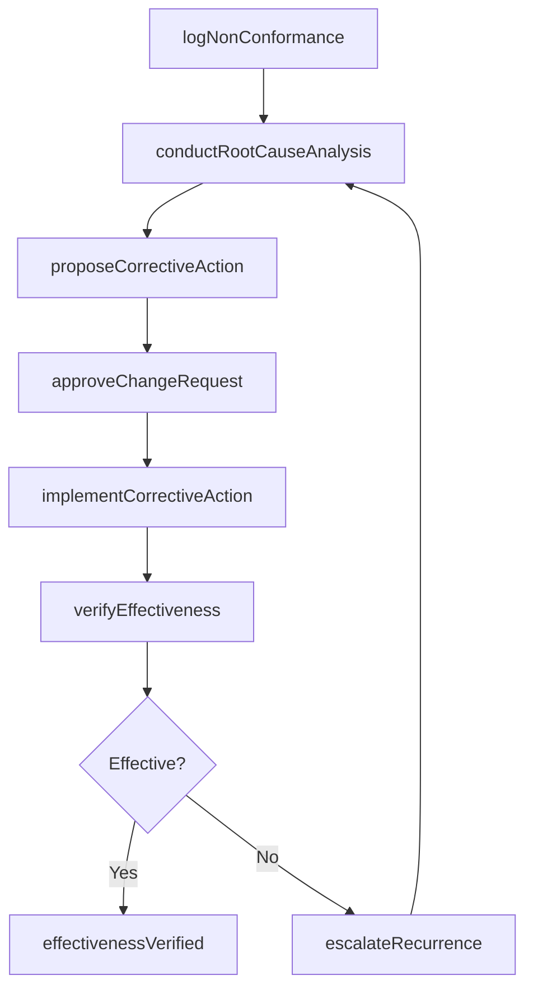
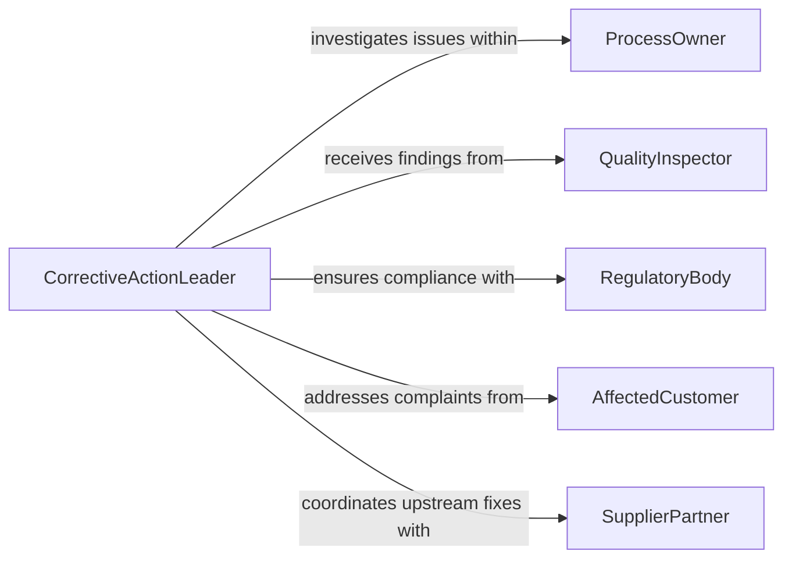

# Recommend Changes Corrective Procedures

> Business-as-Code definition for recommending changes and corrective procedures. Models the process of identifying non-conformances, analyzing root causes, proposing corrective actions, and verifying effectiveness.

## Overview

Recommending changes or corrective procedures involves identifying deviations from expected performance, conducting root cause analysis, and proposing structured corrective and preventive actions. This definition supports quality management, operational compliance, and continuous improvement workflows across manufacturing, service, and administrative settings. It tracks corrective actions from initial finding through implementation and effectiveness verification to ensure issues are resolved and do not recur.

## Actors

| Actor | Description |
|-------|-------------|
| ProcessOwner | Manages the process where a deviation or non-conformance was identified |
| QualityInspector | Detects non-conformances during audits, inspections, or testing |
| RegulatoryBody | Establishes compliance standards that trigger corrective action requirements |
| AffectedCustomer | Reports product or service issues that require corrective response |
| SupplierPartner | Contributes to corrective actions when defects originate upstream |

## Roles

| Role | Description |
|------|-------------|
| CorrectiveActionLeader | Coordinates the investigation and resolution of identified issues |
| RootCauseAnalyst | Conducts systematic analysis to determine underlying causes of deviations |
| QualityManager | Oversees the corrective action program and approves proposed changes |
| ImplementationCoordinator | Ensures corrective actions are executed on schedule and as designed |

## Entities

| Entity | Description |
|--------|-------------|
| NonConformance | A documented deviation from specification, standard, or expected performance |
| RootCauseAnalysis | A systematic investigation identifying the underlying cause of an issue |
| CorrectiveAction | A proposed change or procedure to eliminate the cause of a non-conformance |
| PreventiveAction | A proactive measure to prevent potential issues from occurring |
| EffectivenessReview | An evaluation confirming that corrective actions resolved the issue |
| ChangeRequest | A formal proposal to modify a process, procedure, or system |

## Actions

| Action | Description |
|--------|-------------|
| logNonConformance | Record a deviation or defect requiring corrective investigation |
| conductRootCauseAnalysis | Systematically analyze the underlying causes of an identified issue |
| proposeCorrectiveAction | Recommend specific changes or procedures to address root causes |
| approveChangeRequest | Formally authorize the implementation of proposed corrections |
| implementCorrectiveAction | Execute approved changes to processes, procedures, or systems |
| verifyEffectiveness | Confirm that implemented corrections resolved the original issue |
| escalateRecurrence | Flag issues that reoccur despite previous corrective actions |

## Events

| Event | Description |
|-------|-------------|
| nonConformanceLogged | A deviation has been documented and entered into the corrective action system |
| rootCauseIdentified | The underlying cause of a non-conformance has been determined |
| correctiveActionProposed | A specific correction has been recommended for approval |
| changeRequestApproved | A proposed corrective change has been formally authorized |
| correctiveActionImplemented | Approved corrections have been put into effect |
| effectivenessVerified | Implemented corrections have been confirmed as resolving the issue |
| recurrenceEscalated | A previously corrected issue has reappeared and been flagged |

## Searches

| Search | Description |
|--------|-------------|
| findNonConformances | List deviations by type, severity, process area, or status |
| getCorrectiveActions | Retrieve corrective action proposals by status, assignee, or due date |
| getEffectivenessReviews | Find completed effectiveness checks by outcome or process area |
| findRecurringIssues | Identify non-conformances that have occurred multiple times |

## Workflow



## Actor Relationships



## Usage

### Calling Actions

```typescript
import { recommendChangesCorrectiveProcedures } from '@headlessly/recommend-changes-corrective-procedures'

const capa = recommendChangesCorrectiveProcedures()

// Log a non-conformance
const finding = await capa.logNonConformance({
  title: 'Dimensional tolerance exceeded on Part A-2200',
  processArea: 'CNC Machining',
  severity: 'major',
  detectedBy: 'quality-inspector-12',
  affectedLots: ['LOT-2026-0142', 'LOT-2026-0143']
})

// Conduct root cause analysis
const rca = await capa.conductRootCauseAnalysis({
  nonConformanceId: finding.id,
  methodology: '5-why',
  rootCause: 'Tool wear beyond replacement interval due to missed calibration schedule'
})

// Propose corrective action
await capa.proposeCorrectiveAction({
  rootCauseAnalysisId: rca.id,
  actions: [
    { type: 'corrective', description: 'Replace worn tooling and recalibrate CNC spindle' },
    { type: 'preventive', description: 'Implement automated tool-life monitoring with alerts' }
  ],
  targetCompletionDate: '2026-03-15'
})
```

### Event-Driven Automation

```typescript
// Notify quality manager when major non-conformances are logged
capa.nonConformanceLogged(async ({ title, severity, processArea }) => {
  if (severity === 'major' || severity === 'critical') {
    await notify({
      to: 'quality-manager',
      message: `${severity} non-conformance in ${processArea}: ${title}`
    })
  }
})

// Alert leadership on recurring issues
capa.recurrenceEscalated(async ({ nonConformanceId, occurrenceCount }) => {
  await notify({
    to: 'operations-director',
    message: `Recurring issue (${occurrenceCount} occurrences) requires management review`,
    priority: 'high'
  })
})
```
