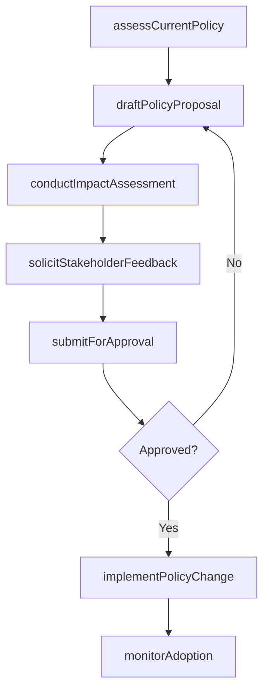
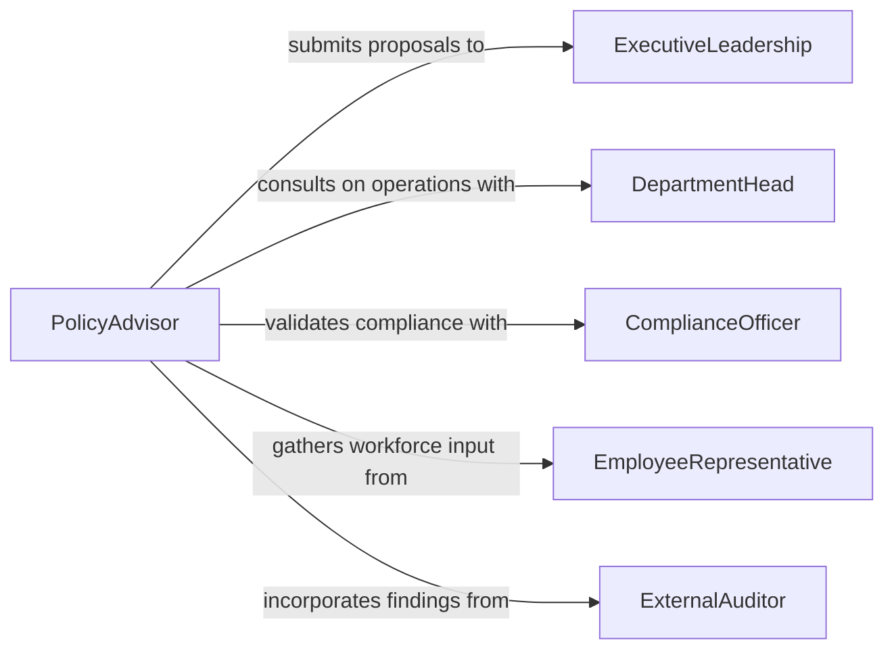

# Recommend Organizational Process Policy Changes

> Business-as-Code definition for recommending organizational process and policy changes. Models the lifecycle of identifying improvement needs, drafting policy proposals, managing stakeholder review, and tracking adoption.

## Overview

Recommending organizational process or policy changes involves analyzing current operational procedures, identifying gaps or inefficiencies, and proposing formal modifications to policies, workflows, or governance structures. This definition covers the full change recommendation lifecycle from initial needs assessment through stakeholder consultation, proposal drafting, approval routing, and post-implementation monitoring. It supports both compliance-driven policy updates and efficiency-focused process redesign across departments and business units.

## Actors

| Actor | Description |
|-------|-------------|
| ExecutiveLeadership | Approves major policy changes and sets organizational priorities |
| DepartmentHead | Provides operational context and implements approved process changes |
| ComplianceOfficer | Ensures proposed changes align with regulatory and legal requirements |
| EmployeeRepresentative | Advocates for workforce impact considerations in policy changes |
| ExternalAuditor | Reviews organizational processes and identifies areas requiring policy updates |

## Roles

| Role | Description |
|------|-------------|
| PolicyAdvisor | Analyzes current processes and drafts change recommendations |
| ChangeManager | Coordinates the review, approval, and rollout of policy changes |
| ProcessAnalyst | Maps current workflows and models proposed process improvements |
| GovernanceCoordinator | Ensures change proposals follow organizational governance procedures |

## Entities

| Entity | Description |
|--------|-------------|
| PolicyProposal | A formal recommendation for modifying an organizational policy |
| ProcessMap | A documented workflow showing current or proposed process steps |
| ImpactAssessment | An analysis of how proposed changes would affect operations and stakeholders |
| StakeholderFeedback | Input collected from affected parties during the review period |
| ApprovalRecord | A formal decision record authorizing or rejecting a proposed change |
| ImplementationTracker | A monitoring record for tracking adoption of approved changes |

## Actions

| Action | Description |
|--------|-------------|
| assessCurrentPolicy | Evaluate existing policies and processes for gaps or inefficiencies |
| draftPolicyProposal | Create a formal recommendation for process or policy modification |
| conductImpactAssessment | Analyze the operational, financial, and workforce effects of proposed changes |
| solicitStakeholderFeedback | Gather input from affected departments and individuals |
| submitForApproval | Route the finalized proposal through the organizational approval process |
| implementPolicyChange | Execute approved modifications to processes and policies |
| monitorAdoption | Track compliance with and adoption of newly implemented changes |

## Events

| Event | Description |
|-------|-------------|
| policyAssessed | An evaluation of current policy effectiveness has been completed |
| proposalDrafted | A formal policy change recommendation has been documented |
| impactAssessmentCompleted | The effects of a proposed change have been analyzed and reported |
| stakeholderFeedbackCollected | Input from affected parties has been gathered and compiled |
| proposalApproved | A policy change recommendation has been formally authorized |
| policyChangeImplemented | Approved process or policy modifications have been put into effect |
| adoptionMonitored | Post-implementation compliance data has been collected and reviewed |

## Searches

| Search | Description |
|--------|-------------|
| findPolicyProposals | List proposals by department, status, or policy area |
| getImpactAssessments | Retrieve impact analyses by proposal, affected area, or risk level |
| getStakeholderFeedback | Find collected feedback by proposal, department, or sentiment |
| findImplementationStatus | Track adoption progress by policy, department, or compliance rate |

## Workflow



## Actor Relationships



## Usage

### Calling Actions

```typescript
import { recommendOrganizationalProcessPolicyChanges } from '@headlessly/recommend-organizational-process-policy-changes'

const policyChange = recommendOrganizationalProcessPolicyChanges()

// Assess current expense approval policy
const assessment = await policyChange.assessCurrentPolicy({
  policyArea: 'Expense Approval',
  scope: ['Finance', 'Operations', 'Sales'],
  criteria: ['efficiency', 'compliance', 'employee-satisfaction']
})

// Draft a policy proposal
const proposal = await policyChange.draftPolicyProposal({
  assessmentId: assessment.id,
  title: 'Streamlined Expense Approval Thresholds',
  summary: 'Increase manager-level approval limit from $500 to $2,000 to reduce bottlenecks',
  currentPolicy: 'All expenses over $500 require VP approval',
  proposedChange: 'Expenses under $2,000 approved at manager level; $2,000+ requires VP approval',
  rationale: 'Current threshold creates 3-day average approval delay for routine expenses'
})

// Conduct impact assessment
await policyChange.conductImpactAssessment({
  proposalId: proposal.id,
  dimensions: ['processing-time', 'risk-exposure', 'employee-experience']
})
```

### Event-Driven Automation

```typescript
// Notify leadership when proposals are ready for approval
policyChange.impactAssessmentCompleted(async ({ proposalId, riskLevel }) => {
  await notify({
    to: 'executive-leadership',
    message: `Policy proposal ready for review (risk level: ${riskLevel})`,
    link: `/proposals/${proposalId}`
  })
})

// Schedule adoption review after implementation
policyChange.policyChangeImplemented(async ({ proposalId, policyArea }) => {
  await scheduleReview({
    proposalId,
    reviewDate: addDays(new Date(), 90),
    type: 'adoption-monitoring',
    area: policyArea
  })
})
```
