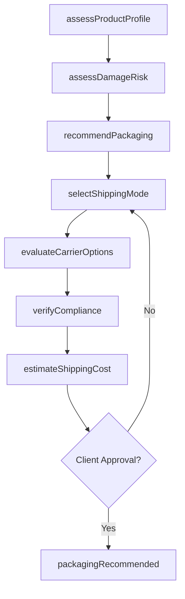
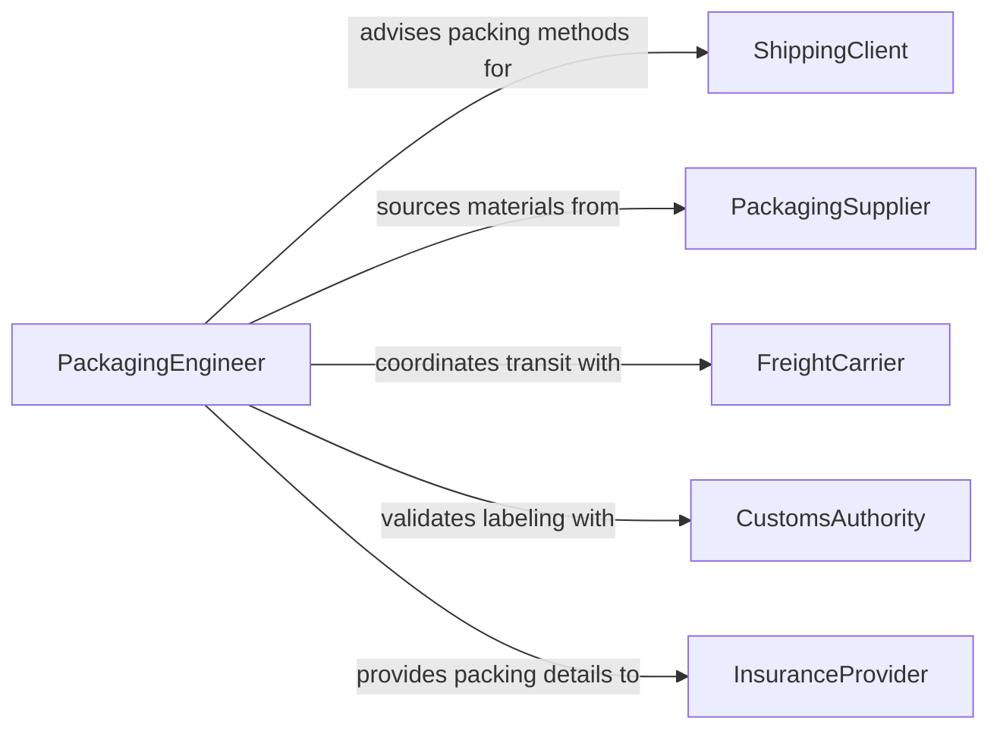

# Recommend Packing Shipping Methods

> Business-as-Code definition for recommending packing and shipping methods. Models the process of evaluating product characteristics, selecting appropriate packaging materials, and advising on optimal shipping modes and carriers.

## Overview

Recommending packing or shipping methods involves evaluating product dimensions, fragility, regulatory requirements, and destination constraints to advise on optimal packaging configurations and transportation modes. This definition covers the complete advisory process from product assessment through packaging specification, carrier selection, and cost optimization. It supports recommendations for domestic and international shipments, including hazardous materials handling, cold chain requirements, and sustainability considerations in packaging selection.

## Actors

| Actor | Description |
|-------|-------------|
| ShippingClient | Requests guidance on how to pack and ship specific products |
| PackagingSupplier | Provides packaging materials, specifications, and pricing |
| FreightCarrier | Offers transportation services with specific handling capabilities |
| CustomsAuthority | Enforces import/export packaging and labeling regulations |
| InsuranceProvider | Underwrites shipment coverage based on packing and shipping methods |

## Roles

| Role | Description |
|------|-------------|
| PackagingEngineer | Designs and recommends packaging solutions for product protection |
| ShippingSpecialist | Advises on carrier selection, shipping modes, and transit routing |
| ComplianceCoordinator | Ensures packing methods meet regulatory and hazmat requirements |
| CostAnalyst | Evaluates shipping and packing costs to optimize total landed cost |

## Entities

| Entity | Description |
|--------|-------------|
| ProductProfile | Physical characteristics and handling requirements of the item to be shipped |
| PackagingSpecification | Recommended materials, dimensions, and configuration for product packaging |
| ShippingRecommendation | A proposed carrier, mode, and route for product transportation |
| CostEstimate | A breakdown of packaging and shipping costs for a recommended method |
| ComplianceRequirement | Regulatory standards that must be met for specific product shipments |
| DamageRiskAssessment | An evaluation of potential product damage under different packing methods |

## Actions

| Action | Description |
|--------|-------------|
| assessProductProfile | Evaluate product dimensions, weight, fragility, and special handling needs |
| recommendPackaging | Propose specific packaging materials and configurations for product protection |
| selectShippingMode | Advise on optimal transportation mode based on cost, speed, and product type |
| evaluateCarrierOptions | Compare carriers based on rates, reliability, and handling capabilities |
| estimateShippingCost | Calculate total costs for recommended packing and shipping methods |
| verifyCompliance | Confirm that recommended methods meet regulatory and labeling requirements |
| assessDamageRisk | Evaluate product vulnerability under proposed packaging and transit conditions |

## Events

| Event | Description |
|-------|-------------|
| productProfileAssessed | Product characteristics and handling requirements have been documented |
| packagingRecommended | A specific packaging configuration has been proposed |
| shippingModeSelected | An optimal transportation mode has been advised |
| carrierOptionsEvaluated | Carrier comparisons have been completed with recommendations |
| shippingCostEstimated | Total packing and shipping costs have been calculated |
| complianceVerified | Regulatory conformance of recommended methods has been confirmed |
| damageRiskAssessed | Product vulnerability analysis under proposed methods has been completed |

## Searches

| Search | Description |
|--------|-------------|
| findPackagingSpecifications | List packaging recommendations by product type, size, or fragility level |
| getShippingRecommendations | Retrieve shipping proposals by destination, mode, or carrier |
| getCostEstimates | Find cost breakdowns by shipment, route, or carrier option |
| findComplianceRequirements | Search regulatory requirements by product category or destination country |

## Workflow



## Actor Relationships



## Usage

### Calling Actions

```typescript
import { recommendPackingShippingMethods } from '@headlessly/recommend-packing-shipping-methods'

const shipping = recommendPackingShippingMethods()

// Assess product profile
const profile = await shipping.assessProductProfile({
  productName: 'Industrial Glass Panel',
  dimensions: { length: 72, width: 48, height: 0.5, unit: 'inches' },
  weight: { value: 85, unit: 'lbs' },
  fragility: 'high',
  specialHandling: ['upright-only', 'no-stacking']
})

// Recommend packaging
const packaging = await shipping.recommendPackaging({
  profileId: profile.id,
  requirements: ['edge-protection', 'vibration-dampening', 'weather-resistant'],
  sustainabilityPreference: 'recyclable-materials'
})

// Evaluate carrier options
const carriers = await shipping.evaluateCarrierOptions({
  origin: 'Toledo, OH',
  destination: 'Phoenix, AZ',
  packagingId: packaging.id,
  deliveryWindow: { earliest: '2026-03-10', latest: '2026-03-14' }
})
```

### Event-Driven Automation

```typescript
// Alert compliance team for regulated shipments
shipping.productProfileAssessed(async ({ productId, specialHandling }) => {
  if (specialHandling.includes('hazmat') || specialHandling.includes('temperature-controlled')) {
    await notify({
      to: 'compliance-team',
      message: `Regulated shipment requires compliance review: ${productId}`
    })
  }
})

// Notify client when cost estimate is ready
shipping.shippingCostEstimated(async ({ clientId, totalCost, options }) => {
  await notify({
    to: clientId,
    message: `Shipping cost estimate ready: ${options.length} options from $${totalCost.min} to $${totalCost.max}`
  })
})
```
