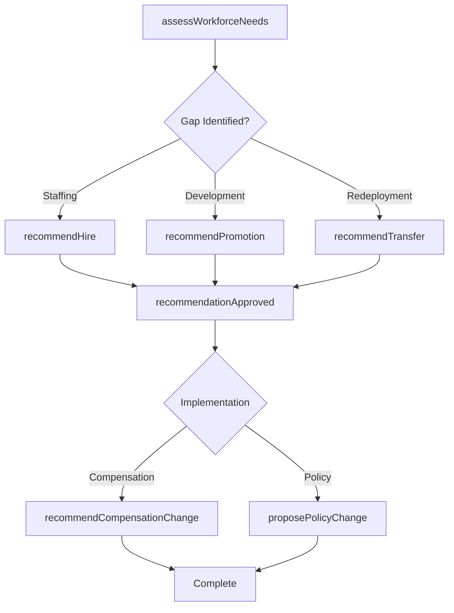
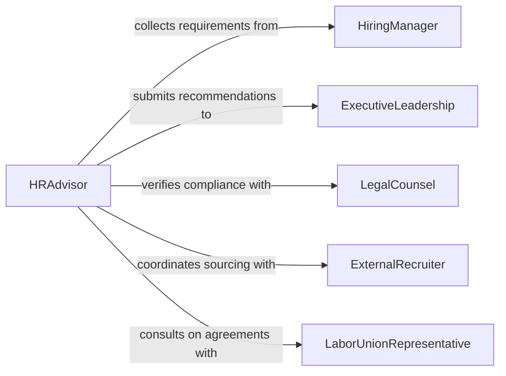

# Recommend Personnel Decisions or Human Resources Activities

> Business-as-Code definition for recommending personnel decisions and human resources activities. Models the advisory process from workforce analysis through staffing recommendations, disciplinary guidance, and organizational development proposals.

## Overview

Recommending personnel decisions and human resources activities encompasses advising management on hiring, promotions, transfers, disciplinary actions, compensation adjustments, and workforce planning initiatives. This definition exposes actions for evaluating workforce needs, formulating staffing recommendations, proposing performance interventions, and guiding organizational restructuring. Events enable automation of approval workflows and compliance tracking, while searches surface historical personnel data and benchmarking insights.

## Actors

| Actor | Description |
|-------|-------------|
| HiringManager | Requests staffing recommendations and provides role requirements |
| Employee | Subject of personnel decisions such as promotions or transfers |
| ExecutiveLeadership | Approves high-impact personnel decisions and organizational changes |
| LegalCounsel | Reviews recommendations for compliance with employment law |
| ExternalRecruiter | Provides candidate pipelines and market compensation data |
| LaborUnionRepresentative | Participates in decisions governed by collective bargaining agreements |

## Roles

| Role | Description |
|------|-------------|
| HRAdvisor | Formulates and presents personnel recommendations to management |
| TalentAcquisitionSpecialist | Evaluates candidates and recommends hiring decisions |
| CompensationAnalyst | Analyzes pay equity and recommends salary adjustments |
| EmployeeRelationsSpecialist | Advises on disciplinary actions and conflict resolution |

## Entities

| Entity | Description |
|--------|-------------|
| PersonnelRecommendation | A formal advisory on a staffing or HR action |
| PositionRequisition | A request to fill or modify a role within the organization |
| PerformanceRecord | Historical performance data used to inform decisions |
| CompensationBenchmark | Market and internal pay data for comparison |
| DisciplinaryCase | Documentation of conduct issues and recommended actions |
| SuccessionPlan | A roadmap for leadership continuity and talent pipeline |

## Actions

| Action | Description |
|--------|-------------|
| assessWorkforceNeeds | Evaluate current headcount, skills gaps, and future requirements |
| recommendHire | Propose a candidate for selection based on qualifications and fit |
| recommendPromotion | Advise promotion of an employee based on performance and readiness |
| recommendTransfer | Suggest reassignment of an employee to a different role or location |
| recommendDisciplinaryAction | Propose corrective action for performance or conduct issues |
| recommendCompensationChange | Advise salary adjustment based on market data and internal equity |
| proposePolicyChange | Suggest modifications to HR policies or procedures |

## Events

| Event | Description |
|-------|-------------|
| workforceNeedsAssessed | Workforce analysis has been completed and gaps identified |
| hireRecommended | A hiring recommendation has been submitted for review |
| promotionRecommended | A promotion recommendation has been formally proposed |
| transferRecommended | A transfer recommendation has been submitted |
| disciplinaryActionRecommended | A disciplinary action has been recommended for an employee |
| compensationChangeRecommended | A salary or benefits adjustment has been proposed |
| recommendationApproved | A personnel recommendation has been approved by leadership |

## Searches

| Search | Description |
|--------|-------------|
| findRecommendations | List personnel recommendations by type, status, or department |
| getPerformanceHistory | Retrieve performance records for a specific employee |
| getCompensationBenchmarks | Look up market and internal pay data for a role or grade level |
| findOpenRequisitions | List unfilled position requisitions by department or priority |

## Workflow



## Actor Relationships



## Usage

### Calling Actions

```typescript
import { recommendPersonnelDecisionsHrActivities } from '@headlessly/recommend-personnel-decisions-hr-activities'

const hr = recommendPersonnelDecisionsHrActivities()

// Assess workforce needs for a department
const assessment = await hr.assessWorkforceNeeds({
  department: 'Product Engineering',
  fiscalYear: 2026,
  includeSkillsGapAnalysis: true
})

// Recommend a hire based on assessment
await hr.recommendHire({
  requisitionId: 'REQ-4821',
  candidateId: 'CAND-1129',
  justification: 'Strong full-stack background fills critical skills gap',
  proposedStartDate: '2026-04-01',
  proposedSalary: 145000
})

// Recommend a promotion
await hr.recommendPromotion({
  employeeId: 'EMP-3042',
  currentRole: 'Senior Engineer',
  proposedRole: 'Staff Engineer',
  performanceRating: 'Exceeds Expectations',
  justification: 'Consistently led cross-team initiatives over past 18 months'
})
```

### Event-Driven Automation

```typescript
// Route high-impact recommendations to executive review
hr.promotionRecommended(async ({ employeeId, proposedRole, department }) => {
  if (proposedRole.includes('Director') || proposedRole.includes('VP')) {
    await escalate({
      to: 'executive-committee',
      message: `Director-level promotion recommended for ${employeeId} in ${department}`
    })
  }
})

// Trigger compliance check on disciplinary recommendations
hr.disciplinaryActionRecommended(async ({ employeeId, caseId, severity }) => {
  await requestLegalReview({
    caseId,
    employeeId,
    priority: severity === 'termination' ? 'urgent' : 'standard'
  })
})
```
