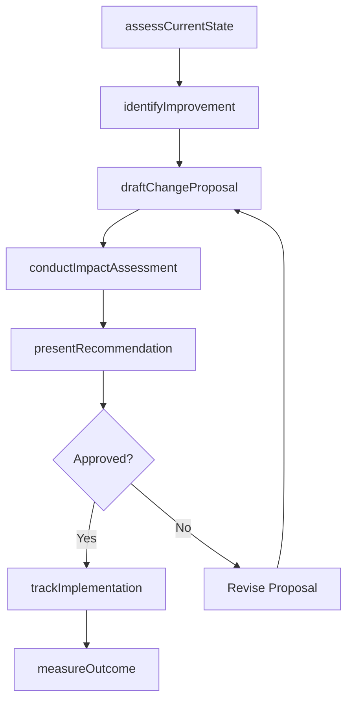
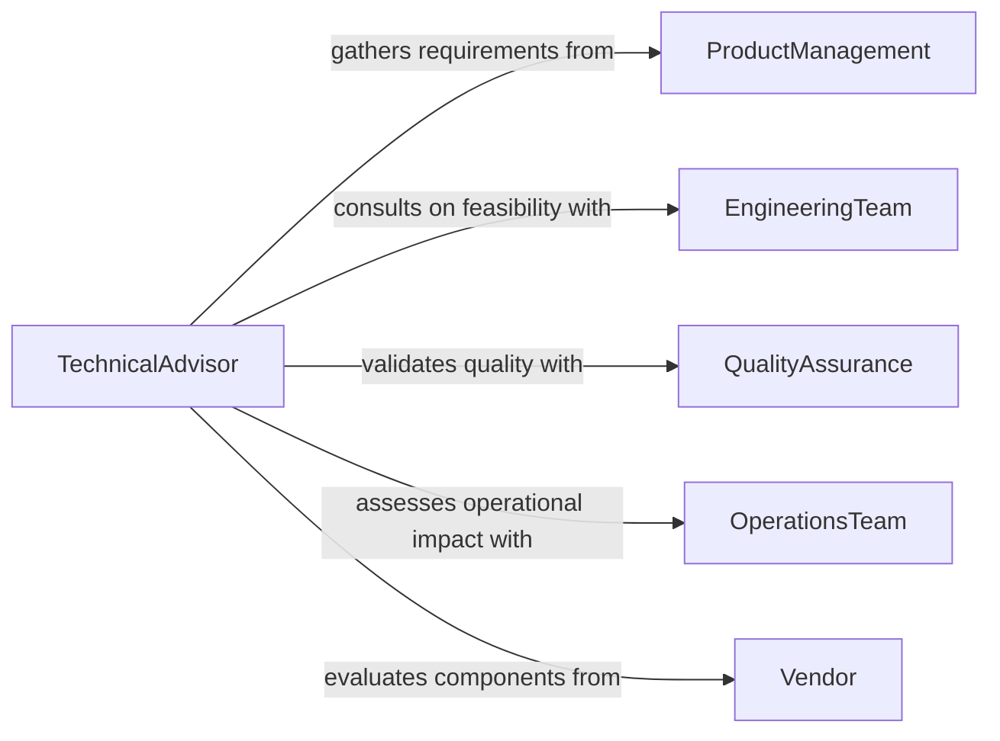

# Recommend Technical Design or Process Changes

> Business-as-Code definition for recommending technical design and process changes. Models the advisory lifecycle from performance analysis through change proposal, impact assessment, and implementation guidance.

## Overview

Recommending technical design or process changes involves evaluating current systems, workflows, and engineering practices to identify opportunities for improving efficiency, quality, or performance. This definition exposes actions for conducting technical assessments, drafting change proposals, performing impact analyses, and tracking implementation outcomes. Events support automated routing of proposals through approval chains, while searches surface performance baselines and historical change data.

## Actors

| Actor | Description |
|-------|-------------|
| EngineeringTeam | Implements recommended changes and provides technical feasibility feedback |
| ProductManagement | Prioritizes changes based on business value and roadmap alignment |
| QualityAssurance | Validates that proposed changes meet quality and reliability standards |
| OperationsTeam | Evaluates operational impact and deployment considerations |
| Vendor | Provides technical specifications for third-party components or tools |
| RegulatoryBody | Enforces industry standards that constrain design decisions |

## Roles

| Role | Description |
|------|-------------|
| TechnicalAdvisor | Evaluates systems and formulates design or process recommendations |
| ProcessEngineer | Analyzes workflows and proposes efficiency improvements |
| SystemsArchitect | Recommends architectural changes for scalability and performance |
| ChangeManager | Coordinates the review and approval of proposed changes |

## Entities

| Entity | Description |
|--------|-------------|
| ChangeProposal | A documented recommendation for a technical or process modification |
| ImpactAssessment | An evaluation of risks, costs, and benefits of a proposed change |
| PerformanceBaseline | Current metrics used as a reference point for improvement |
| DesignSpecification | Technical details describing the proposed new design |
| ProcessMap | A visual representation of current or proposed workflow steps |
| ImplementationPlan | A phased roadmap for executing the recommended change |

## Actions

| Action | Description |
|--------|-------------|
| assessCurrentState | Evaluate existing design or process against performance targets |
| identifyImprovement | Pinpoint specific areas where changes would yield measurable gains |
| draftChangeProposal | Create a formal proposal documenting the recommended change |
| conductImpactAssessment | Analyze risks, costs, dependencies, and expected benefits |
| presentRecommendation | Deliver the change proposal to stakeholders for review |
| trackImplementation | Monitor progress of approved changes against the plan |
| measureOutcome | Compare post-change metrics to the performance baseline |

## Events

| Event | Description |
|-------|-------------|
| currentStateAssessed | Technical or process assessment has been completed |
| improvementIdentified | A specific improvement opportunity has been documented |
| changeProposalDrafted | A formal change proposal has been created |
| impactAssessmentCompleted | Risk and benefit analysis of the proposal is complete |
| recommendationPresented | The change proposal has been delivered to decision-makers |
| changeApproved | The proposed change has been approved for implementation |
| outcomesMeasured | Post-implementation metrics have been collected and compared |

## Searches

| Search | Description |
|--------|-------------|
| findChangeProposals | List proposals by status, type, system, or date range |
| getPerformanceBaselines | Retrieve current metrics for a system or process |
| getImpactAssessments | Look up risk and benefit analyses for pending proposals |
| findImplementationHistory | Search past changes by outcome, system, or time period |

## Workflow



## Actor Relationships



## Usage

### Calling Actions

```typescript
import { recommendTechnicalDesignProcessChanges } from '@headlessly/recommend-technical-design-process-changes'

const advisor = recommendTechnicalDesignProcessChanges()

// Assess current state of a production system
const baseline = await advisor.assessCurrentState({
  system: 'order-processing-pipeline',
  metrics: ['throughput', 'latency', 'errorRate'],
  period: { start: '2025-10-01', end: '2025-12-31' }
})

// Draft a change proposal
const proposal = await advisor.draftChangeProposal({
  title: 'Migrate to event-driven order processing',
  system: 'order-processing-pipeline',
  currentIssue: 'Synchronous pipeline creates bottleneck at 500 req/s',
  proposedChange: 'Replace synchronous handlers with async message queue',
  expectedImprovement: { throughput: '+300%', latency: '-60%' }
})

// Conduct impact assessment
await advisor.conductImpactAssessment({
  proposalId: proposal.id,
  dimensions: ['cost', 'risk', 'timeline', 'dependencies']
})
```

### Event-Driven Automation

```typescript
// Notify stakeholders when a change is approved
advisor.changeApproved(async ({ proposalId, system, approvedBy }) => {
  await notify({
    to: 'engineering-leads',
    message: `Change proposal ${proposalId} for ${system} approved by ${approvedBy}`
  })
})

// Auto-trigger outcome measurement after implementation period
advisor.recommendationPresented(async ({ proposalId, system }) => {
  await scheduleTask({
    action: 'measureOutcome',
    proposalId,
    system,
    delay: '30d'
  })
})
```
