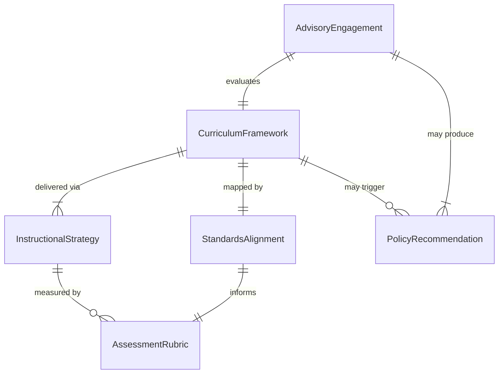
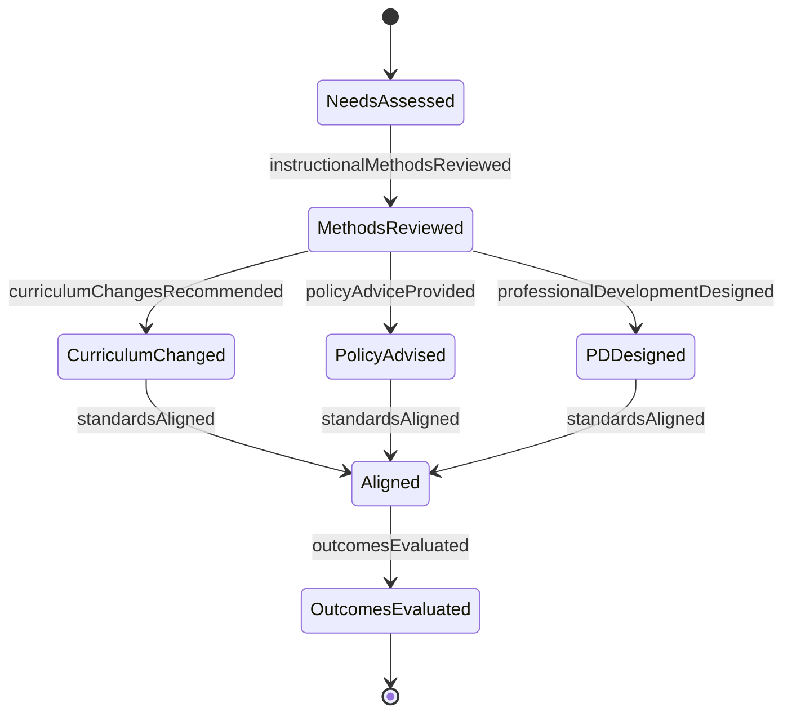
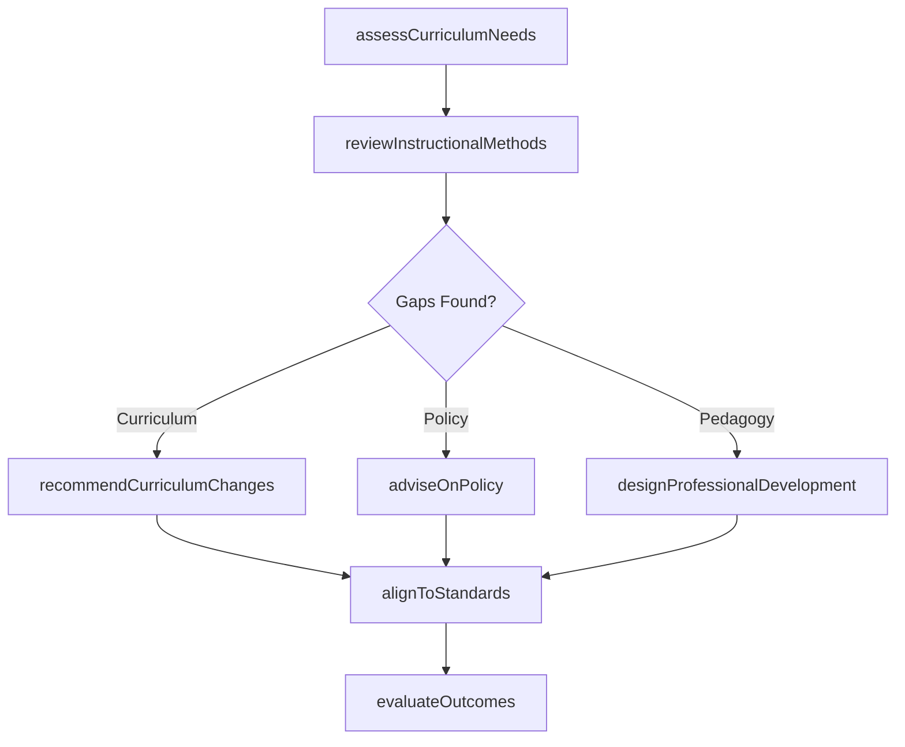
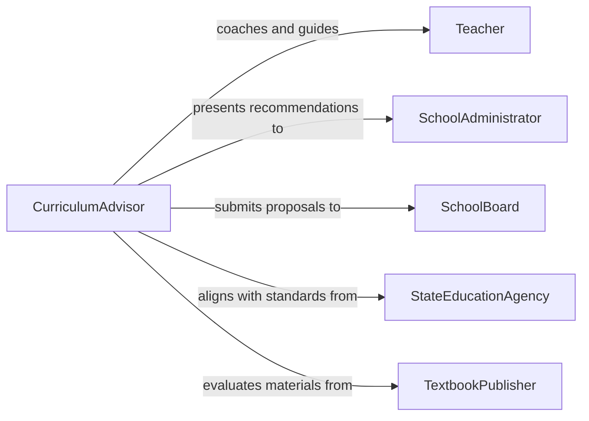

# Advise Educators on Curricula, Instructional Methods, or Policies

> Business-as-Code definition for advising educators on curricula, instructional methods, and educational policies. Models the consultative process from needs assessment through curriculum review, pedagogical guidance, and policy recommendation.

## Overview

Advising educators on curricula, instructional methods, and policies involves consulting with teachers, administrators, and academic departments to improve educational outcomes. This definition exposes actions for evaluating existing curricula, recommending pedagogical approaches, analyzing policy impacts, and supporting professional development. Events enable automated tracking of advisory engagements, while searches provide access to standards alignment data and instructional effectiveness metrics.

## Actors

| Actor | Description |
|-------|-------------|
| Teacher | Receives guidance on instructional methods and curriculum delivery |
| SchoolAdministrator | Requests advisory support for institutional policy and program changes |
| SchoolBoard | Approves curriculum adoptions and policy modifications |
| StateEducationAgency | Sets academic standards and regulatory requirements |
| ParentCommunity | Provides feedback on educational programs and student needs |
| TextbookPublisher | Supplies curricular materials and supplementary resources |

## Roles

| Role | Description |
|------|-------------|
| CurriculumAdvisor | Evaluates and recommends curricular frameworks and materials |
| InstructionalCoach | Guides teachers on pedagogical techniques and classroom strategies |
| PolicyAnalyst | Assesses educational policies and recommends improvements |
| ProfessionalDevelopmentCoordinator | Designs training to support adoption of new methods |

## Entities

| Entity | Description |
|--------|-------------|
| CurriculumFramework | A structured outline of learning objectives, scope, and sequence |
| InstructionalStrategy | A documented pedagogical approach or teaching technique |
| PolicyRecommendation | A formal proposal for educational policy change |
| StandardsAlignment | A mapping between curriculum content and state or national standards |
| AssessmentRubric | Criteria for evaluating student learning outcomes |
| AdvisoryEngagement | A record of a consultative session with educators or administrators |

## Actions

| Action | Description |
|--------|-------------|
| assessCurriculumNeeds | Evaluate current curricula against student outcomes and standards |
| reviewInstructionalMethods | Analyze teaching practices for effectiveness and engagement |
| recommendCurriculumChanges | Propose modifications to scope, sequence, or materials |
| adviseOnPolicy | Provide guidance on educational policy development or revision |
| designProfessionalDevelopment | Create training programs to support instructional improvement |
| alignToStandards | Map curriculum components to state or national academic standards |
| evaluateOutcomes | Measure the impact of adopted recommendations on student performance |

## Events

| Event | Description |
|-------|-------------|
| curriculumNeedsAssessed | A curriculum evaluation has been completed |
| instructionalMethodsReviewed | Teaching practices have been analyzed and documented |
| curriculumChangesRecommended | Curricular modifications have been formally proposed |
| policyAdviceProvided | Educational policy guidance has been delivered |
| professionalDevelopmentDesigned | A training program has been created for educators |
| standardsAligned | Curriculum has been mapped to required academic standards |
| outcomesEvaluated | Impact of recommendations on student performance has been measured |

## Searches

| Search | Description |
|--------|-------------|
| findAdvisoryEngagements | List advisory sessions by school, subject area, or date range |
| getCurriculumFrameworks | Retrieve curriculum outlines by grade level or subject |
| getStandardsAlignment | Look up alignment status between curricula and academic standards |
| findPolicyRecommendations | Search policy proposals by topic, status, or institution |

## Entity Relationships



## State Diagram



## Workflow



## Actor Relationships



## Usage

### Calling Actions

```typescript
import { adviseEducatorsOnCurriculaAndInstructionalMethods } from '@headlessly/advise-educators-on-curricula-and-instructional-methods'

const advisor = adviseEducatorsOnCurriculaAndInstructionalMethods()

// Assess curriculum needs for a school district
const assessment = await advisor.assessCurriculumNeeds({
  district: 'Westfield Unified',
  gradeLevel: 'K-8',
  subjectArea: 'Mathematics',
  includeStudentOutcomes: true
})

// Recommend curriculum changes
await advisor.recommendCurriculumChanges({
  assessmentId: assessment.id,
  recommendations: [
    { area: 'Problem-Based Learning', priority: 'high', rationale: 'Student engagement scores below benchmark' },
    { area: 'Formative Assessment Integration', priority: 'medium', rationale: 'Limited ongoing progress monitoring' }
  ]
})

// Design professional development to support changes
await advisor.designProfessionalDevelopment({
  topic: 'Implementing Problem-Based Learning in Mathematics',
  targetAudience: 'middle-school-math-teachers',
  format: 'workshop-series',
  sessions: 6
})
```

### Event-Driven Automation

```typescript
// Notify administrators when curriculum changes are proposed
advisor.curriculumChangesRecommended(async ({ district, subjectArea, recommendations }) => {
  await notify({
    to: 'curriculum-committee',
    message: `New curriculum recommendations for ${subjectArea} in ${district}: ${recommendations.length} changes proposed`
  })
})

// Schedule outcome evaluation after implementation
advisor.professionalDevelopmentDesigned(async ({ topic, targetAudience }) => {
  await scheduleTask({
    action: 'evaluateOutcomes',
    topic,
    targetAudience,
    delay: '90d'
  })
})
```
