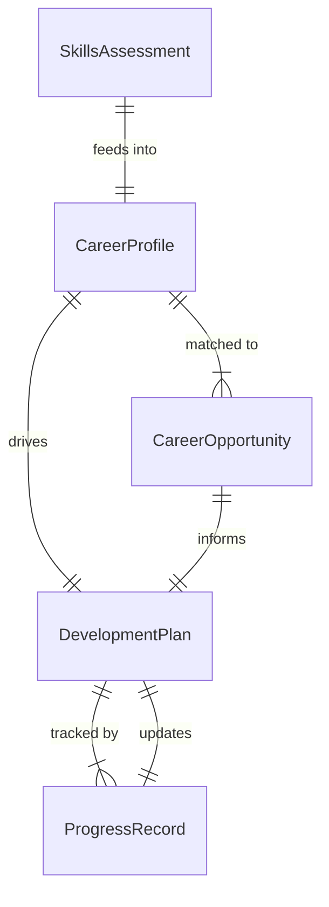
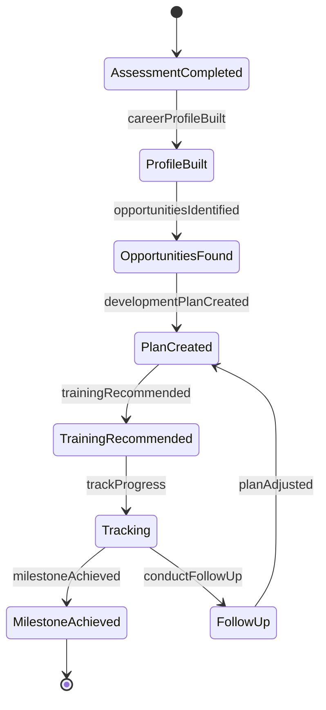
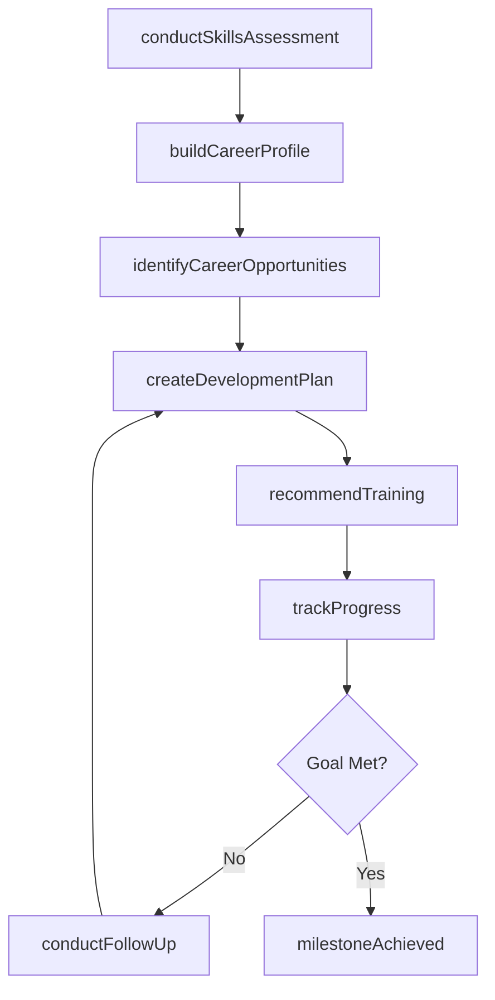
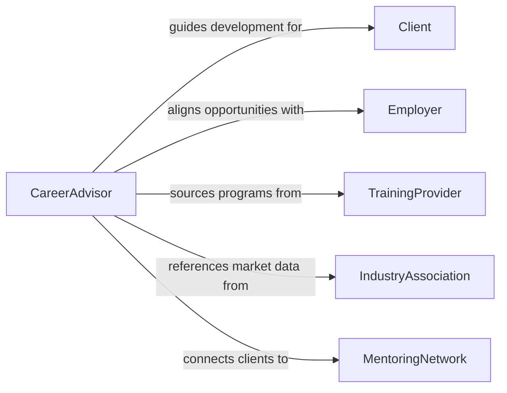

# Advise Others Career Personal Development

> Business-as-Code definition for career and personal development advisory services. Models the process of assessing individual strengths, exploring career paths, setting development goals, and tracking professional growth.

## Overview

Advising others on career or personal development involves conducting skills assessments, exploring career interests and labor market opportunities, and creating actionable development plans. This definition covers the full advisory engagement from initial intake through goal setting, resource identification, and progress monitoring. It supports career counselors, HR professionals, mentors, and coaches who guide individuals through career transitions, professional advancement, and personal growth initiatives.

## Actors

| Actor | Description |
|-------|-------------|
| Client | The individual seeking career or personal development guidance |
| Employer | Provides organizational context, job descriptions, and advancement criteria |
| TrainingProvider | Offers courses, certifications, and skill-building programs |
| IndustryAssociation | Supplies labor market data and professional credentialing requirements |
| MentoringNetwork | Connects clients with experienced professionals for guidance and networking |

## Roles

| Role | Description |
|------|-------------|
| CareerAdvisor | Conducts assessments and delivers personalized career guidance |
| DevelopmentCoach | Supports clients in achieving professional and personal growth goals |
| AssessmentSpecialist | Administers and interprets skills, interest, and aptitude evaluations |
| PlacementCoordinator | Connects clients with job opportunities aligned to their development plans |

## Entities

| Entity | Description |
|--------|-------------|
| SkillsAssessment | An evaluation of a client's current competencies, strengths, and gaps |
| CareerProfile | A composite view of a client's experience, interests, and career aspirations |
| DevelopmentPlan | A structured roadmap with goals, milestones, and resources for growth |
| CareerOpportunity | A specific role, industry path, or advancement track aligned to client goals |
| ProgressRecord | A log of completed development activities and achieved milestones |

## Actions

| Action | Description |
|--------|-------------|
| conductSkillsAssessment | Evaluate client competencies, interests, and aptitude |
| buildCareerProfile | Compile experience, aspirations, and market alignment into a profile |
| identifyCareerOpportunities | Research and present roles or paths matching the client profile |
| createDevelopmentPlan | Design a structured plan with goals, timelines, and learning resources |
| recommendTraining | Suggest specific courses, certifications, or programs for skill building |
| trackProgress | Monitor completion of development activities and milestone achievement |
| conductFollowUp | Schedule and perform periodic check-ins to review and adjust plans |

## Events

| Event | Description |
|-------|-------------|
| skillsAssessmentCompleted | A client competency evaluation has been finalized |
| careerProfileBuilt | A comprehensive career profile has been compiled for the client |
| opportunitiesIdentified | Career paths or roles matching client goals have been researched |
| developmentPlanCreated | A structured growth roadmap has been established |
| trainingRecommended | Specific learning resources have been suggested to the client |
| milestoneAchieved | A client has completed a key step in their development plan |
| followUpConducted | A periodic review session has been completed with the client |

## Searches

| Search | Description |
|--------|-------------|
| findClientProfiles | List career profiles by industry, skill area, or development stage |
| getDevelopmentPlans | Retrieve active plans by client, goal type, or completion status |
| getCareerOpportunities | Find roles or paths by industry, location, or skill requirements |
| findProgressRecords | Search milestone completions by client, date range, or plan |

## Entity Relationships



## State Diagram



## Workflow



## Actor Relationships



## Usage

### Calling Actions

```typescript
import { adviseOthersCareerPersonalDevelopment } from '@headlessly/advise-others-career-personal-development'

const career = adviseOthersCareerPersonalDevelopment()

// Conduct skills assessment
const assessment = await career.conductSkillsAssessment({
  clientId: 'client-2847',
  instruments: ['skills-inventory', 'interest-profiler', 'work-values'],
  selfReportedSkills: ['project-management', 'data-analysis', 'team-leadership']
})

// Build career profile
const profile = await career.buildCareerProfile({
  assessmentId: assessment.id,
  experience: [
    { role: 'Operations Analyst', years: 3 },
    { role: 'Project Coordinator', years: 2 }
  ],
  aspirations: ['management-role', 'technology-sector']
})

// Create development plan
await career.createDevelopmentPlan({
  profileId: profile.id,
  goals: [
    { title: 'Earn PMP Certification', targetDate: '2026-09-01', priority: 'high' },
    { title: 'Complete Leadership Development Program', targetDate: '2026-12-01', priority: 'medium' }
  ]
})
```

### Event-Driven Automation

```typescript
// Celebrate milestone achievements
career.milestoneAchieved(async ({ clientId, milestone, planId }) => {
  await notify({
    to: clientId,
    message: `Congratulations on completing: ${milestone.title}`
  })
})

// Schedule follow-up when training is recommended
career.trainingRecommended(async ({ clientId, courses }) => {
  await scheduleFollowUp({
    clientId,
    checkDate: addDays(new Date(), 45),
    items: courses.map(c => c.title)
  })
})
```
