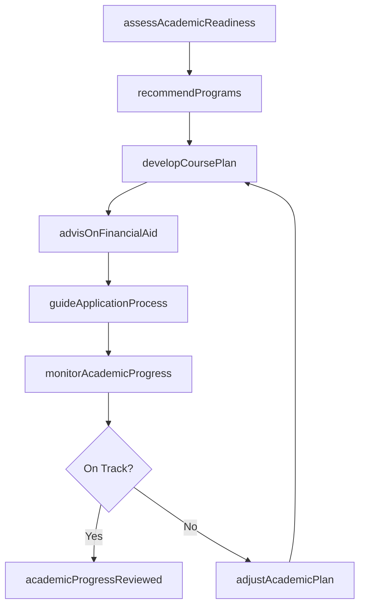
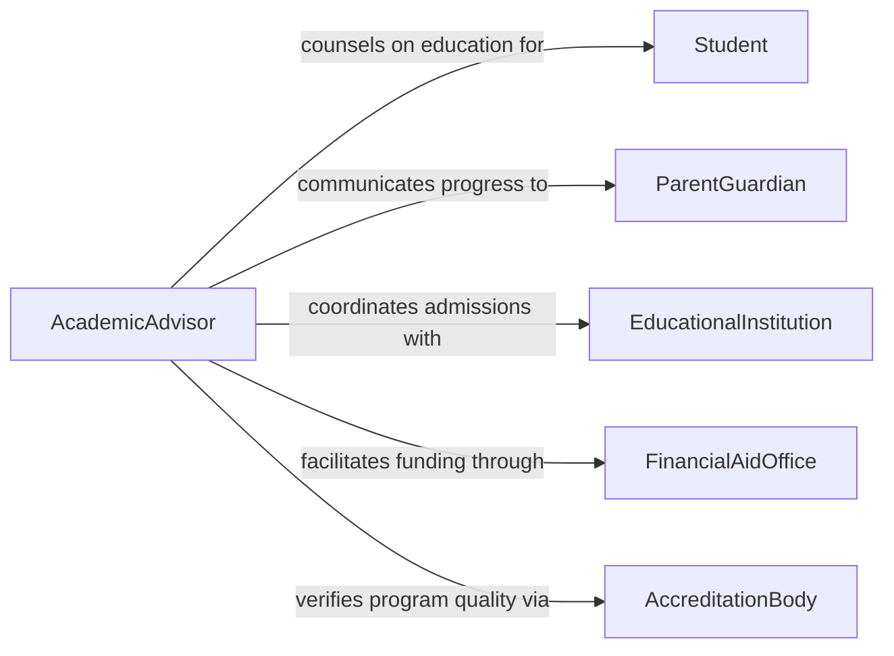

# Advise Others Educational Matters

> Business-as-Code definition for educational advisory services. Models the process of evaluating academic needs, recommending educational programs, guiding course selection, and supporting enrollment decisions.

## Overview

Advising others on educational matters involves assessing academic readiness, recommending appropriate educational programs and institutions, guiding course selection, and supporting decisions about degree paths, financial aid, and enrollment. This definition covers the advisory lifecycle from initial academic assessment through program recommendation, application support, and enrollment follow-through. It supports academic advisors, guidance counselors, admissions professionals, and educational consultants working with students at all levels.

## Actors

| Actor | Description |
|-------|-------------|
| Student | Seeks guidance on educational programs, course selection, or academic planning |
| ParentGuardian | Provides family context and participates in educational decisions for minors |
| EducationalInstitution | Offers academic programs, admissions criteria, and enrollment processes |
| FinancialAidOffice | Provides information on scholarships, grants, loans, and tuition assistance |
| AccreditationBody | Certifies program quality and institutional standards |

## Roles

| Role | Description |
|------|-------------|
| AcademicAdvisor | Guides students on course selection, degree requirements, and academic planning |
| GuidanceCounselor | Provides holistic educational guidance including social and career considerations |
| AdmissionsConsultant | Advises on application strategies and institutional fit |
| FinancialAidAdvisor | Counsels on funding options, scholarship applications, and financial planning |

## Entities

| Entity | Description |
|--------|-------------|
| AcademicProfile | A student's educational history, test scores, interests, and goals |
| ProgramRecommendation | A suggested educational program or institution based on student fit |
| CoursePlan | A semester-by-semester or term-based schedule of recommended courses |
| EnrollmentApplication | A formal application to an educational institution or program |
| FinancialAidPackage | A combination of funding sources available to support education costs |

## Actions

| Action | Description |
|--------|-------------|
| assessAcademicReadiness | Evaluate a student's preparation level and educational goals |
| recommendPrograms | Suggest educational programs and institutions matching student profiles |
| developCoursePlan | Create a structured academic schedule aligned with degree requirements |
| guideApplicationProcess | Support students through admissions applications and essay preparation |
| advisOnFinancialAid | Counsel on available funding options and application procedures |
| monitorAcademicProgress | Track student performance against their educational plan |
| adjustAcademicPlan | Modify course plans or program recommendations based on progress |

## Events

| Event | Description |
|-------|-------------|
| academicReadinessAssessed | A student's educational preparation has been evaluated |
| programsRecommended | Educational programs matching the student profile have been suggested |
| coursePlanDeveloped | A structured academic schedule has been created |
| applicationSubmitted | A student has completed and submitted an admissions application |
| financialAidAdvised | Funding options have been presented and discussed with the student |
| academicProgressReviewed | Student performance against plan has been evaluated |
| academicPlanAdjusted | Course plan or program recommendations have been modified |

## Searches

| Search | Description |
|--------|-------------|
| findStudentProfiles | List academic profiles by grade level, interest area, or readiness score |
| getProgramRecommendations | Retrieve suggested programs by student, field of study, or institution type |
| getCoursePlans | Find active course plans by student, term, or completion status |
| findApplicationStatus | Track admissions application outcomes by student or institution |

## Workflow



## Actor Relationships



## Usage

### Calling Actions

```typescript
import { adviseOthersEducationalMatters } from '@headlessly/advise-others-educational-matters'

const education = adviseOthersEducationalMatters()

// Assess academic readiness
const profile = await education.assessAcademicReadiness({
  studentId: 'student-4821',
  gradeLevel: 11,
  gpa: 3.6,
  testScores: { sat: 1280, act: 28 },
  interests: ['environmental-science', 'public-policy']
})

// Recommend programs
const recommendations = await education.recommendPrograms({
  profileId: profile.id,
  degreeLevel: 'bachelors',
  preferredRegions: ['Northeast', 'Pacific-Northwest'],
  maxTuition: 45000
})

// Develop course plan
await education.developCoursePlan({
  studentId: 'student-4821',
  programId: recommendations[0].id,
  startTerm: 'Fall 2027',
  includeSummerTerms: false
})
```

### Event-Driven Automation

```typescript
// Notify parent when program recommendations are ready
education.programsRecommended(async ({ studentId, programCount }) => {
  await notify({
    to: `parent-of-${studentId}`,
    message: `${programCount} educational programs have been recommended for review`
  })
})

// Schedule progress check after enrollment
education.coursePlanDeveloped(async ({ studentId, startTerm }) => {
  await scheduleReview({
    studentId,
    reviewDate: getTermMidpoint(startTerm),
    type: 'academic-progress'
  })
})
```
