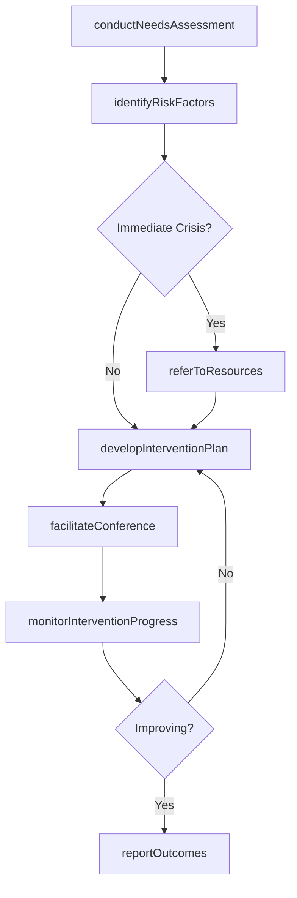
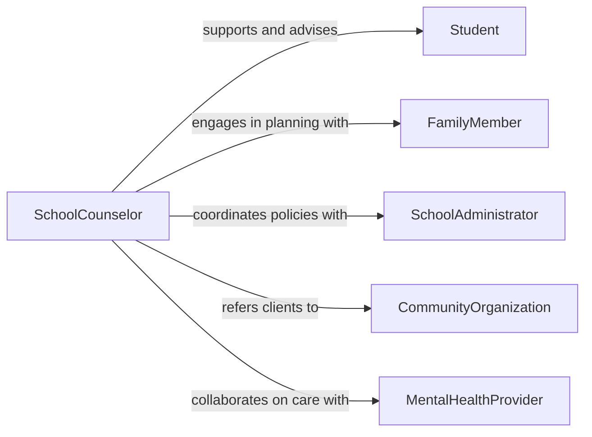

# Advise Others Social Educational Issues

> Business-as-Code definition for social and educational issue advisory. Models the process of identifying social-educational barriers, assessing needs, developing intervention strategies, and connecting individuals to appropriate resources.

## Overview

Advising others on social or educational issues involves identifying barriers to learning and social well-being, assessing individual and community needs, and recommending interventions that address both academic and social challenges. This definition covers advisory work at the intersection of education and social services, including guidance on bullying prevention, truancy, substance abuse, family instability, and socioeconomic barriers to educational attainment. It supports school counselors, social workers, community advocates, and nonprofit professionals who help individuals navigate complex social-educational challenges.

## Actors

| Actor | Description |
|-------|-------------|
| Student | Experiences social or educational challenges requiring professional guidance |
| FamilyMember | Provides context on home environment and participates in intervention planning |
| SchoolAdministrator | Implements institutional policies and programs addressing social-educational issues |
| CommunityOrganization | Offers social services, after-school programs, and family support resources |
| MentalHealthProvider | Delivers counseling and therapeutic services for social-emotional concerns |
| GovernmentAgency | Administers social welfare programs and mandatory reporting requirements |

## Roles

| Role | Description |
|------|-------------|
| SchoolCounselor | Addresses social and educational issues within the school environment |
| SocialWorker | Coordinates interventions spanning educational, family, and community systems |
| CommunityAdvocate | Connects individuals to local resources and support programs |
| InterventionSpecialist | Designs and implements targeted strategies for at-risk populations |

## Entities

| Entity | Description |
|--------|-------------|
| NeedsAssessment | An evaluation of social and educational barriers affecting an individual |
| InterventionPlan | A structured strategy for addressing identified social-educational challenges |
| ResourceReferral | A connection to a specific service, program, or provider |
| CaseRecord | A documented history of advisory interactions, interventions, and outcomes |
| RiskIndicator | A measurable factor signaling potential social or educational difficulty |
| OutcomeReport | A summary of intervention results and follow-up status |

## Actions

| Action | Description |
|--------|-------------|
| conductNeedsAssessment | Evaluate social and educational barriers affecting an individual |
| identifyRiskFactors | Screen for indicators of social-educational difficulty or crisis |
| developInterventionPlan | Create a structured strategy to address identified challenges |
| referToResources | Connect individuals to appropriate services, programs, or providers |
| facilitateConference | Organize meetings between family, school, and support professionals |
| monitorInterventionProgress | Track participation and outcomes of recommended interventions |
| reportOutcomes | Document intervention results and update case records |

## Events

| Event | Description |
|-------|-------------|
| needsAssessmentCompleted | An individual's social-educational barriers have been evaluated |
| riskFactorsIdentified | Indicators of social or educational difficulty have been flagged |
| interventionPlanDeveloped | A structured support strategy has been created |
| resourceReferralMade | An individual has been connected to a specific service or program |
| conferenceHeld | A multi-party meeting has been conducted to coordinate support |
| interventionProgressReviewed | Participation and outcomes have been checked and documented |
| outcomeReported | Intervention results have been formally recorded |

## Searches

| Search | Description |
|--------|-------------|
| findNeedsAssessments | List assessments by individual, issue type, or severity level |
| getInterventionPlans | Retrieve active plans by individual, intervention type, or status |
| getResourceReferrals | Find referrals by service type, provider, or utilization status |
| findAtRiskIndividuals | Identify individuals with elevated risk indicators |

## Workflow



## Actor Relationships



## Usage

### Calling Actions

```typescript
import { adviseOthersSocialEducationalIssues } from '@headlessly/advise-others-social-educational-issues'

const advisory = adviseOthersSocialEducationalIssues()

// Conduct needs assessment
const assessment = await advisory.conductNeedsAssessment({
  individualId: 'student-3291',
  domains: ['academic-performance', 'attendance', 'social-emotional', 'family-stability'],
  referralSource: 'classroom-teacher'
})

// Identify risk factors
const risks = await advisory.identifyRiskFactors({
  assessmentId: assessment.id,
  indicators: ['chronic-absenteeism', 'declining-grades', 'social-withdrawal']
})

// Develop intervention plan
await advisory.developInterventionPlan({
  assessmentId: assessment.id,
  strategies: [
    { area: 'Attendance', intervention: 'Assign attendance mentor and daily check-in' },
    { area: 'Academic Support', intervention: 'Enroll in after-school tutoring program' },
    { area: 'Family Services', intervention: 'Connect family with housing assistance agency' }
  ],
  reviewDate: '2026-04-15'
})
```

### Event-Driven Automation

```typescript
// Urgent notification for high-risk individuals
advisory.riskFactorsIdentified(async ({ individualId, riskLevel, indicators }) => {
  if (riskLevel === 'critical') {
    await notify({
      to: 'crisis-response-team',
      message: `Critical risk factors identified for ${individualId}: ${indicators.join(', ')}`,
      priority: 'urgent'
    })
  }
})

// Schedule follow-up after conference
advisory.conferenceHeld(async ({ individualId, participants, actionItems }) => {
  await scheduleFollowUp({
    individualId,
    checkDate: addDays(new Date(), 14),
    items: actionItems.map(a => a.description)
  })
})
```
