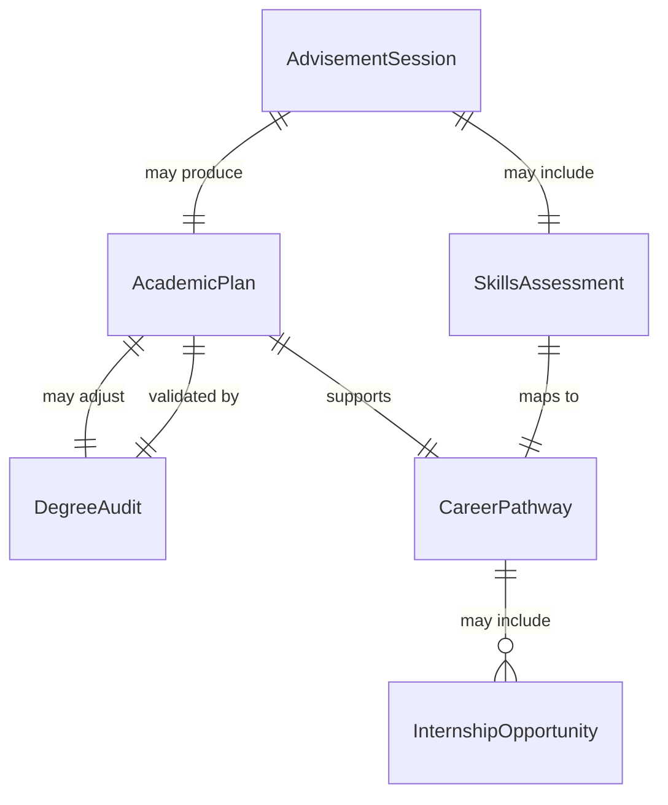
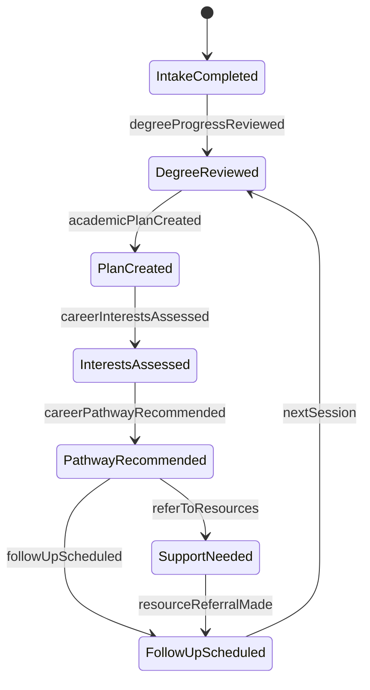
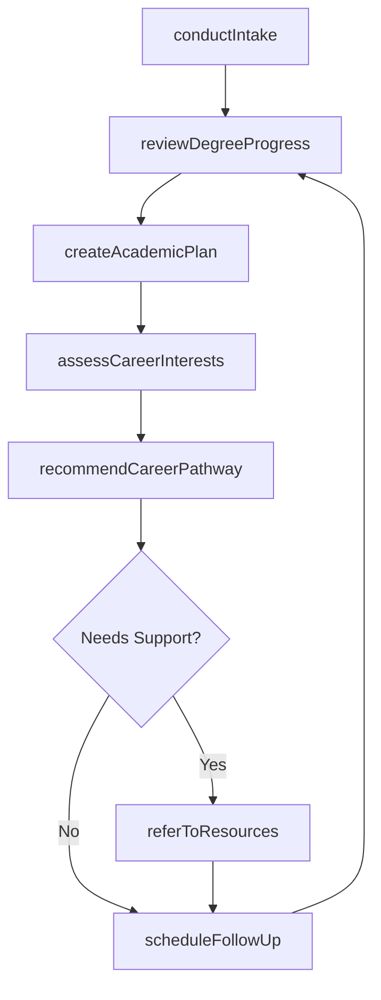
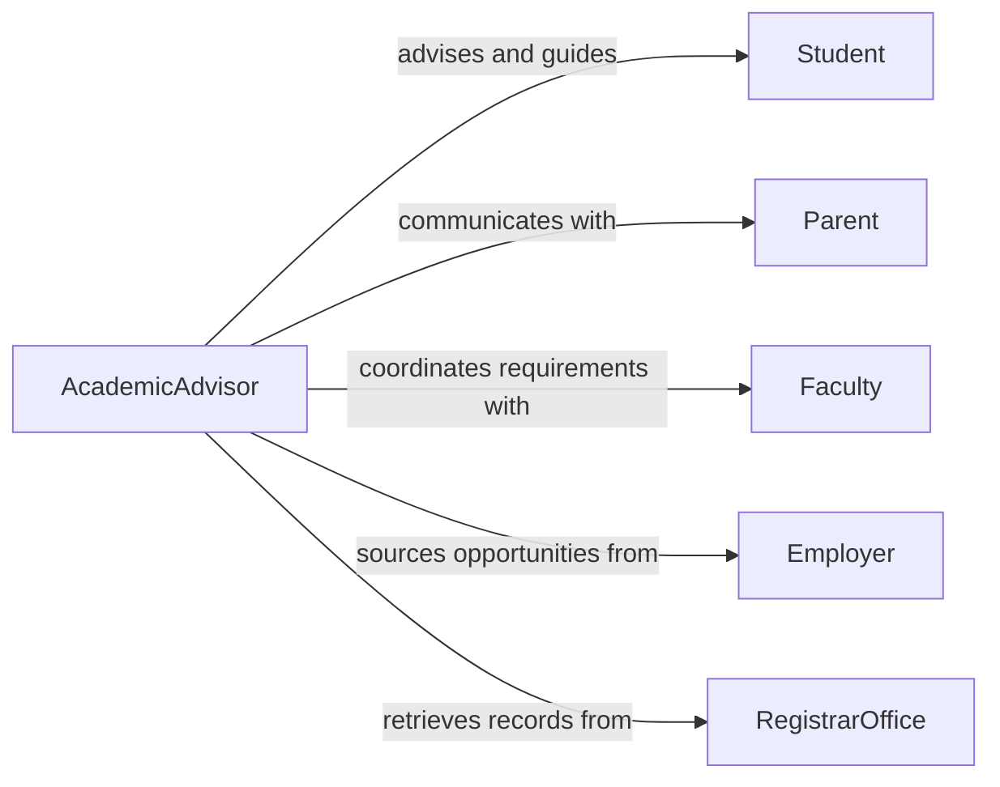

# Advise Students on Academic or Career Matters

> Business-as-Code definition for advising students on academic and career matters. Models the advisory process from student intake through academic planning, career exploration, and progress monitoring.

## Overview

Advising students on academic or career matters involves guiding individuals through course selection, degree planning, career exploration, and professional development decisions. This definition exposes actions for assessing student goals, creating academic plans, recommending career pathways, and tracking advisement outcomes. Events support automated scheduling and follow-up workflows, while searches provide access to program requirements, career data, and advisement histories.

## Actors

| Actor | Description |
|-------|-------------|
| Student | Seeks guidance on academic progress and career direction |
| Parent | Provides context on family expectations and financial considerations |
| Faculty | Offers academic perspective on program requirements and research opportunities |
| Employer | Provides internship and job opportunities relevant to career pathways |
| RegistrarOffice | Manages enrollment records, transcripts, and degree audits |
| FinancialAidOffice | Administers scholarships, grants, and financial planning |

## Roles

| Role | Description |
|------|-------------|
| AcademicAdvisor | Guides students on course selection and degree requirements |
| CareerCounselor | Assists students in exploring career options and building professional skills |
| FacultyMentor | Provides discipline-specific academic and research guidance |
| AdvisementCoordinator | Manages caseloads and ensures students receive timely outreach |

## Entities

| Entity | Description |
|--------|-------------|
| AcademicPlan | A structured roadmap of courses and milestones toward degree completion |
| CareerPathway | A documented career direction with required skills and experiences |
| DegreeAudit | A report comparing completed coursework against program requirements |
| AdvisementSession | A recorded meeting between advisor and student |
| SkillsAssessment | An evaluation of student aptitudes, interests, and competencies |
| InternshipOpportunity | A position that provides career-relevant work experience |

## Actions

| Action | Description |
|--------|-------------|
| conductIntake | Gather student background, goals, and academic history |
| createAcademicPlan | Develop a semester-by-semester course schedule toward degree completion |
| assessCareerInterests | Evaluate student aptitudes and interests against career options |
| recommendCareerPathway | Suggest career directions aligned with student strengths and goals |
| reviewDegreeProgress | Compare completed coursework against degree requirements |
| referToResources | Connect student with financial aid, tutoring, or career services |
| scheduleFollowUp | Set a future advisement session to monitor progress |

## Events

| Event | Description |
|-------|-------------|
| intakeCompleted | Student background and goals have been gathered |
| academicPlanCreated | A course plan has been developed for the student |
| careerInterestsAssessed | Student aptitudes and interests have been evaluated |
| careerPathwayRecommended | A career direction has been suggested to the student |
| degreeProgressReviewed | Degree audit has been completed and reviewed with student |
| resourceReferralMade | Student has been connected with support services |
| followUpScheduled | A future advisement session has been booked |

## Searches

| Search | Description |
|--------|-------------|
| findAdvisementSessions | List sessions by student, advisor, or date range |
| getDegreeAudit | Retrieve degree completion status for a student |
| getCareerPathways | Look up career directions by field of study or interest area |
| findInternships | Search internship opportunities by industry, location, or skill match |

## Entity Relationships



## State Diagram



## Workflow



## Actor Relationships



## Usage

### Calling Actions

```typescript
import { adviseStudentsOnAcademicOrCareerMatters } from '@headlessly/advise-students-on-academic-or-career-matters'

const advisor = adviseStudentsOnAcademicOrCareerMatters()

// Conduct student intake
const intake = await advisor.conductIntake({
  studentId: 'STU-20260415',
  declaredMajor: 'Computer Science',
  currentYear: 'sophomore',
  goals: ['software engineering career', 'graduate school consideration']
})

// Create an academic plan
await advisor.createAcademicPlan({
  studentId: 'STU-20260415',
  targetGraduation: 'Spring 2028',
  remainingCredits: 72,
  plannedCourses: [
    { semester: 'Fall 2026', courses: ['CS301', 'MATH310', 'CS350'] },
    { semester: 'Spring 2027', courses: ['CS401', 'CS420', 'STAT340'] }
  ]
})

// Assess career interests
const assessment = await advisor.assessCareerInterests({
  studentId: 'STU-20260415',
  instruments: ['strong-interest-inventory', 'skills-checklist']
})
```

### Event-Driven Automation

```typescript
// Auto-schedule follow-up when academic plan is created
advisor.academicPlanCreated(async ({ studentId, targetGraduation }) => {
  await advisor.scheduleFollowUp({
    studentId,
    scheduledDate: nextSemesterStart(),
    topic: 'Progress review and course registration'
  })
})

// Alert advisor when degree audit shows deficiencies
advisor.degreeProgressReviewed(async ({ studentId, deficiencies }) => {
  if (deficiencies.length > 0) {
    await notify({
      to: 'academic-advising',
      message: `Student ${studentId} has ${deficiencies.length} outstanding degree requirements`
    })
  }
})
```
