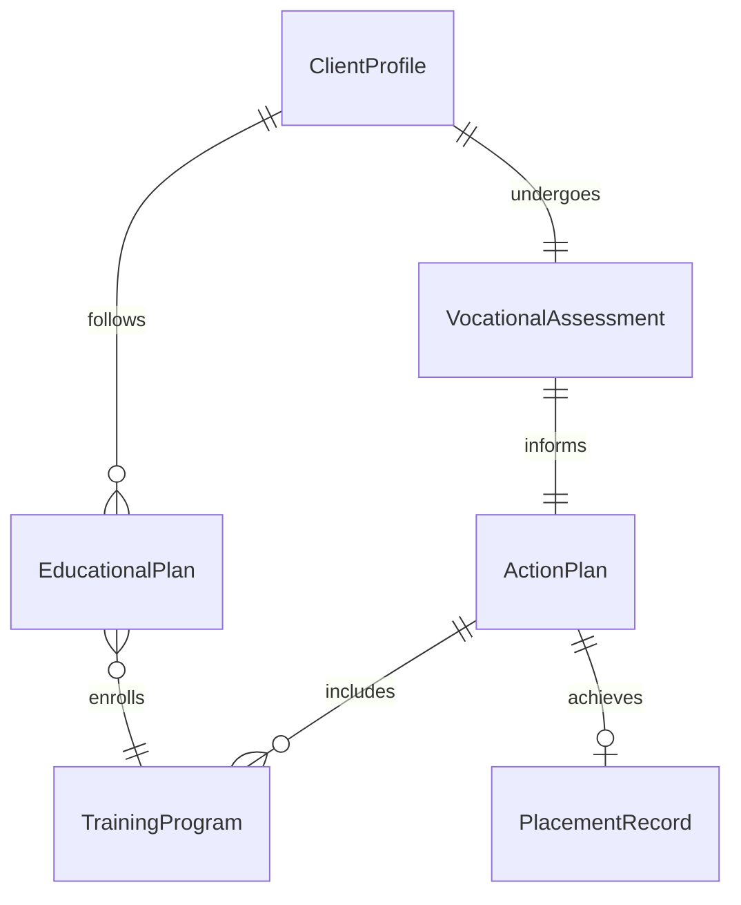
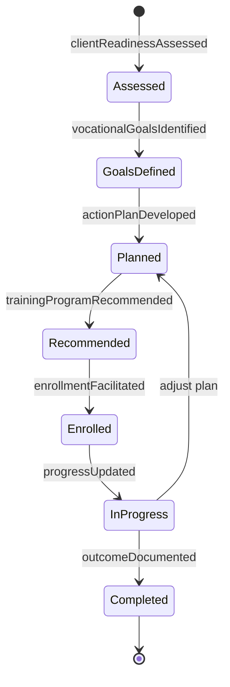
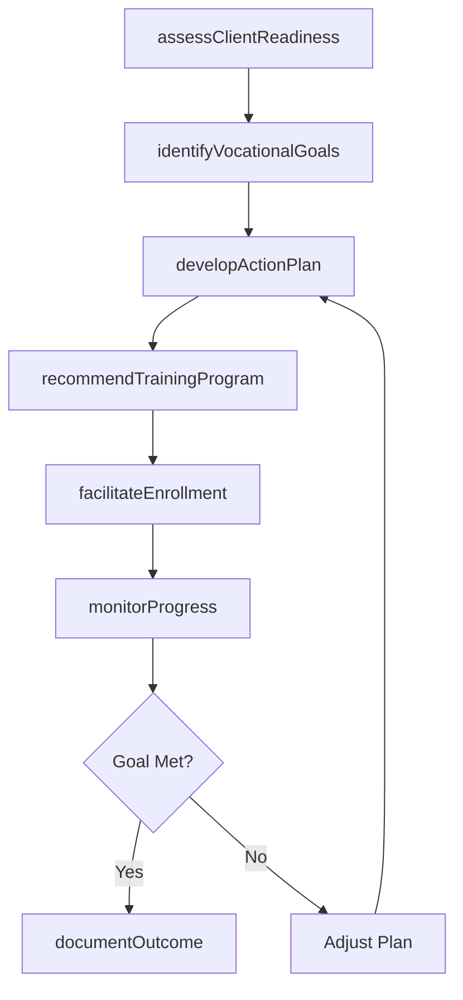
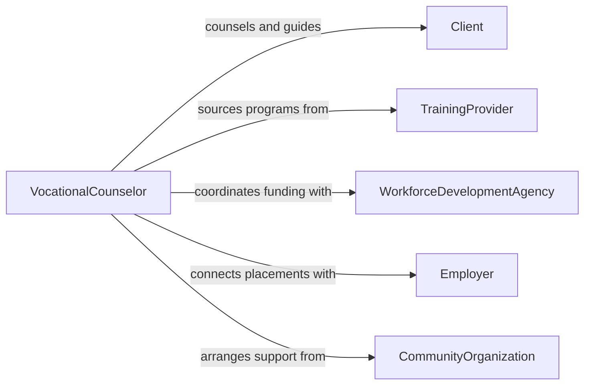

# Counsel Clients Regarding Educational or Vocational Issues

> Business-as-Code definition for counseling clients on educational and vocational issues. Models the counseling process from client assessment through goal setting, educational planning, vocational exploration, and outcome tracking.

## Overview

Counseling clients regarding educational or vocational issues involves helping individuals navigate training programs, career transitions, educational barriers, and workforce development pathways. This definition exposes actions for assessing client readiness, identifying educational or vocational goals, developing action plans, and connecting clients with training providers. Events enable automated case management workflows, while searches provide access to program catalogs, labor market data, and client progress records.

## Actors

| Actor | Description |
|-------|-------------|
| Client | Seeks guidance on educational programs or vocational training options |
| TrainingProvider | Offers accredited educational or vocational programs |
| WorkforceDevelopmentAgency | Funds and oversees job training and reemployment programs |
| Employer | Provides job placements, apprenticeships, and on-the-job training |
| InsuranceCarrier | Covers vocational rehabilitation services for eligible individuals |
| CommunityOrganization | Offers wraparound support services such as childcare or transportation |

## Roles

| Role | Description |
|------|-------------|
| VocationalCounselor | Guides clients through career assessment and vocational planning |
| EducationalPlanner | Assists clients in selecting programs and navigating admissions |
| RehabilitationSpecialist | Supports clients with disabilities in returning to work or school |
| CaseManager | Coordinates services and tracks client progress across agencies |

## Entities

| Entity | Description |
|--------|-------------|
| ClientProfile | Demographics, history, aptitudes, and goals of the individual |
| VocationalAssessment | An evaluation of skills, interests, and employability factors |
| EducationalPlan | A structured path through coursework or certification requirements |
| TrainingProgram | A specific educational or vocational offering from a provider |
| ActionPlan | A documented set of steps and milestones toward the client's goals |
| PlacementRecord | Documentation of job or program placement outcomes |

## Actions

| Action | Description |
|--------|-------------|
| assessClientReadiness | Evaluate the client's educational background, skills, and barriers |
| identifyVocationalGoals | Collaborate with the client to define career and training objectives |
| developActionPlan | Create a step-by-step plan with milestones and timelines |
| recommendTrainingProgram | Suggest specific programs based on client goals and qualifications |
| facilitateEnrollment | Assist the client in applying and enrolling in a selected program |
| monitorProgress | Track client advancement through the action plan |
| documentOutcome | Record educational or vocational placement results |

## Events

| Event | Description |
|-------|-------------|
| clientReadinessAssessed | Client skills and barriers have been evaluated |
| vocationalGoalsIdentified | Career and training objectives have been defined |
| actionPlanDeveloped | A structured plan has been created for the client |
| trainingProgramRecommended | A specific program has been suggested to the client |
| enrollmentFacilitated | Client has been assisted through the enrollment process |
| progressUpdated | Client milestone or status has been updated |
| outcomeDocumented | Final placement or completion result has been recorded |

## Searches

| Search | Description |
|--------|-------------|
| findClientProfiles | List clients by status, counselor, or demographic criteria |
| getTrainingPrograms | Retrieve programs by field, location, cost, or duration |
| getActionPlans | Look up action plans by client, status, or milestone date |
| findPlacementRecords | Search placement outcomes by program, employer, or date range |

## Entity Relationships



## State Diagram



## Workflow



## Actor Relationships



## Usage

### Calling Actions

```typescript
import { counselClientsOnEducationalOrVocationalIssues } from '@headlessly/counsel-clients-on-educational-or-vocational-issues'

const counselor = counselClientsOnEducationalOrVocationalIssues()

// Assess client readiness
const assessment = await counselor.assessClientReadiness({
  clientId: 'CLT-8821',
  educationLevel: 'high-school-diploma',
  workHistory: ['retail-3yr', 'warehouse-1yr'],
  barriers: ['transportation', 'childcare']
})

// Identify vocational goals
await counselor.identifyVocationalGoals({
  clientId: 'CLT-8821',
  assessmentId: assessment.id,
  preferredFields: ['healthcare', 'information-technology'],
  targetTimeframe: '12-months'
})

// Recommend a training program
await counselor.recommendTrainingProgram({
  clientId: 'CLT-8821',
  program: 'Certified Medical Assistant',
  provider: 'Metro Community College',
  duration: '9 months',
  financialAid: 'workforce-innovation-grant'
})
```

### Event-Driven Automation

```typescript
// Alert case manager when barriers are identified
counselor.clientReadinessAssessed(async ({ clientId, barriers }) => {
  if (barriers.length > 0) {
    await notify({
      to: 'case-management',
      message: `Client ${clientId} has ${barriers.length} barriers requiring wraparound support`
    })
  }
})

// Track completion and document outcome
counselor.progressUpdated(async ({ clientId, milestone, status }) => {
  if (milestone === 'program-completion' && status === 'achieved') {
    await counselor.documentOutcome({
      clientId,
      outcome: 'program-completed',
      date: new Date().toISOString()
    })
  }
})
```
