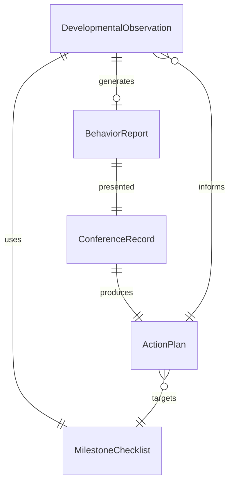
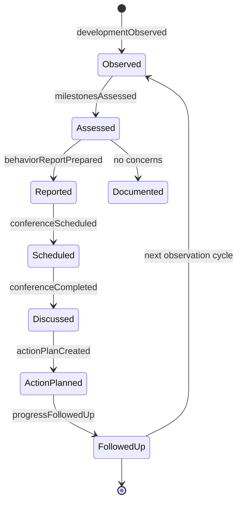
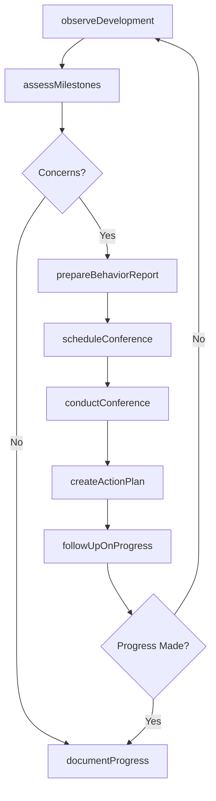
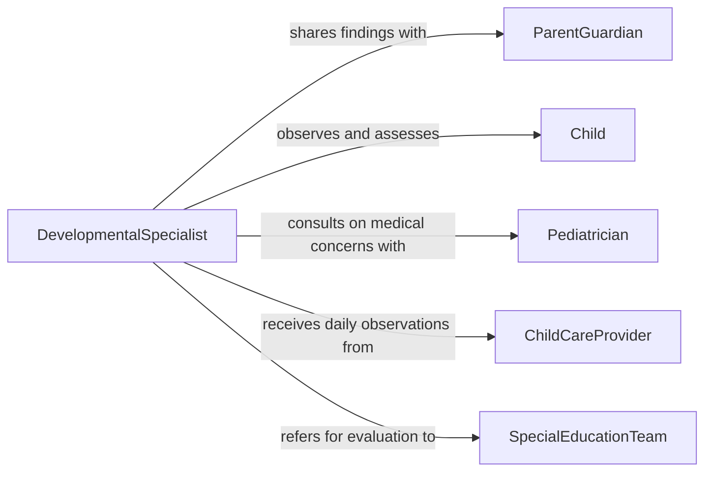

# Discuss Child Development Behavior Parents

> Business-as-Code definition for child development and behavior discussions with parents or guardians. Models the process of observing children, documenting developmental milestones, communicating findings to families, and coordinating support strategies.

## Overview

Discussing child development and behavior with parents or guardians involves systematically observing children, assessing developmental progress against age-appropriate milestones, and communicating findings and recommendations to families. This definition covers the full communication cycle from developmental observation through parent conference preparation, meeting facilitation, and collaborative action planning. It supports early childhood educators, pediatric professionals, child psychologists, and social workers who engage families in understanding and supporting their children's growth.

## Actors

| Actor | Description |
|-------|-------------|
| ParentGuardian | Receives information about their child's development and collaborates on support plans |
| Child | The individual whose development and behavior are being observed and discussed |
| Pediatrician | Provides medical context for developmental milestones and behavioral patterns |
| ChildCareProvider | Observes daily behavior and development in caregiving settings |
| SpecialEducationTeam | Evaluates children for developmental delays and provides targeted services |

## Roles

| Role | Description |
|------|-------------|
| DevelopmentalSpecialist | Assesses child development and communicates findings to families |
| EarlyChildhoodEducator | Observes children in classroom settings and prepares developmental reports |
| BehaviorConsultant | Analyzes behavioral patterns and recommends management strategies |
| FamilyLiaison | Facilitates communication between professional staff and families |

## Entities

| Entity | Description |
|--------|-------------|
| DevelopmentalObservation | A recorded assessment of a child's behavior and milestone progress |
| MilestoneChecklist | A standardized list of age-appropriate developmental markers |
| BehaviorReport | A documented summary of a child's behavioral patterns and concerns |
| ConferenceRecord | A log of parent-professional meetings including topics discussed and agreements |
| ActionPlan | A collaborative strategy for supporting a child's development at home and school |

## Actions

| Action | Description |
|--------|-------------|
| observeDevelopment | Systematically watch and document a child's behavior and milestone progress |
| assessMilestones | Evaluate a child's development against age-appropriate benchmarks |
| prepareBehaviorReport | Compile observations into a structured summary for parent communication |
| scheduleConference | Arrange a meeting with parents or guardians to discuss findings |
| conductConference | Facilitate a discussion with families about development and behavior |
| createActionPlan | Collaboratively develop strategies for supporting the child |
| followUpOnProgress | Check in with families on implementation of agreed-upon strategies |

## Events

| Event | Description |
|-------|-------------|
| developmentObserved | A child's behavior and milestone progress have been documented |
| milestonesAssessed | A developmental evaluation against benchmarks has been completed |
| behaviorReportPrepared | A structured summary of behavioral observations has been compiled |
| conferenceScheduled | A parent meeting has been arranged |
| conferenceCompleted | A parent-professional discussion has taken place |
| actionPlanCreated | A collaborative support strategy has been agreed upon |
| progressFollowedUp | A check-in on action plan implementation has been conducted |

## Searches

| Search | Description |
|--------|-------------|
| findDevelopmentalObservations | List observations by child, age group, or developmental domain |
| getConferenceHistory | Retrieve past meeting records by child, date, or discussion topic |
| getActionPlans | Find active support plans by child, strategy area, or status |
| findMilestoneConcerns | Identify children with delayed or atypical milestone progress |

## Entity Relationships



## State Diagram



## Workflow



## Actor Relationships



## Usage

### Calling Actions

```typescript
import { discussChildDevelopmentBehaviorParents } from '@headlessly/discuss-child-development-behavior-parents'

const childDev = discussChildDevelopmentBehaviorParents()

// Observe development
const observation = await childDev.observeDevelopment({
  childId: 'child-0847',
  ageMonths: 36,
  domains: ['language', 'motor-skills', 'social-emotional', 'cognitive'],
  setting: 'preschool-classroom'
})

// Assess milestones
const assessment = await childDev.assessMilestones({
  observationId: observation.id,
  checklist: 'CDC-developmental-milestones',
  findings: {
    language: 'on-track',
    motorSkills: 'on-track',
    socialEmotional: 'area-of-concern',
    cognitive: 'on-track'
  }
})

// Schedule conference with parent
await childDev.scheduleConference({
  childId: 'child-0847',
  parentId: 'parent-0847',
  topics: ['social-emotional-development', 'peer-interaction-patterns'],
  preferredDates: ['2026-03-10', '2026-03-12']
})
```

### Event-Driven Automation

```typescript
// Alert team when significant developmental concerns arise
childDev.milestonesAssessed(async ({ childId, domains, concerns }) => {
  if (concerns.length > 0) {
    await notify({
      to: 'developmental-team',
      message: `Milestone concerns for child ${childId}: ${concerns.join(', ')}`
    })
  }
})

// Remind families about follow-up
childDev.actionPlanCreated(async ({ childId, parentId, reviewDate }) => {
  await scheduleReminder({
    to: parentId,
    date: addDays(new Date(reviewDate), -3),
    message: `Upcoming progress check on your child's development plan`
  })
})
```
