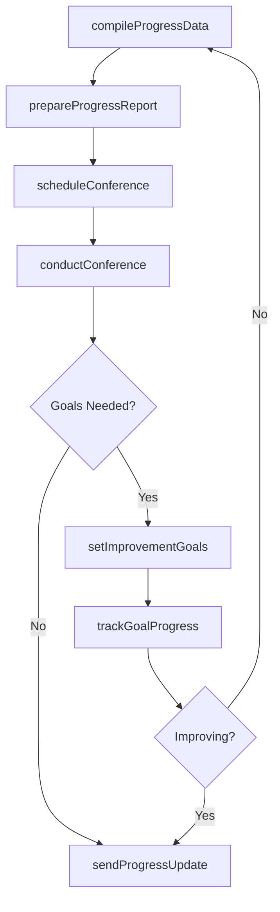
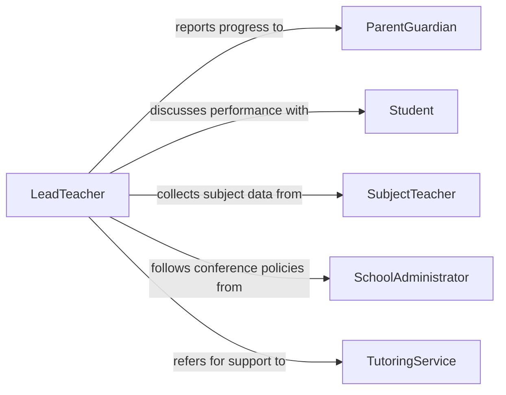

# Discuss Student Progress Parents Guardians

> Business-as-Code definition for student progress discussions with parents or guardians. Models the process of compiling academic performance data, preparing progress reports, conducting parent-teacher conferences, and establishing collaborative improvement strategies.

## Overview

Discussing student progress with parents or guardians involves gathering academic performance data, attendance records, and behavioral observations to communicate a comprehensive picture of a student's standing. This definition covers the full conference lifecycle from data compilation and report preparation through meeting facilitation and collaborative goal setting. It supports teachers, school counselors, and administrators who regularly engage families in monitoring and improving student outcomes across academic, social, and behavioral dimensions.

## Actors

| Actor | Description |
|-------|-------------|
| ParentGuardian | Receives updates on student performance and participates in goal setting |
| Student | The individual whose academic progress is being evaluated and discussed |
| SubjectTeacher | Provides grades, assignments, and classroom performance observations |
| SchoolAdministrator | Sets conferencing policies and supports teachers in parent communication |
| TutoringService | Offers supplemental academic support when performance gaps are identified |

## Roles

| Role | Description |
|------|-------------|
| LeadTeacher | Compiles student data and facilitates parent-teacher conferences |
| AcademicCounselor | Interprets performance patterns and recommends academic interventions |
| ConferenceCoordinator | Schedules and organizes parent meetings and communication logistics |
| StudentSupportSpecialist | Develops targeted strategies for students needing additional assistance |

## Entities

| Entity | Description |
|--------|-------------|
| ProgressReport | A compiled summary of academic grades, attendance, and behavioral notes |
| GradeRecord | Individual subject grades and assignment scores for a reporting period |
| AttendanceLog | A record of student attendance, tardiness, and absences |
| ConferenceNotes | A documented record of topics discussed and agreements during parent meetings |
| ImprovementGoal | A specific academic or behavioral target set collaboratively with families |

## Actions

| Action | Description |
|--------|-------------|
| compileProgressData | Gather grades, attendance, and behavioral information for a student |
| prepareProgressReport | Create a structured summary of student performance for parent review |
| scheduleConference | Arrange a parent-teacher meeting at a mutually convenient time |
| conductConference | Facilitate a discussion with parents about student progress and needs |
| setImprovementGoals | Collaboratively establish academic or behavioral targets with families |
| sendProgressUpdate | Deliver interim performance communications to parents between conferences |
| trackGoalProgress | Monitor student advancement toward agreed-upon improvement targets |

## Events

| Event | Description |
|-------|-------------|
| progressDataCompiled | Academic, attendance, and behavioral data have been gathered |
| progressReportPrepared | A student performance summary has been created for parent review |
| conferenceScheduled | A parent-teacher meeting has been arranged |
| conferenceCompleted | A parent-teacher discussion has taken place |
| improvementGoalsSet | Academic or behavioral targets have been established with family input |
| progressUpdateSent | An interim performance communication has been delivered to parents |
| goalProgressTracked | Student advancement toward improvement targets has been reviewed |

## Searches

| Search | Description |
|--------|-------------|
| findProgressReports | List student reports by grade level, class, or reporting period |
| getConferenceSchedule | Retrieve upcoming or past conferences by teacher, student, or date |
| getImprovementGoals | Find active goals by student, subject area, or target date |
| findStudentsNeedingAttention | Identify students with declining grades or attendance patterns |

## Workflow



## Actor Relationships



## Usage

### Calling Actions

```typescript
import { discussStudentProgressParentsGuardians } from '@headlessly/discuss-student-progress-parents-guardians'

const progress = discussStudentProgressParentsGuardians()

// Compile progress data
const data = await progress.compileProgressData({
  studentId: 'student-1192',
  reportingPeriod: 'Q2-2026',
  subjects: ['Math', 'English', 'Science', 'History']
})

// Prepare progress report
const report = await progress.prepareProgressReport({
  studentId: 'student-1192',
  dataId: data.id,
  includeAttendance: true,
  includeBehavioralNotes: true
})

// Schedule conference
await progress.scheduleConference({
  studentId: 'student-1192',
  parentId: 'parent-1192',
  reportId: report.id,
  proposedDates: ['2026-03-18T15:00', '2026-03-19T16:00'],
  format: 'in-person'
})
```

### Event-Driven Automation

```typescript
// Notify parents when progress reports are ready
progress.progressReportPrepared(async ({ studentId, parentId, reportingPeriod }) => {
  await notify({
    to: parentId,
    message: `Your student's ${reportingPeriod} progress report is ready for review`
  })
})

// Flag students needing intervention
progress.progressDataCompiled(async ({ studentId, subjects }) => {
  const declining = subjects.filter(s => s.trend === 'declining')
  if (declining.length >= 2) {
    await notify({
      to: 'academic-support-team',
      message: `Student ${studentId} showing decline in ${declining.map(s => s.name).join(', ')}`
    })
  }
})
```
