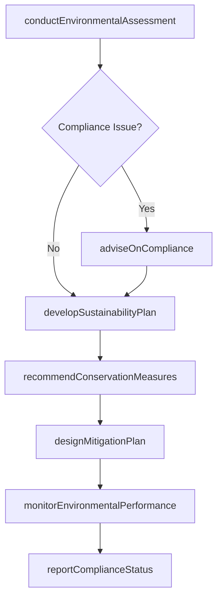
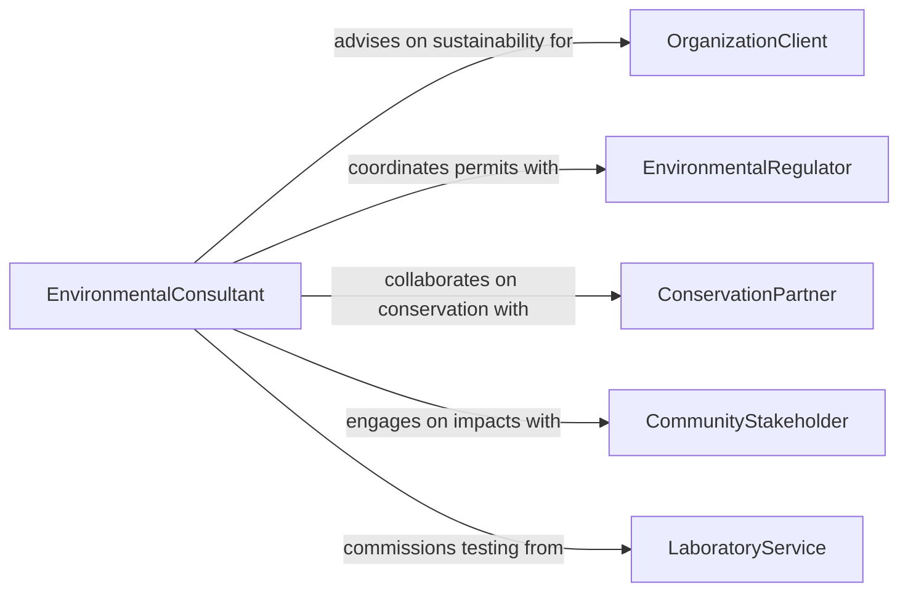

# Advise Others About Environmental Management

> Business-as-Code definition for environmental management and conservation advisory. Models the process of assessing environmental impacts, developing sustainability strategies, ensuring regulatory compliance, and guiding conservation practices.

## Overview

Advising others about environmental management or conservation involves evaluating organizational and site-level environmental impacts, recommending sustainable practices, ensuring compliance with environmental regulations, and guiding conservation efforts. This definition covers the full advisory cycle from environmental assessment through strategy development, implementation guidance, and compliance monitoring. It supports environmental consultants, sustainability officers, conservation biologists, and regulatory compliance specialists who help organizations and communities reduce ecological footprints and protect natural resources.

## Actors

| Actor | Description |
|-------|-------------|
| OrganizationClient | Seeks guidance on environmental compliance, sustainability, or conservation planning |
| EnvironmentalRegulator | Enforces environmental laws and issues permits for regulated activities |
| ConservationPartner | Collaborates on habitat protection, species management, and restoration projects |
| CommunityStakeholder | Represents local interests affected by environmental management decisions |
| LaboratoryService | Provides environmental testing, sampling, and analytical services |
| FundingAgency | Awards grants and financing for environmental and conservation projects |

## Roles

| Role | Description |
|------|-------------|
| EnvironmentalConsultant | Assesses environmental conditions and delivers management recommendations |
| SustainabilityAdvisor | Guides organizations in reducing environmental impact and adopting green practices |
| ComplianceSpecialist | Ensures activities meet environmental regulations and permit requirements |
| ConservationPlanner | Develops strategies for protecting habitats and managing natural resources |

## Entities

| Entity | Description |
|--------|-------------|
| EnvironmentalAssessment | An evaluation of ecological conditions, risks, and regulatory obligations |
| SustainabilityPlan | A strategic framework for reducing environmental impact over time |
| ComplianceReport | A documented evaluation of conformance with environmental regulations |
| ConservationStrategy | A plan for protecting, restoring, or managing natural resources |
| ImpactMitigation | A set of measures designed to reduce or offset environmental harm |
| EnvironmentalPermit | A regulatory authorization required for activities affecting the environment |

## Actions

| Action | Description |
|--------|-------------|
| conductEnvironmentalAssessment | Evaluate site conditions, ecological risks, and regulatory obligations |
| developSustainabilityPlan | Create a strategic framework for reducing environmental impact |
| adviseOnCompliance | Provide guidance on meeting environmental regulations and permit requirements |
| recommendConservationMeasures | Propose strategies for habitat protection and resource management |
| designMitigationPlan | Develop measures to reduce or offset environmental harm from activities |
| monitorEnvironmentalPerformance | Track progress against sustainability and compliance targets |
| reportComplianceStatus | Document and communicate regulatory conformance to stakeholders |

## Events

| Event | Description |
|-------|-------------|
| environmentalAssessmentCompleted | Site conditions and ecological risks have been evaluated |
| sustainabilityPlanDeveloped | A strategic environmental impact reduction plan has been created |
| complianceAdvised | Regulatory guidance has been provided to the client |
| conservationMeasuresRecommended | Habitat protection or resource management strategies have been proposed |
| mitigationPlanDesigned | Measures to reduce environmental harm have been documented |
| environmentalPerformanceReviewed | Progress against sustainability targets has been assessed |
| complianceStatusReported | Regulatory conformance findings have been communicated |

## Searches

| Search | Description |
|--------|-------------|
| findEnvironmentalAssessments | List assessments by site, client, or environmental risk category |
| getSustainabilityPlans | Retrieve plans by organization, target area, or implementation status |
| getComplianceReports | Find compliance documentation by regulation, site, or reporting period |
| findConservationStrategies | Search conservation plans by habitat type, species, or geographic area |

## Workflow



## Actor Relationships



## Usage

### Calling Actions

```typescript
import { adviseOthersAboutEnvironmentalManagement } from '@headlessly/advise-others-about-environmental-management'

const envAdvisory = adviseOthersAboutEnvironmentalManagement()

// Conduct environmental assessment
const assessment = await envAdvisory.conductEnvironmentalAssessment({
  site: 'Riverside Industrial Park',
  client: 'greenfield-manufacturing',
  scope: ['air-quality', 'water-discharge', 'habitat-impact', 'waste-management'],
  regulations: ['Clean Water Act', 'Clean Air Act', 'ESA']
})

// Develop sustainability plan
const plan = await envAdvisory.developSustainabilityPlan({
  assessmentId: assessment.id,
  targets: [
    { metric: 'carbon-emissions', reduction: '30%', timeframe: '5 years' },
    { metric: 'water-usage', reduction: '20%', timeframe: '3 years' },
    { metric: 'waste-to-landfill', reduction: '50%', timeframe: '4 years' }
  ]
})

// Recommend conservation measures
await envAdvisory.recommendConservationMeasures({
  assessmentId: assessment.id,
  measures: [
    { type: 'riparian-buffer', description: 'Establish 100-foot vegetated buffer along creek corridor' },
    { type: 'habitat-restoration', description: 'Restore 15 acres of native grassland on inactive parcels' }
  ]
})
```

### Event-Driven Automation

```typescript
// Alert on compliance issues discovered during assessment
envAdvisory.environmentalAssessmentCompleted(async ({ siteId, complianceGaps }) => {
  if (complianceGaps.length > 0) {
    await notify({
      to: 'compliance-team',
      message: `Environmental compliance gaps found at ${siteId}: ${complianceGaps.map(g => g.regulation).join(', ')}`,
      priority: 'high'
    })
  }
})

// Schedule performance review after plan implementation
envAdvisory.sustainabilityPlanDeveloped(async ({ planId, client }) => {
  await scheduleReview({
    planId,
    reviewDate: addDays(new Date(), 180),
    type: 'environmental-performance',
    client
  })
})
```
