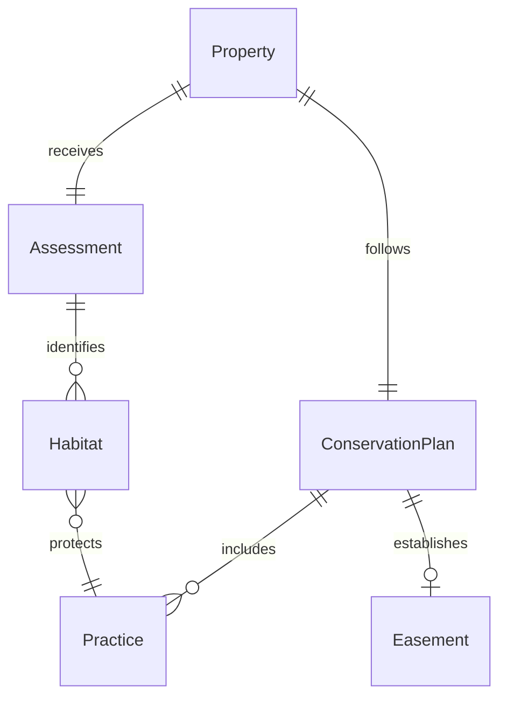
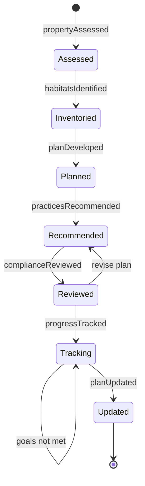
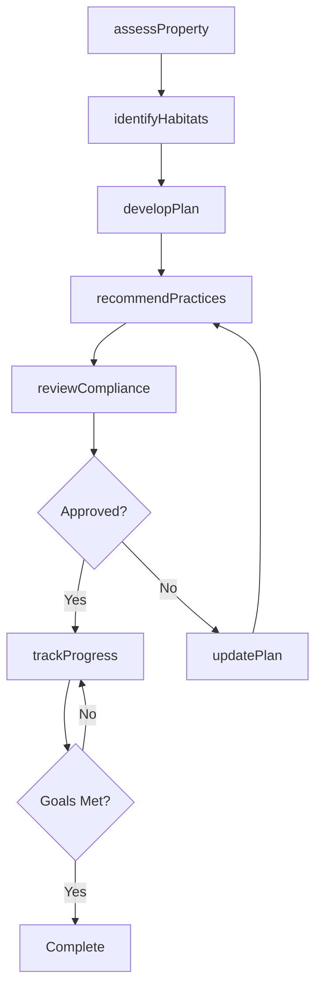
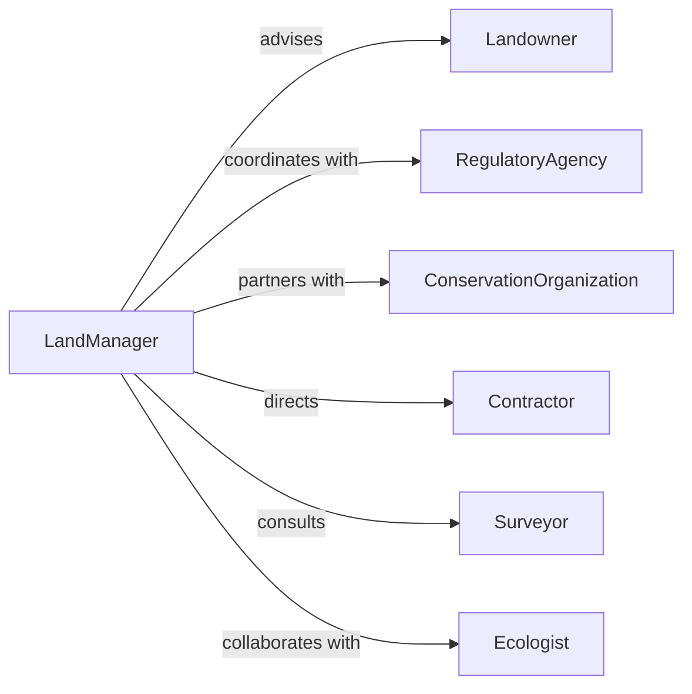

# Advise Others About Land Management

> Business-as-Code definition for land management and conservation advisory services. Models the complete consultation process from site assessment through conservation plan development and implementation guidance.

## Overview

Land management advisory services involve evaluating property conditions, recommending conservation practices, and guiding landowners through sustainable land use strategies. This definition exposes actions for site analysis, conservation planning, and regulatory compliance, along with events for tracking advisory milestones.

## Actors

| Actor | Description |
|-------|-------------|
| Landowner | Property owner seeking conservation guidance |
| RegulatoryAgency | Government body enforcing environmental regulations |
| ConservationOrganization | Non-profit supporting habitat protection |
| Contractor | Service provider implementing conservation practices |
| Surveyor | Professional conducting land assessments |
| Ecologist | Specialist evaluating ecosystem health |

## Roles

| Role | Description |
|------|-------------|
| LandManager | Develops and oversees conservation plans |
| ConservationAdvisor | Provides technical guidance on land stewardship |
| Compliance Specialist | Ensures adherence to environmental regulations |
| Planner | Creates long-term land use strategies |

## Entities

| Entity | Description |
|--------|-------------|
| Property | Land parcel under management consideration |
| Assessment | Evaluation of current land conditions |
| ConservationPlan | Strategy for sustainable land use |
| Practice | Specific conservation technique or method |
| Habitat | Ecosystem supporting wildlife populations |
| Easement | Legal agreement restricting land development |

## Actions

| Action | Description |
|--------|-------------|
| assessProperty | Evaluate current land conditions and usage |
| identifyHabitats | Catalog ecosystems and wildlife present |
| developPlan | Create conservation strategy for property |
| recommendPractices | Suggest specific conservation techniques |
| reviewCompliance | Verify adherence to regulatory requirements |
| trackProgress | Monitor implementation of conservation measures |
| updatePlan | Revise strategy based on new conditions |

## Events

| Event | Description |
|-------|-------------|
| propertyAssessed | Initial site evaluation completed |
| habitatsIdentified | Ecosystem inventory finished |
| planDeveloped | Conservation strategy created |
| practicesRecommended | Specific techniques suggested |
| complianceReviewed | Regulatory adherence verified |
| progressTracked | Implementation status updated |
| planUpdated | Strategy revised |

## Searches

| Search | Description |
|--------|-------------|
| findProperties | List properties by location, size, or habitat type |
| getAssessments | Retrieve evaluation reports for properties |
| getConservationPlans | Find strategies by status or practice type |
| getPractices | List recommended techniques by effectiveness |

## Entity Relationships



## State Diagram



## Workflow



## Actor Relationships



## Usage

### Calling Actions

```typescript
import { adviseOthersAboutLandManagement } from '@headlessly/advise-others-about-land-management'

const advisory = adviseOthersAboutLandManagement()

// Assess a property for conservation potential
const assessment = await advisory.assessProperty({
  propertyId: 'prop-789',
  acreage: 450,
  currentUse: 'Mixed agriculture and forest',
  ownerGoals: ['Habitat restoration', 'Water quality']
})

// Identify critical habitats
const habitats = await advisory.identifyHabitats({
  assessmentId: assessment.id,
  surveys: ['wildlife', 'wetlands', 'forestry']
})

// Develop conservation plan
const plan = await advisory.developPlan({
  propertyId: 'prop-789',
  priorities: ['Riparian buffer restoration', 'Native grassland establishment'],
  timeline: '5-year implementation'
})
```

### Event-Driven Automation

```typescript
// Notify stakeholders when assessment completes
advisory.propertyAssessed(async ({ propertyId, assessment }) => {
  await notify({
    to: assessment.owner,
    message: `Property assessment complete. ${assessment.opportunities.length} conservation opportunities identified.`
  })
})

// Flag compliance issues
advisory.complianceReviewed(async ({ planId, status }) => {
  if (status.violations.length > 0) {
    await escalate({
      to: 'compliance-team',
      issue: `Plan ${planId} has ${status.violations.length} regulatory concerns`
    })
  }
})
```
