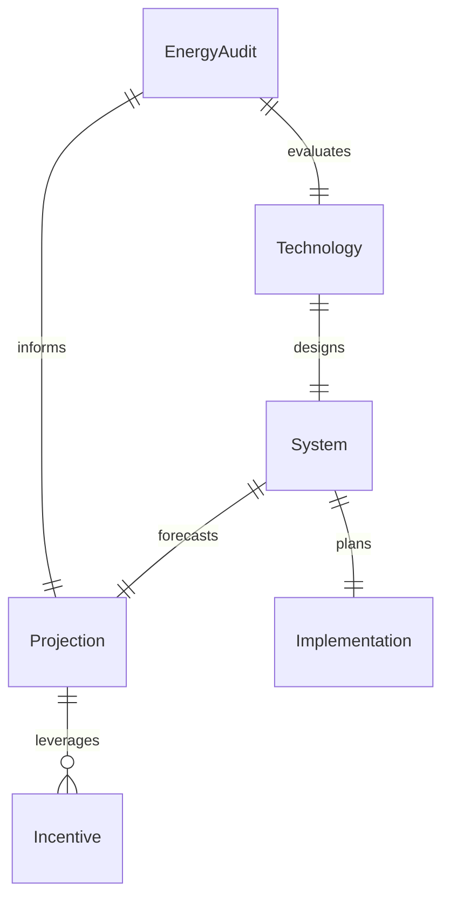
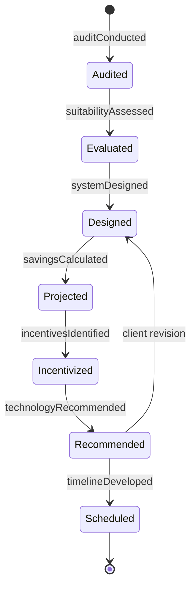
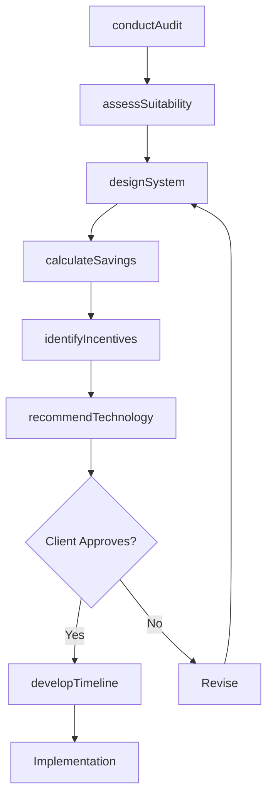
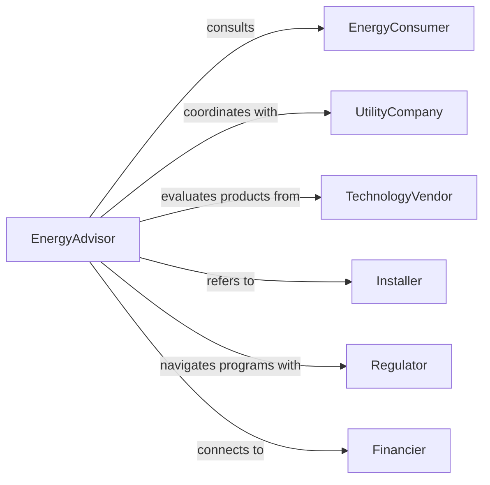

# Advise Others Green Energy Related

> Business-as-Code definition for green energy advisory services. Models the complete consultation process from energy audits through technology selection and implementation planning for renewable energy systems.

## Overview

Green energy advisory services involve evaluating energy needs, recommending renewable technologies, and guiding clients through implementation of sustainable energy solutions. This definition exposes actions for energy analysis, system design, and financial modeling, along with events for tracking project milestones.

## Actors

| Actor | Description |
|-------|-------------|
| EnergyConsumer | Individual or organization seeking renewable energy solutions |
| UtilityCompany | Energy provider offering grid connectivity |
| TechnologyVendor | Supplier of renewable energy equipment |
| Installer | Contractor implementing energy systems |
| Regulator | Agency managing energy incentives and permits |
| Financier | Institution providing project funding |

## Roles

| Role | Description |
|------|-------------|
| EnergyAdvisor | Provides technical guidance on renewable systems |
| SystemDesigner | Creates detailed implementation plans |
| FinancialAnalyst | Models return on investment and incentives |
| Compliance Specialist | Ensures regulatory adherence |

## Entities

| Entity | Description |
|--------|-------------|
| EnergyAudit | Assessment of current energy usage and costs |
| Technology | Specific renewable energy system type |
| System | Designed renewable energy installation |
| Projection | Forecast of energy production and savings |
| Incentive | Government rebate or tax credit program |
| Implementation | Detailed installation plan and timeline |

## Actions

| Action | Description |
|--------|-------------|
| conductAudit | Evaluate current energy consumption patterns |
| assessSuitability | Determine viable renewable technologies for site |
| designSystem | Create detailed renewable energy system plan |
| calculateSavings | Project financial returns and payback period |
| identifyIncentives | Find applicable rebates and tax credits |
| recommendTechnology | Suggest optimal renewable energy solution |
| developTimeline | Create implementation schedule |

## Events

| Event | Description |
|-------|-------------|
| auditConducted | Energy usage assessment completed |
| suitabilityAssessed | Technology viability determined |
| systemDesigned | Detailed plan created |
| savingsCalculated | Financial projections completed |
| incentivesIdentified | Funding opportunities cataloged |
| technologyRecommended | Optimal solution suggested |
| timelineDeveloped | Implementation schedule finalized |

## Searches

| Search | Description |
|--------|-------------|
| findAudits | List energy assessments by client or date |
| getTechnologies | Retrieve renewable systems by type or capacity |
| getProjections | Find financial models by ROI or payback |
| getIncentives | List available rebates by location or type |

## Entity Relationships



## State Diagram



## Workflow



## Actor Relationships



## Usage

### Calling Actions

```typescript
import { adviseOthersGreenEnergyRelated } from '@headlessly/advise-others-green-energy-related'

const advisory = adviseOthersGreenEnergyRelated()

// Conduct energy audit for commercial facility
const audit = await advisory.conductAudit({
  clientId: 'client-456',
  facilityType: 'Manufacturing',
  annualConsumption: 850000,
  peakDemand: 250
})

// Assess technology suitability
const assessment = await advisory.assessSuitability({
  auditId: audit.id,
  siteCharacteristics: {
    roofArea: 50000,
    orientation: 'South-facing',
    shading: 'Minimal'
  }
})

// Design solar system
const system = await advisory.designSystem({
  technology: 'Solar PV',
  capacity: 500,
  budget: 1200000
})
```

### Event-Driven Automation

```typescript
// Generate report when savings calculated
advisory.savingsCalculated(async ({ systemId, projections }) => {
  await generateReport({
    type: 'Financial Analysis',
    data: projections,
    format: 'PDF',
    recipients: [projections.clientEmail]
  })
})

// Alert when high-value incentives identified
advisory.incentivesIdentified(async ({ systemId, incentives }) => {
  const total = incentives.reduce((sum, i) => sum + i.amount, 0)
  if (total > 100000) {
    await notify({
      to: 'sales-team',
      priority: 'high',
      message: `Major incentive opportunity: ${formatCurrency(total)}`
    })
  }
})
```
