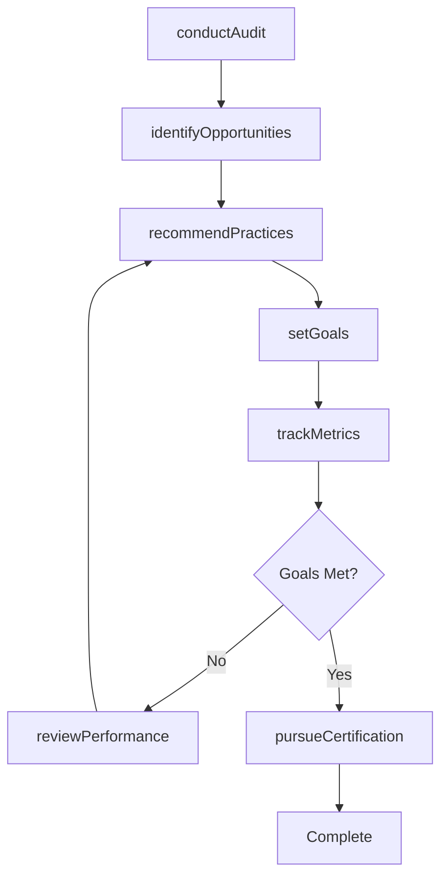
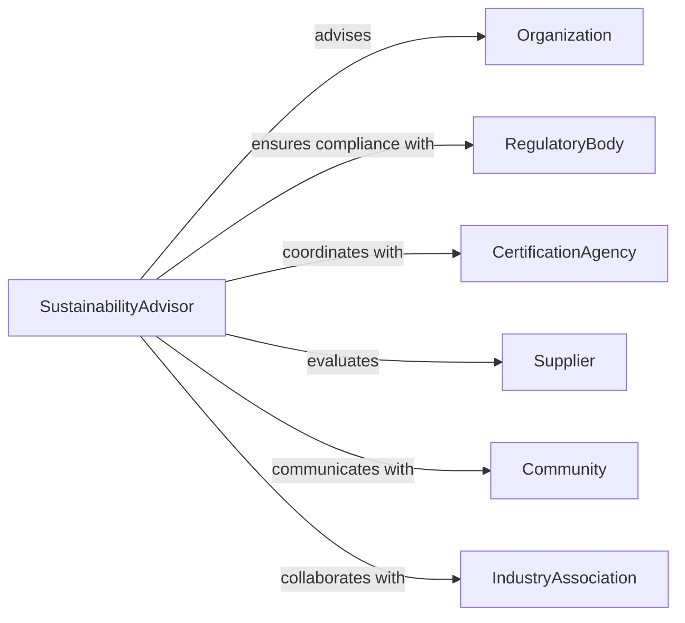

# Advise Others Regarding Green Practices

> Business-as-Code definition for environmental sustainability advisory services. Models the complete consultation process from environmental impact assessment through green practice implementation and performance tracking.

## Overview

Environmental sustainability advisory involves evaluating current practices, identifying environmental impacts, and guiding organizations toward sustainable operations. This definition exposes actions for sustainability audits, practice recommendations, and performance monitoring, along with events for tracking environmental improvements.

## Actors

| Actor | Description |
|-------|-------------|
| Organization | Business or institution seeking sustainability guidance |
| RegulatoryBody | Government agency enforcing environmental standards |
| CertificationAgency | Authority issuing green certifications |
| Supplier | Vendor providing sustainable materials or services |
| Community | Local stakeholders affected by environmental practices |
| IndustryAssociation | Trade group promoting sustainability standards |

## Roles

| Role | Description |
|------|-------------|
| SustainabilityAdvisor | Develops and oversees green practice strategies |
| EnvironmentalAuditor | Assesses current environmental performance |
| Compliance Manager | Ensures adherence to environmental regulations |
| Trainer | Educates staff on sustainable practices |

## Entities

| Entity | Description |
|--------|-------------|
| SustainabilityAudit | Comprehensive assessment of environmental impact |
| Practice | Specific green initiative or procedure |
| Metric | Measurable environmental performance indicator |
| Goal | Target for environmental improvement |
| Certification | Formal recognition of sustainability achievement |
| Initiative | Coordinated program of green practices |

## Actions

| Action | Description |
|--------|-------------|
| conductAudit | Assess current environmental practices and impacts |
| identifyOpportunities | Find areas for sustainability improvement |
| recommendPractices | Suggest specific green initiatives |
| setGoals | Establish environmental performance targets |
| trackMetrics | Monitor sustainability indicators over time |
| pursueCertification | Guide organization through green credential process |
| reviewPerformance | Evaluate progress toward sustainability goals |

## Events

| Event | Description |
|-------|-------------|
| auditConducted | Environmental assessment completed |
| opportunitiesIdentified | Improvement areas cataloged |
| practicesRecommended | Green initiatives suggested |
| goalsSet | Environmental targets established |
| metricsTracked | Performance data updated |
| certificationPursued | Credentialing process initiated |
| performanceReviewed | Progress evaluation completed |

## Searches

| Search | Description |
|--------|-------------|
| findAudits | List assessments by organization or date |
| getPractices | Retrieve green initiatives by category or impact |
| getMetrics | Find performance data by indicator or period |
| getCertifications | List credentials by type or status |

## Workflow



## Actor Relationships



## Usage

### Calling Actions

```typescript
import { adviseOthersRegardingGreenPractices } from '@headlessly/advise-others-regarding-green-practices'

const advisory = adviseOthersRegardingGreenPractices()

// Conduct sustainability audit
const audit = await advisory.conductAudit({
  organizationId: 'org-321',
  scope: ['Energy', 'Waste', 'Water', 'Transportation'],
  facilities: ['HQ', 'Plant A', 'Plant B']
})

// Identify improvement opportunities
const opportunities = await advisory.identifyOpportunities({
  auditId: audit.id,
  priorityAreas: ['Carbon reduction', 'Waste diversion']
})

// Recommend specific practices
const practices = await advisory.recommendPractices({
  opportunities: opportunities.id,
  budget: 500000,
  timeline: '18 months'
})
```

### Event-Driven Automation

```typescript
// Generate report when audit completes
advisory.auditConducted(async ({ organizationId, audit }) => {
  await generateReport({
    template: 'sustainability-audit',
    data: audit,
    deliverTo: audit.stakeholders
  })
})

// Celebrate milestone achievements
advisory.performanceReviewed(async ({ organizationId, performance }) => {
  if (performance.wasteReduction > 50) {
    await notify({
      to: 'all-staff',
      message: `Milestone achieved: 50% waste reduction target met!`,
      type: 'celebration'
    })
  }
})
```
