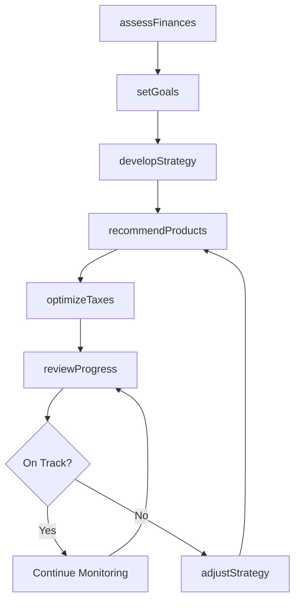
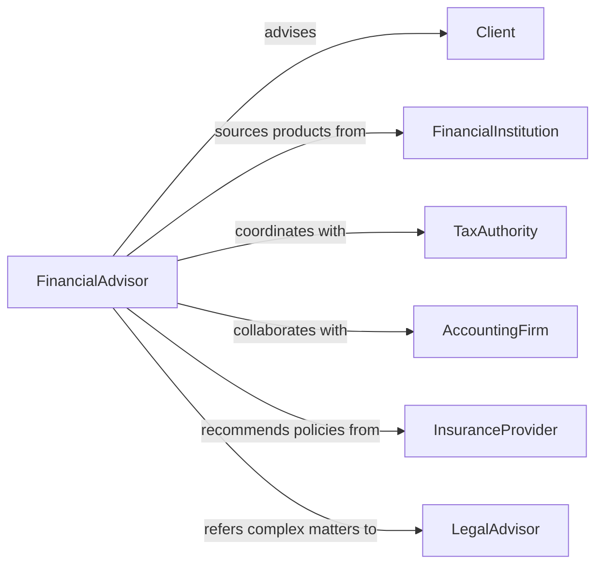

# Advise Others Financial Matters

> Business-as-Code definition for financial advisory services. Models the complete consultation process from financial assessment through strategy development and implementation guidance across personal and business finance.

## Overview

Financial advisory services involve analyzing financial situations, recommending strategies, and guiding clients toward financial goals. This definition exposes actions for financial analysis, planning, and monitoring, along with events for tracking advisory milestones and client progress.

## Actors

| Actor | Description |
|-------|-------------|
| Client | Individual or business seeking financial guidance |
| FinancialInstitution | Bank or investment firm providing products |
| TaxAuthority | Government agency collecting taxes |
| AccountingFirm | Professional services firm managing books |
| InsuranceProvider | Company offering risk protection products |
| LegalAdvisor | Attorney handling estate or business matters |

## Roles

| Role | Description |
|------|-------------|
| FinancialAdvisor | Provides comprehensive financial guidance |
| FinancialPlanner | Develops long-term financial strategies |
| InvestmentAnalyst | Researches and recommends investment options |
| TaxConsultant | Advises on tax optimization strategies |

## Entities

| Entity | Description |
|--------|-------------|
| FinancialProfile | Comprehensive view of client financial situation |
| Goal | Specific financial objective and timeline |
| Strategy | Recommended approach to achieve financial goals |
| Portfolio | Collection of investment holdings |
| Plan | Detailed roadmap for financial success |
| Review | Periodic assessment of financial progress |

## Actions

| Action | Description |
|--------|-------------|
| assessFinances | Evaluate current financial position and needs |
| setGoals | Establish specific financial objectives |
| developStrategy | Create approach to achieve financial goals |
| recommendProducts | Suggest specific financial instruments or services |
| optimizeTaxes | Identify strategies to reduce tax burden |
| reviewProgress | Monitor performance against financial plan |
| adjustStrategy | Modify approach based on changing circumstances |

## Events

| Event | Description |
|-------|-------------|
| financesAssessed | Financial situation evaluated |
| goalsSet | Objectives established |
| strategyDeveloped | Approach created |
| productsRecommended | Specific solutions suggested |
| taxesOptimized | Tax reduction strategies implemented |
| progressReviewed | Performance assessed |
| strategyAdjusted | Plan modified |

## Searches

| Search | Description |
|--------|-------------|
| findClients | List clients by advisor, status, or profile type |
| getStrategies | Retrieve plans by goal type or risk tolerance |
| getPortfolios | Find investment holdings by client or asset class |
| getReviews | List performance assessments by period or status |

## Workflow



## Actor Relationships



## Usage

### Calling Actions

```typescript
import { adviseOthersFinancialMatters } from '@headlessly/advise-others-financial-matters'

const advisory = adviseOthersFinancialMatters()

// Assess client financial situation
const assessment = await advisory.assessFinances({
  clientId: 'client-789',
  income: 150000,
  assets: 850000,
  liabilities: 320000,
  dependents: 2
})

// Set financial goals
await advisory.setGoals({
  clientId: 'client-789',
  goals: [
    { type: 'Retirement', target: 2000000, timeline: '20 years' },
    { type: 'Education', target: 200000, timeline: '10 years' },
    { type: 'Emergency Fund', target: 30000, timeline: '2 years' }
  ]
})

// Develop strategy
const strategy = await advisory.developStrategy({
  clientId: 'client-789',
  riskTolerance: 'Moderate',
  priorities: ['Growth', 'Tax efficiency']
})
```

### Event-Driven Automation

```typescript
// Send quarterly review reminders
advisory.progressReviewed(async ({ clientId, review }) => {
  const nextReview = addMonths(review.date, 3)
  await scheduleTask({
    date: nextReview,
    action: 'Send review reminder',
    assignedTo: review.advisorId
  })
})

// Alert on significant portfolio changes
advisory.strategyAdjusted(async ({ clientId, changes }) => {
  if (changes.assetReallocation > 15) {
    await notify({
      to: clientId,
      subject: 'Portfolio Rebalancing Recommended',
      message: `Your financial strategy has been updated. Review recommended changes.`
    })
  }
})
```
