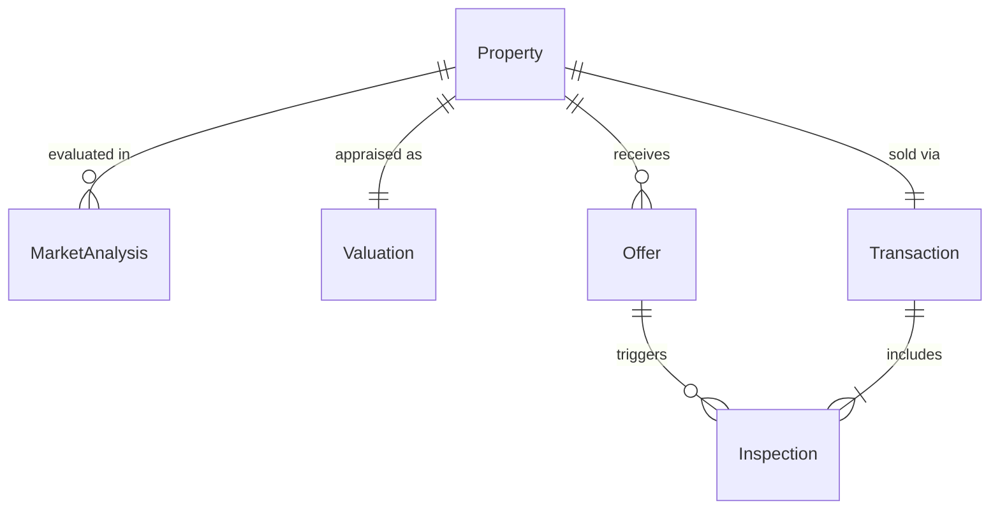
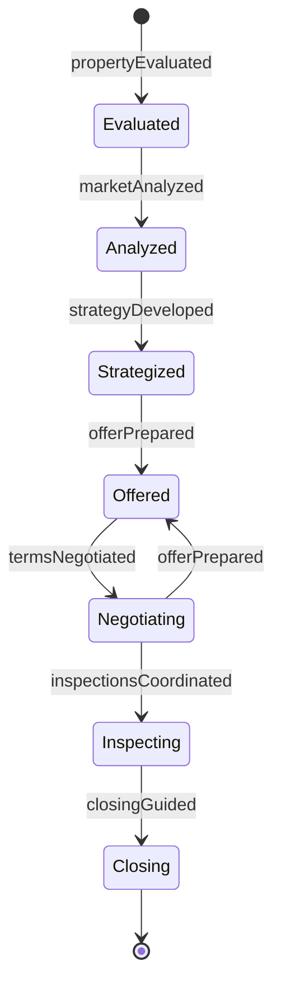
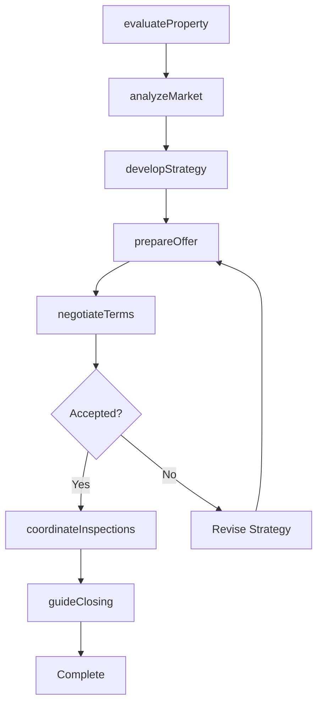
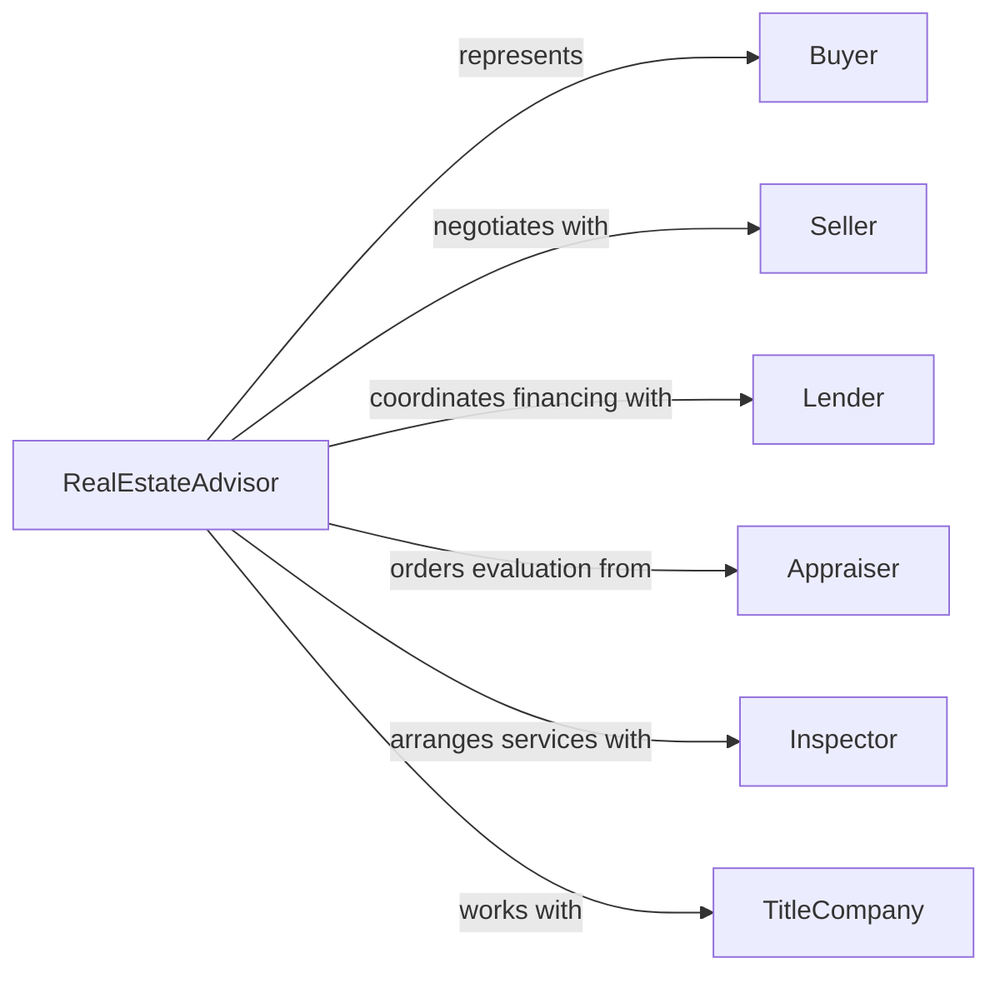

# Advise Real Estate Clients

> Business-as-Code definition for real estate advisory services. Models the complete consultation process from property evaluation through transaction strategy and negotiation guidance for buyers, sellers, and investors.

## Overview

Real estate advisory involves evaluating properties, analyzing market conditions, and guiding clients through property transactions. This definition exposes actions for property analysis, market research, and transaction management, along with events for tracking deal progress and client milestones.

## Actors

| Actor | Description |
|-------|-------------|
| Buyer | Individual or entity seeking to purchase property |
| Seller | Property owner looking to sell real estate |
| Lender | Financial institution providing mortgage financing |
| Appraiser | Professional estimating property value |
| Inspector | Specialist evaluating property condition |
| TitleCompany | Firm managing legal transfer of ownership |

## Roles

| Role | Description |
|------|-------------|
| RealEstateAdvisor | Provides comprehensive transaction guidance |
| MarketAnalyst | Researches property values and trends |
| NegotiationSpecialist | Manages offer and counteroffer strategy |
| TransactionCoordinator | Oversees deal execution and closing |

## Entities

| Entity | Description |
|--------|-------------|
| Property | Real estate asset under consideration |
| MarketAnalysis | Report on local property values and trends |
| Valuation | Estimated worth of specific property |
| Offer | Proposed purchase terms and price |
| Inspection | Report on property physical condition |
| Transaction | Complete record of property sale process |

## Actions

| Action | Description |
|--------|-------------|
| evaluateProperty | Assess property value and investment potential |
| analyzeMarket | Research comparable sales and trends |
| developStrategy | Create approach for optimal transaction |
| prepareOffer | Structure purchase proposal |
| negotiateTerms | Manage offer and counteroffer process |
| coordinateInspections | Arrange property evaluations |
| guideClosing | Oversee final transaction steps |

## Events

| Event | Description |
|-------|-------------|
| propertyEvaluated | Assessment completed |
| marketAnalyzed | Comparable research finished |
| strategyDeveloped | Transaction approach created |
| offerPrepared | Purchase proposal structured |
| termsNegotiated | Agreement reached on terms |
| inspectionsCoordinated | Property evaluations arranged |
| closingGuided | Transaction finalized |

## Searches

| Search | Description |
|--------|-------------|
| findProperties | List properties by location, type, or price |
| getAnalyses | Retrieve market reports by area or date |
| getTransactions | Find deals by status, client, or property |
| getOffers | List proposals by property or status |

## Entity Relationships



## State Diagram



## Workflow



## Actor Relationships



## Usage

### Calling Actions

```typescript
import { adviseRealEstateClients } from '@headlessly/advise-real-estate-clients'

const advisory = adviseRealEstateClients()

// Evaluate investment property
const evaluation = await advisory.evaluateProperty({
  propertyId: 'prop-456',
  clientGoal: 'Long-term rental income',
  analysisType: 'Investment cashflow'
})

// Analyze local market
const market = await advisory.analyzeMarket({
  location: 'Austin, TX',
  propertyType: 'Multi-family',
  radius: 5,
  lookback: '6 months'
})

// Prepare purchase offer
const offer = await advisory.prepareOffer({
  propertyId: 'prop-456',
  strategy: 'Below asking with quick close',
  price: 485000,
  contingencies: ['Financing', 'Inspection'],
  closingDate: '45 days'
})
```

### Event-Driven Automation

```typescript
// Notify client when market analysis completes
advisory.marketAnalyzed(async ({ clientId, analysis }) => {
  await sendEmail({
    to: clientId,
    subject: 'Market Analysis Complete',
    template: 'market-report',
    data: analysis
  })
})

// Alert team when offer accepted
advisory.termsNegotiated(async ({ transactionId, terms }) => {
  if (terms.status === 'accepted') {
    await notify({
      to: 'transaction-team',
      priority: 'high',
      message: `Offer accepted on transaction ${transactionId}. Begin inspection coordination.`
    })
  }
})
```
