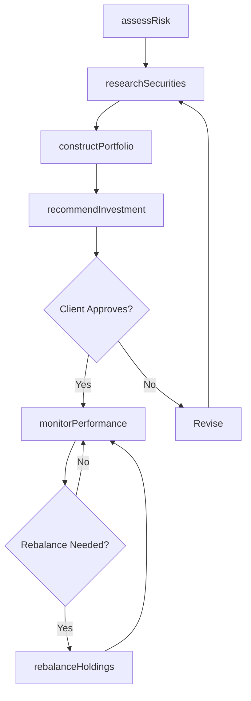
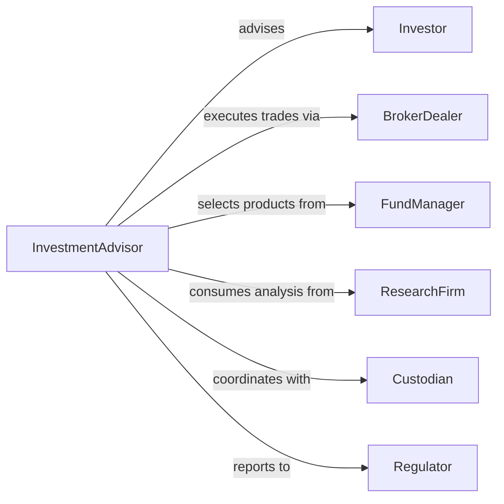

# Recommend Investments Clients

> Business-as-Code definition for investment advisory services. Models the complete recommendation process from client profile analysis through portfolio construction and performance monitoring.

## Overview

Investment advisory services involve analyzing client objectives, researching opportunities, and recommending suitable investments. This definition exposes actions for risk assessment, security analysis, and portfolio management, along with events for tracking recommendations and performance.

## Actors

| Actor | Description |
|-------|-------------|
| Investor | Client seeking investment recommendations |
| BrokerDealer | Firm executing investment transactions |
| FundManager | Professional managing mutual funds or ETFs |
| ResearchFirm | Organization providing market analysis |
| Custodian | Institution holding investment assets |
| Regulator | Agency overseeing investment practices |

## Roles

| Role | Description |
|------|-------------|
| InvestmentAdvisor | Provides personalized investment guidance |
| PortfolioManager | Constructs and maintains investment portfolios |
| ResearchAnalyst | Evaluates securities and market conditions |
| ComplianceOfficer | Ensures regulatory adherence |

## Entities

| Entity | Description |
|--------|-------------|
| InvestorProfile | Client risk tolerance and investment objectives |
| Security | Individual investment instrument |
| Portfolio | Collection of investment holdings |
| Recommendation | Specific investment suggestion with rationale |
| Allocation | Distribution of assets across categories |
| Performance | Historical returns and risk metrics |

## Actions

| Action | Description |
|--------|-------------|
| assessRisk | Evaluate client risk tolerance and capacity |
| researchSecurities | Analyze potential investment opportunities |
| constructPortfolio | Build diversified collection of investments |
| recommendInvestment | Suggest specific security or fund |
| rebalanceHoldings | Adjust portfolio to maintain target allocation |
| monitorPerformance | Track investment returns and risk |
| updateRecommendations | Revise suggestions based on market changes |

## Events

| Event | Description |
|-------|-------------|
| riskAssessed | Client risk profile established |
| securitiesResearched | Investment opportunities evaluated |
| portfolioConstructed | Diversified holdings created |
| investmentRecommended | Specific suggestion provided |
| holdingsRebalanced | Portfolio adjusted to target allocation |
| performanceMonitored | Returns and metrics updated |
| recommendationsUpdated | Suggestions revised |

## Searches

| Search | Description |
|--------|-------------|
| findInvestors | List clients by risk profile or assets |
| getSecurities | Retrieve investments by type, sector, or rating |
| getPortfolios | Find holdings by client or allocation strategy |
| getRecommendations | List suggestions by status or performance |

## Workflow



## Actor Relationships



## Usage

### Calling Actions

```typescript
import { recommendInvestmentsClients } from '@headlessly/recommend-investments-clients'

const advisory = recommendInvestmentsClients()

// Assess investor risk profile
const profile = await advisory.assessRisk({
  investorId: 'inv-123',
  age: 42,
  investmentHorizon: '20 years',
  questionnaire: {
    marketDownturnReaction: 'Hold course',
    targetReturn: '8-10%',
    liquidityNeeds: 'Low'
  }
})

// Research securities for moderate risk profile
const research = await advisory.researchSecurities({
  riskProfile: 'Moderate',
  sectors: ['Technology', 'Healthcare', 'Financials'],
  criteria: { minRating: 'A', maxExpenseRatio: 0.5 }
})

// Construct diversified portfolio
const portfolio = await advisory.constructPortfolio({
  investorId: 'inv-123',
  amount: 250000,
  allocation: {
    domestic_equity: 50,
    international_equity: 20,
    bonds: 25,
    alternatives: 5
  }
})
```

### Event-Driven Automation

```typescript
// Send recommendation details when investment suggested
advisory.investmentRecommended(async ({ investorId, recommendation }) => {
  await sendEmail({
    to: investorId,
    subject: 'New Investment Recommendation',
    template: 'investment-rec',
    data: {
      security: recommendation.symbol,
      rationale: recommendation.reason,
      allocation: recommendation.percentage
    }
  })
})

// Alert on significant underperformance
advisory.performanceMonitored(async ({ portfolioId, performance }) => {
  if (performance.trailingReturn < performance.benchmark - 3) {
    await escalate({
      to: 'portfolio-management',
      severity: 'medium',
      issue: `Portfolio ${portfolioId} underperforming benchmark by 3%`
    })
  }
})
```
