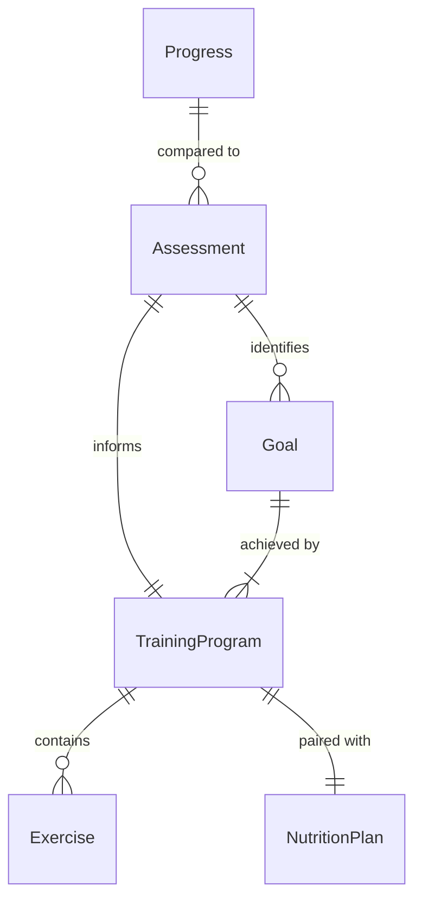
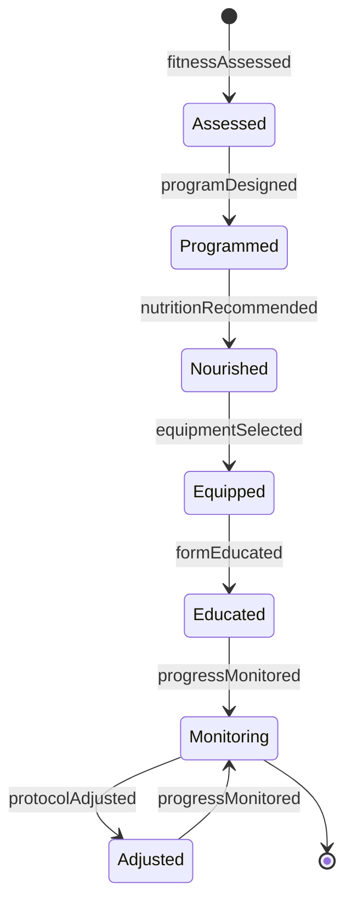
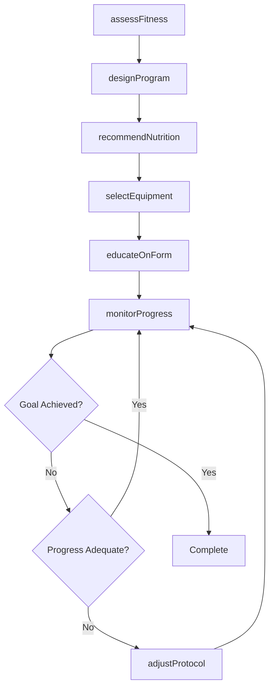
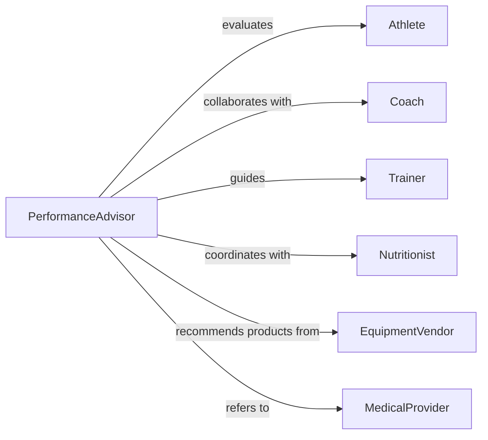

# Advise Athletes Coaches Trainers Exercise

> Business-as-Code definition for athletic performance advisory services. Models the complete consultation process from fitness assessment through training program design, nutrition planning, and performance optimization.

## Overview

Athletic advisory services involve evaluating performance, designing training regimens, and optimizing nutrition and equipment use. This definition exposes actions for fitness testing, program development, and progress tracking, along with events for monitoring athlete development and goal achievement.

## Actors

| Actor | Description |
|-------|-------------|
| Athlete | Individual seeking performance improvement |
| Coach | Professional directing training programs |
| Trainer | Specialist implementing exercise protocols |
| Nutritionist | Expert providing dietary guidance |
| EquipmentVendor | Supplier of athletic gear and technology |
| MedicalProvider | Healthcare professional managing injuries |

## Roles

| Role | Description |
|------|-------------|
| PerformanceAdvisor | Provides comprehensive athletic guidance |
| StrengthCoach | Designs resistance training programs |
| NutritionSpecialist | Develops meal plans for performance |
| BiomechanicsAnalyst | Evaluates movement patterns and technique |

## Entities

| Entity | Description |
|--------|-------------|
| Assessment | Evaluation of current fitness and performance |
| TrainingProgram | Structured exercise regimen with periodization |
| NutritionPlan | Dietary strategy for performance and recovery |
| Exercise | Specific movement with sets, reps, and intensity |
| Goal | Target performance metric or competition objective |
| Progress | Tracked improvements in fitness or performance |

## Actions

| Action | Description |
|--------|-------------|
| assessFitness | Evaluate current physical capabilities and limitations |
| designProgram | Create structured training regimen |
| recommendNutrition | Develop dietary plan for performance goals |
| selectEquipment | Suggest appropriate gear and technology |
| monitorProgress | Track performance improvements over time |
| adjustProtocol | Modify training based on response and results |
| educateOnForm | Provide guidance on proper exercise technique |

## Events

| Event | Description |
|-------|-------------|
| fitnessAssessed | Physical evaluation completed |
| programDesigned | Training regimen created |
| nutritionRecommended | Dietary plan developed |
| equipmentSelected | Gear suggestions provided |
| progressMonitored | Performance data updated |
| protocolAdjusted | Training modified |
| formEducated | Technique instruction delivered |

## Searches

| Search | Description |
|--------|-------------|
| findAthletes | List clients by sport, level, or goal |
| getPrograms | Retrieve training regimens by type or phase |
| getAssessments | Find fitness evaluations by date or metric |
| getProgress | List performance data by athlete or period |

## Entity Relationships



## State Diagram



## Workflow



## Actor Relationships



## Usage

### Calling Actions

```typescript
import { adviseAthletesCoachesTrainersExercise } from '@headlessly/advise-athletes-coaches-trainers-exercise'

const advisory = adviseAthletesCoachesTrainersExercise()

// Assess athlete baseline fitness
const assessment = await advisory.assessFitness({
  athleteId: 'athlete-789',
  sport: 'Basketball',
  tests: ['VO2Max', 'Vertical Jump', '1RM Squat', 'Sprint Time'],
  goals: ['Increase explosiveness', 'Improve endurance']
})

// Design 12-week training program
const program = await advisory.designProgram({
  athleteId: 'athlete-789',
  phase: 'Off-season strength',
  duration: 12,
  frequency: 5,
  focus: ['Power development', 'Functional movement']
})

// Recommend nutrition for muscle gain
const nutrition = await advisory.recommendNutrition({
  athleteId: 'athlete-789',
  goal: 'Lean mass gain',
  calories: 3200,
  macros: { protein: 35, carbs: 45, fat: 20 }
})
```

### Event-Driven Automation

```typescript
// Send workout reminders
advisory.programDesigned(async ({ athleteId, program }) => {
  for (const session of program.sessions) {
    await scheduleNotification({
      to: athleteId,
      date: session.scheduledDate,
      message: `Today's workout: ${session.focus}`,
      details: session.exercises
    })
  }
})

// Alert on plateau
advisory.progressMonitored(async ({ athleteId, progress }) => {
  if (progress.weeksSinceImprovement > 3) {
    await notify({
      to: progress.advisorId,
      priority: 'medium',
      message: `Athlete ${athleteId} showing training plateau. Consider protocol adjustment.`
    })
  }
})
```
