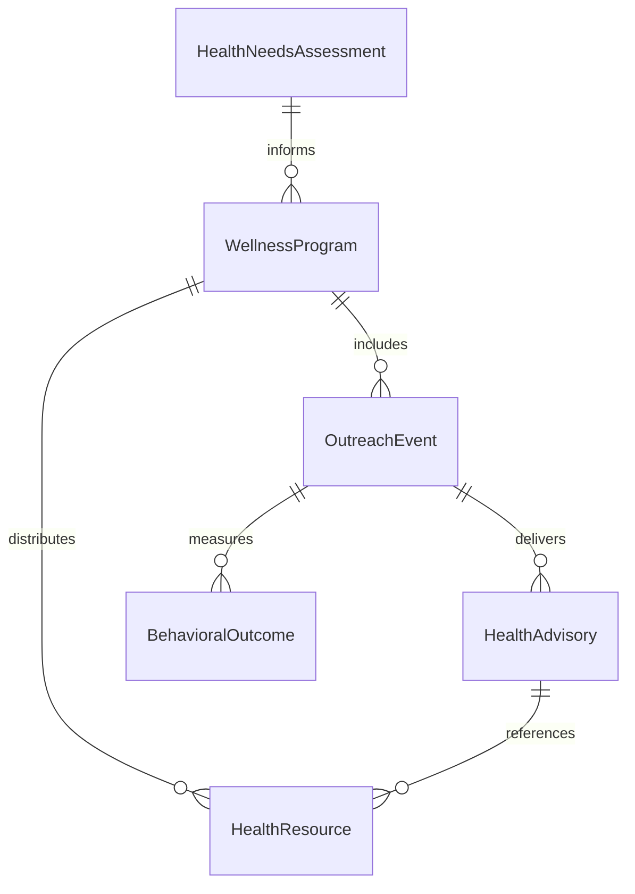
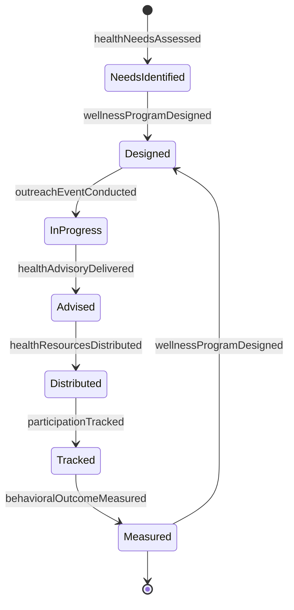
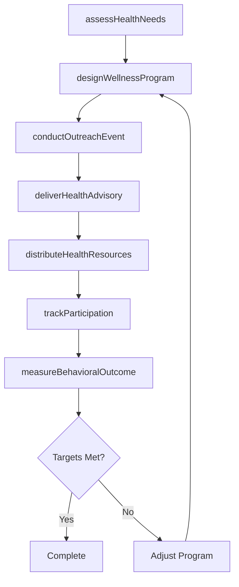
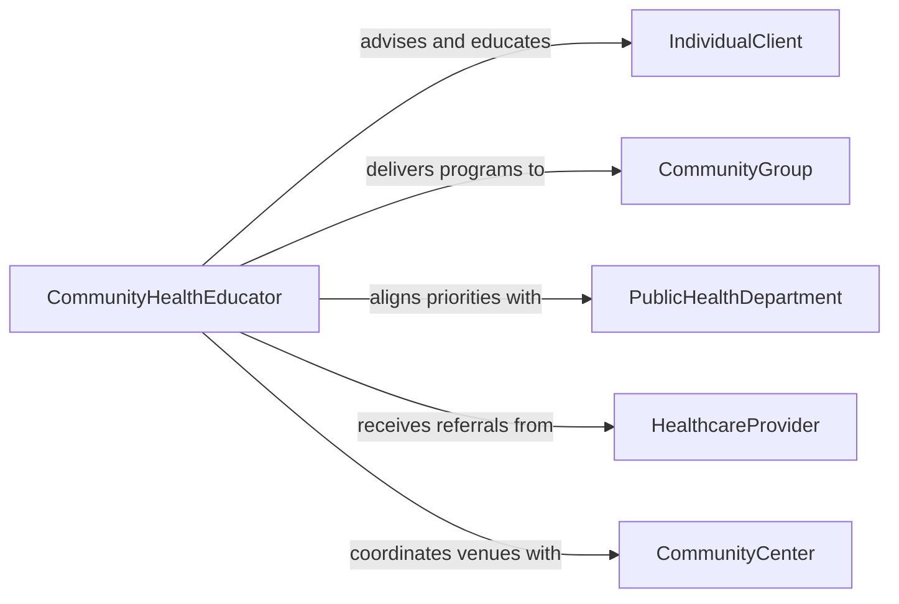

# Advise Clients or Community Groups on Health Issues

> Business-as-Code definition for advising clients and community groups on health issues. Models the health advisory process from community health assessment through educational program design, outreach delivery, and impact measurement.

## Overview

Advising clients or community groups on health issues involves providing evidence-based guidance on disease prevention, nutrition, physical activity, wellness practices, and public health concerns. This definition exposes actions for assessing community health needs, designing educational programs, delivering health advisories, and measuring behavioral health outcomes. Events enable automated outreach scheduling and engagement tracking, while searches provide access to epidemiological data, wellness program catalogs, and community health indicators.

## Actors

| Actor | Description |
|-------|-------------|
| IndividualClient | Seeks personalized health advice for lifestyle or wellness concerns |
| CommunityGroup | Receives group-level health education and prevention programming |
| PublicHealthDepartment | Sets health priorities and funds community wellness initiatives |
| HealthcareProvider | Refers patients for lifestyle counseling and wellness education |
| InsurancePayer | Supports preventive health programs and wellness incentives |
| CommunityCenter | Provides venues and outreach channels for health education events |

## Roles

| Role | Description |
|------|-------------|
| HealthAdvisor | Provides evidence-based guidance on wellness and disease prevention |
| CommunityHealthEducator | Designs and delivers health education programs for groups |
| NutritionCounselor | Advises on dietary practices and nutritional health |
| WellnessCoordinator | Manages community wellness initiatives and tracks participation |

## Entities

| Entity | Description |
|--------|-------------|
| HealthNeedsAssessment | An evaluation of health risks and concerns for a population or individual |
| WellnessProgram | A structured initiative promoting specific health behaviors |
| HealthAdvisory | A documented recommendation on a health topic |
| OutreachEvent | A scheduled health education session or community engagement activity |
| BehavioralOutcome | A measured change in health behavior following advisory intervention |
| HealthResource | Educational materials, referral guides, or self-care tools |

## Actions

| Action | Description |
|--------|-------------|
| assessHealthNeeds | Evaluate health risks and wellness priorities for individuals or groups |
| designWellnessProgram | Create a structured health promotion initiative |
| deliverHealthAdvisory | Provide specific guidance on a health topic to clients or groups |
| conductOutreachEvent | Facilitate a community health education session |
| distributeHealthResources | Share educational materials and self-care tools with participants |
| trackParticipation | Monitor attendance and engagement in wellness programs |
| measureBehavioralOutcome | Evaluate changes in health behaviors following interventions |

## Events

| Event | Description |
|-------|-------------|
| healthNeedsAssessed | Health risks and priorities have been evaluated |
| wellnessProgramDesigned | A health promotion initiative has been created |
| healthAdvisoryDelivered | Specific health guidance has been provided |
| outreachEventConducted | A community health education session has been completed |
| healthResourcesDistributed | Educational materials have been shared with participants |
| participationTracked | Attendance and engagement data have been recorded |
| behavioralOutcomeMeasured | Post-intervention health behavior changes have been evaluated |

## Searches

| Search | Description |
|--------|-------------|
| findHealthAssessments | List needs assessments by population, region, or health priority |
| getWellnessPrograms | Retrieve wellness programs by topic, status, or target group |
| findOutreachEvents | Search events by location, topic, or date range |
| getBehavioralOutcomes | Look up outcome data by program, population, or metric |

## Entity Relationships



## State Diagram



## Workflow



## Actor Relationships



## Usage

### Calling Actions

```typescript
import { adviseClientsOrCommunityGroupsOnHealthIssues } from '@headlessly/advise-clients-or-community-groups-on-health-issues'

const advisor = adviseClientsOrCommunityGroupsOnHealthIssues()

// Assess health needs for a community
const assessment = await advisor.assessHealthNeeds({
  population: 'Eastside Neighborhood',
  demographics: { size: 12000, medianAge: 38 },
  healthPriorities: ['diabetes-prevention', 'physical-activity', 'nutrition']
})

// Design a wellness program
const program = await advisor.designWellnessProgram({
  assessmentId: assessment.id,
  title: 'Healthy Living Workshop Series',
  topics: ['meal-planning', 'daily-exercise', 'blood-sugar-management'],
  format: 'weekly-group-sessions',
  duration: '8 weeks'
})

// Conduct an outreach event
await advisor.conductOutreachEvent({
  programId: program.id,
  title: 'Diabetes Prevention Kickoff',
  venue: 'Eastside Community Center',
  date: '2026-03-15',
  expectedAttendance: 60
})
```

### Event-Driven Automation

```typescript
// Send follow-up materials after outreach events
advisor.outreachEventConducted(async ({ programId, title, attendeeCount }) => {
  await advisor.distributeHealthResources({
    programId,
    resourceType: 'post-event-summary',
    channel: 'email',
    recipientCount: attendeeCount
  })
})

// Alert coordinator when participation drops
advisor.participationTracked(async ({ programId, sessionNumber, attendance, capacity }) => {
  if (attendance / capacity < 0.4) {
    await notify({
      to: 'wellness-coordinator',
      message: `Low attendance for program ${programId} session ${sessionNumber}: ${attendance}/${capacity}`
    })
  }
})
```
